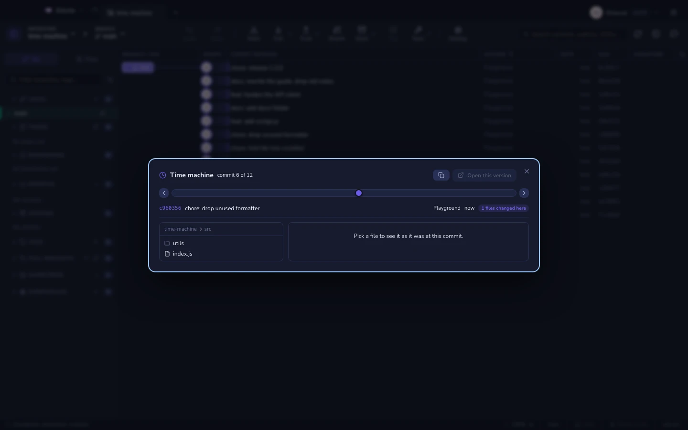
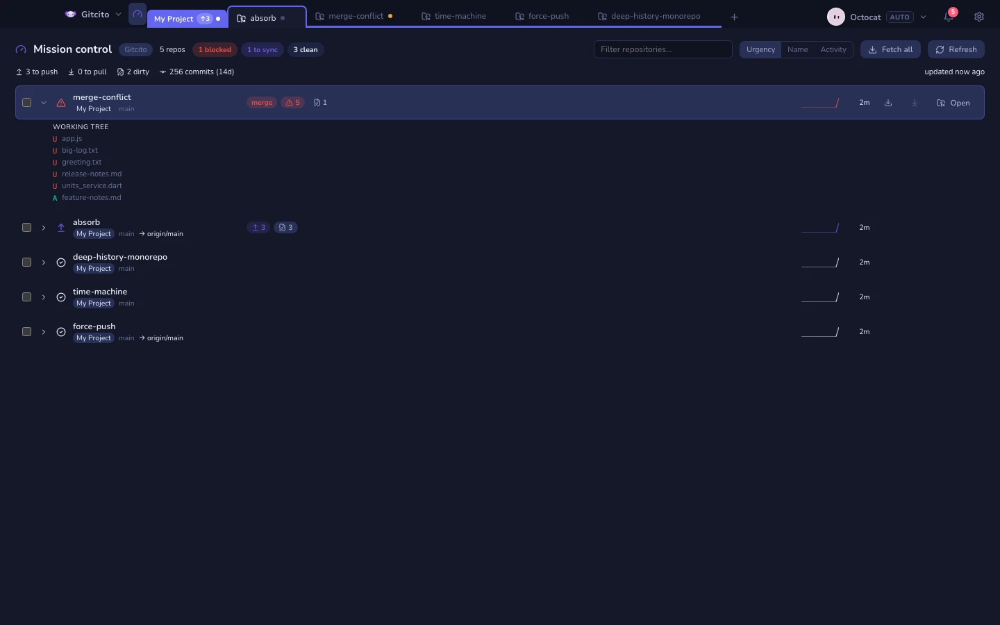
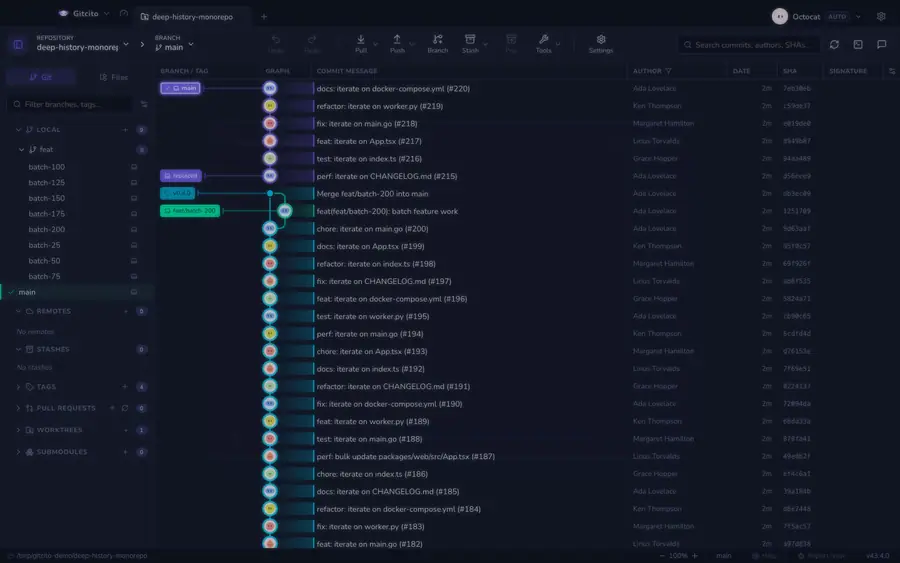
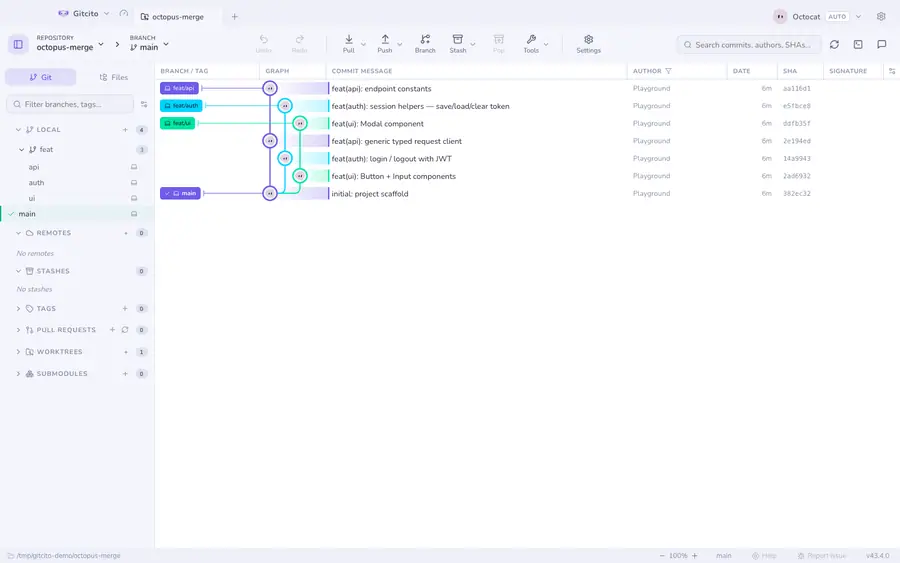

<div align="center">


# Gitcito

**A fully vibe-coded Git client. Free.**

_Which branch will conflict? What changed since they force-pushed? Which commit does this fix belong to?_

[](https://github.com/MyAppDesk/gitcito/releases)
[](LICENSE)

[](https://github.com/sponsors/cgutierr-zgz)


</div>

---

## Most Git clients run the commands you know. Gitcito answers the question first.

| | |
|---|---|
|  | 🛰️ [Conflict radar](docs/help/conflict-radar.md)<br><br>See which branches will conflict **before** merging any of them. The merges happen inside the object database — no checkout, no working-tree change, nothing to clean up. |
| 🧠 [Semantic diff](docs/help/semantic-diff.md)<br><br>`startServer` → `bootServer`, instead of a 400-line red/green wall. Real tree-sitter parsing, 18 languages. |  |
|  | 🕰️ [Time machine](docs/help/time-machine.md)<br><br>Drag a slider and watch the repository change: files appear, move, come back. HEAD never moves and your uncommitted work is untouched. |
| 🎛️ [Mission control](docs/help/mission-control.md)<br><br>Twenty repositories, one question: which one needs me? Blocked first, then to sync, then dirty, then the quiet ones. |  |

<div align="center">

**[⏪ What changed since](docs/help/range-diff.md)** · **[🧲 Absorb](docs/help/absorb.md)** · **[🎬 Timelapse](docs/help/timelapse.md)** · **[🧪 Preview a PR](docs/help/pr-preview.md)**



</div>

> [!WARNING]
> **Honest disclaimer.** Gitcito is young. **GitHub** is the battle-tested path:
> PR review/merge, issues, milestones, notifications, inline CI and project
> fields are GitHub-only. GitLab, Bitbucket and Azure DevOps can **list and
> create** PRs/MRs, but their detail/review/merge screens are not built yet.
> AI providers other than OpenAI use an OpenAI-compatible call shape and are
> unverified. If it breaks: well, **it works on my machine**. PRs welcome. 💜

## Install

Grab the latest build from **[gitcito's site](https://myappdesk.github.io/gitcito/)**
or **[Releases](https://github.com/MyAppDesk/gitcito/releases)** — the macOS build
is signed and notarised.

Then, optionally, open repositories from your terminal:

```sh
gitcito .                        # open this folder
gitcito ~/code/api -n "API"      # …with a display name
gitcito . -g "Work"              # …inside a group tab
```

Install the shim from the command palette: `⌘K` → **Install 'gitcito' command in PATH**.

## The rest of it

### Reading history

| | |
|---|---|
| **[Command palette](docs/help/search.md)** (`⌘K`) | Fuzzy-jump to any branch, commit, file or action. |
| **[Commit graph](docs/help/graph.md)** | Octopus merges drawn properly, windowed for huge histories, linear first-parent toggle, "new since last fetch" marks. |
| **[Code search](docs/help/search.md)** (`⌘⇧F`) | `git grep` across the tree, or a history pickaxe. |
| **[Blame & history](docs/help/blame.md)** | Per-file, with follow-the-line and "reblame before this commit". |
| **[Commit notes](docs/help/notes.md)** | Annotate a commit that is already pushed, without rewriting it. |
| **[Insights](docs/help/insights.md)** | Commits/day, contributors, weekly churn, file hotspots. |

### Changing code

| | |
|---|---|
| **[Commit composer](docs/help/committing.md)** | Conventional, Gitmoji, Ticket, Plain… even Caveman. Co-author picker, message recall, live linter. |
| **[Staging](docs/help/staging.md)** | Whole files, hunks, or **individual lines**. |
| **[Conflict resolver](docs/help/conflicts.md)** | Three panes, per-line picking, a conflict-by-conflict navigator, editable output. |
| **[External diff & merge tools](docs/help/diff-tools.md)** | Hand a file to Kaleidoscope, Beyond Compare, Meld — read straight from git's own tool list. |
| **[Interactive rebase](docs/help/rebase.md)** | Drag to reorder, squash, fixup, reword, edit or drop. |
| **[Stacked branches](docs/help/stacks.md)** | Graphite-style chains with cascade restack and a PR per level. |
| **[Git flow](docs/help/gitflow.md)** | Start and finish features, releases and hotfixes — merges, tag and cleanup in one step, undoable. |
| **[Merge options](docs/help/merge-options.md)** | `-X ours`, whitespace-blind merges, squash, `-s subtree` — and the commits behind a conflict. |
| **[Recovery](docs/help/recovery.md)** | Reflog, WIP snapshots under `refs/gitcito/wip`, guided bisect — or hand the search to `git bisect run`. |
| **[Remove a file from history](docs/help/history-purge.md)** | A leaked key or a 400 MB blob out of every commit — measured first, backed up, undoable. |
| **[File attributes](docs/help/attributes.md)** | `.gitattributes` with a UI: line endings, `merge=union`, `export-ignore`, and readable diffs for Word and PDF. |
| **[Object explorer](docs/help/objects.md)** | Walk blobs, trees, commits and refs — the layer beneath the graph, read-only. |
| **[Repository maintenance](docs/help/maintenance.md)** | Where the disk went — packed, loose, unreachable — and what gc, repack, prune or fsck would do about it. |
| **[Remove untracked files](docs/help/clean.md)** | `git clean` as a dry run: every path sized, ignored files apart and unselected, Trash by default. |

### Many repositories, and your hosts

| | |
|---|---|
| **[Groups & workspaces](docs/help/workspaces.md)** | Tabs with folders nested to any depth, colour-coded, fetch-all per subtree. |
| **[Pull requests](docs/help/hosting.md)** | Create on GitHub, GitLab, Bitbucket and Azure DevOps. Review, comment, approve and merge on GitHub. |
| **[Plumbing, with a UI](docs/help/lfs-sparse.md)** | Stashes, tags, worktrees, submodules, LFS, sparse-checkout, patches, hooks. |
| **[Subtrees](docs/help/subtree.md)** | Vendor another repo into a directory — and remember where it came from, which git does not. |
| **[Bundles & archives](docs/help/export.md)** | The repository as one file git can clone from — or a tree as a zip, honouring `export-ignore`. |
| **[Credential helper](docs/help/credentials.md)** | Git's own password store — why https keeps asking, and the plaintext file nobody meant to have. |
| **[SSH keys](docs/help/ssh-keys.md)** | See which key the agent is holding, generate one, test the host — the auth path tokens never covered. |

### AI, optional and grounded

Commit messages, PR descriptions and branch names from the actual diff ·
[hover to explain](docs/help/ai.md) an identifier · [PR review](docs/help/ai.md)
whose findings must anchor to a real `path:line` or get rejected ·
a [repo wiki](docs/help/repo-wiki.md) where every claim cites its file.
OpenAI, Anthropic, OpenRouter, Groq, Mistral, Ollama, or any compatible endpoint.

### Make it yours

<div align="center">

</div>

[9 themes](docs/help/themes.md) × light/dark, plus **AI-generated** ones ·
[rebindable shortcuts](docs/help/keyboard.md) · [profiles](docs/help/profiles.md)
for separate identities · English & Spanish ·
[integrated terminal](docs/help/terminal.md) with splits ·
[**Open in your editor**](docs/help/editor.md) — repo, file, or the exact line
you right-clicked ·
[**Run & debug**](docs/help/launch.md) from your `.vscode/launch.json` ·
[previews](docs/help/diffs.md) for Markdown, Word, Excel, PDF, video and images.

## Your secrets stay yours

Gitcito has no backend. Tokens and [vault](docs/help/vault.md) entries are
encrypted with your **OS keychain** — and before it ever touches that keychain it
tells you what for and lets you say no; the app keeps working either way. Nothing
is synced or phoned home. The only network calls are to your Git host and, if you
turn it on, your AI provider. Details in [Security & secrets](docs/help/security.md).

## The handbook

**52 pages**, built into the app — the **Help** button in the status bar, or `⌘K`
→ *Help*. It is the same Markdown you can
[read right here in the repository](docs/help/getting-started.md), offline and
versioned with the code.

Contributions welcome — **[CONTRIBUTING.md](CONTRIBUTING.md)** has the working
agreement: commit format, the translation rule, the test fixtures, and when a
change has to update the handbook.

## What's next

**[ROADMAP.md](ROADMAP.md)** — what might come next, what it would cost, and what
is deliberately out of scope. Half of it is gaps against other clients; the other
half is [Pro Git](https://git-scm.com/book/en/v2) — things git already does that
no client surfaces. Ideas welcome as
[issues](https://github.com/MyAppDesk/gitcito/issues).

## Sponsor this project

Gitcito is free, MIT-licensed and has no backend, no telemetry and nothing to
upsell — so there is nothing to buy. If it saves you an afternoon of `git reflog`,
you can pay for the next one instead:

**[💜 Sponsor on GitHub](https://github.com/sponsors/cgutierr-zgz)**

Sponsorship funds the Apple Developer certificate the signed macOS builds need,
the time that goes into the handbook, and the translations. Not sponsoring costs
you nothing — bug reports, issues and pull requests are worth as much.

## License

MIT.

---

<div align="center">

Made by **MyAppDesk** with 💜

_[myappdesk.dev](https://myappdesk.dev)_

</div>
