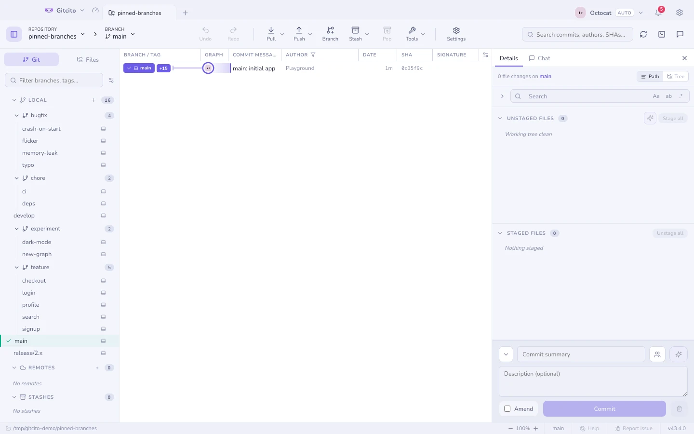
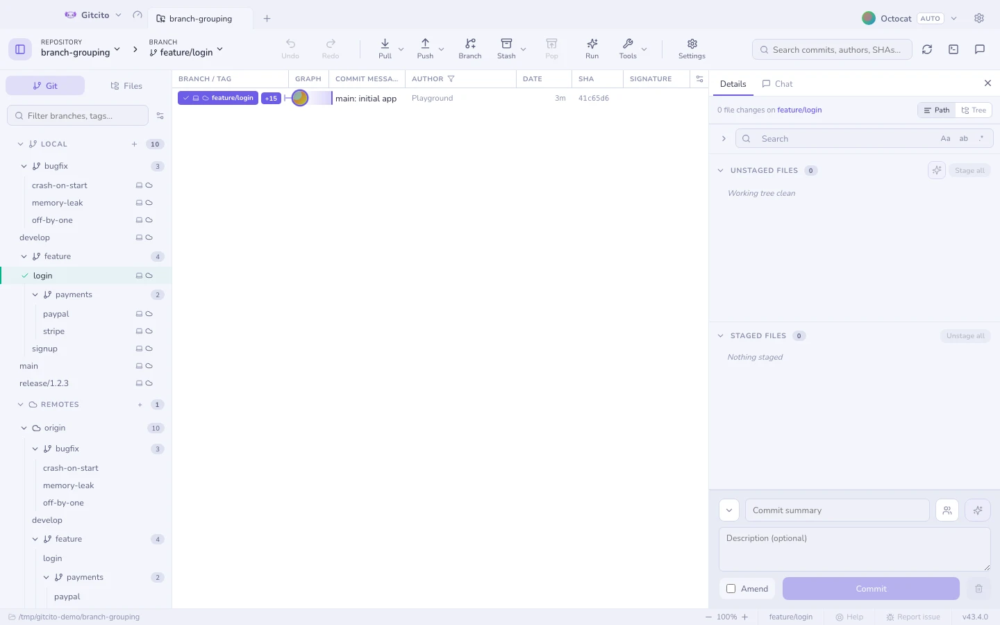
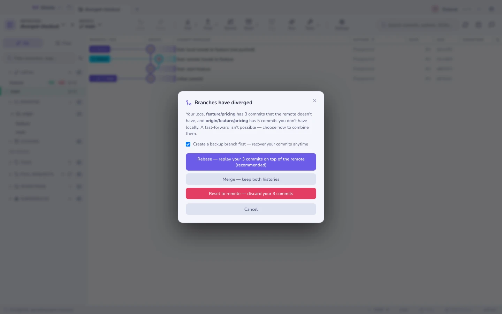
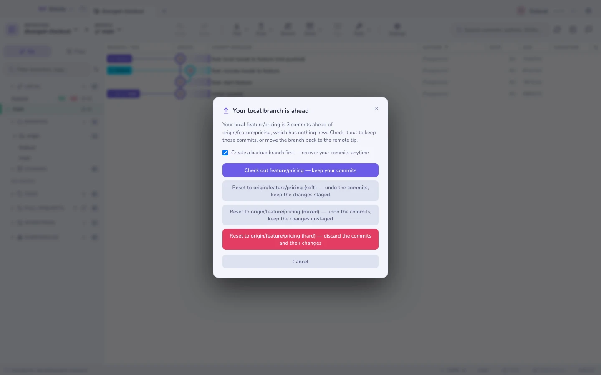

# الفروع والمستودعات البعيدة والشريط الجانبي

شريط جانبي واحد قابل لإعادة الترتيب وللبحث يحمل **الفروع والمستودعات البعيدة
والوسوم والمخابئ وأشجار العمل والوحدات الفرعية**. وكل قسم يمكن إخفاؤه أو إعادة
ترتيبه (الإعدادات ← التخطيط)، وصندوق التصفية يسري عليها جميعًا.

## الفروع

أنشئ وسُحُب وأعِد تسمية واحذف — محليًا وبعيدًا. وصفوف الفروع تعرض:

- **↑متقدم / ↓متأخر** بالنسبة إلى منبعها،
- **شارات حضور لكل مستودع بعيد** (أي المستودعات البعيدة لديها هذا الفرع)،
- **نقطة خطر** بعد فحص [رادار التعارضات](conflict-radar.md)،
- **علامة ⟳** حين يكون المستودع البعيد قد [أعاد كتابة السجل](range-diff.md).

والفروع التي في أسمائها `/` تُطوى في مجلدات قابلة للطي تلقائيًا.

## الفروع المثبَّتة

ضع نجمة على الفروع التي تعود إليها دائمًا — مرّر على الصف واضغط ★، أو انقر
بالزر الأيمن ← *تثبيت الفرع*. فتظهر في مجموعة **مثبَّتة** أعلى القسم المحلي،
محفوظةً لكل مستودع على حدة، مع بقائها في مكانها المعتاد أسفل ذلك.

## سحب فرع بعيد

انقر نقرًا مزدوجًا على فرع بعيد لإنشاء الفرع المحلي الذي يتتبعه. وإن كان هناك
فرع محلي بذلك الاسم قد **تشعّب**، سألك Gitcito كيف يوفّق بينهما — إعادة أساس أو
دمج أو إعادة تعيين — وعرض عليك أخذ نسخة احتياطية من الفرع أولًا.

### عندما يكون فرعك المحلي متأخّرًا

يُقدَّم سريعًا (fast-forward) إلى رأس الفرع البعيد ضمن عملية الانتقال. وإذا كانت
شجرة العمل غير نظيفة فتُحفظ في مخبأ (stash) باسم محدّد ثم تُستعاد بعد التحديث،
حتى لا تُلغي تعديلاتك المحلية العملية.

### عندما يكون فرعك المحلي متقدّمًا

إذا كان الفرع المحلي متقدّمًا ولا جديد في الفرع البعيد، فإن الانتقال يردّ على طلب
الفرع *البعيد* بعملك أنت غير المدفوع — لذلك لا يُنفَّذ أي انتقال حتى تحدّد الجانب
الذي تقصده:

| الخيار | ما يحدث |
|--------|---------|
| الانتقال إلى المحلي | ينتقل إلى الفرع المحلي مع بقاء الإيداعات كما هي. وهو ما تفعله بقية العملاء بصمت. |
| إعادة التعيين (soft) | يعيد الفرع إلى رأس البعيد مع إبقاء تغييرات الإيداعات **مهيّأة** وجاهزة لإيداع جديد. |
| إعادة التعيين (mixed) | النقل نفسه، لكن التغييرات تبقى **غير مهيّأة** في شجرة العمل. |
| إعادة التعيين (hard) | يتجاهل الإيداعات *وتغييراتها* معًا. |

اترك خيار *أنشئ فرع نسخة احتياطية أولاً* مفعّلًا ليُحفظ رأس الفرع المحلي باسم
`backup/<الفرع>-<الطابع-الزمني>` قبل أي تحريك، فيبقى حتى إعادة التعيين hard على
بُعد انتقال واحد من التراجع. كما تدخل إعادة التعيين في مكدّس التراجع (⌘Z)، لكن حتى
إغلاق المستودع فقط — أما فرع النسخة الاحتياطية فيبقى بعده.

**الحدود:** تقارن النافذة الفرع مع مرجع التتبّع الذي جُلب للتو فقط، لذا فإن مستودعًا
بعيدًا رفض الجلب (انقطاع الشبكة أو بيانات اعتماد خاطئة) تجري مقارنته بآخر رأس معروف.
وهي لا تقول شيئًا عن *جودة* إيداعاتك، بل فقط أنها موجودة هنا وغير موجودة هناك.

**انظر أيضًا:** [الدمج وإعادة الأساس](merging.md) · [أشجار العمل](worktrees.md)
