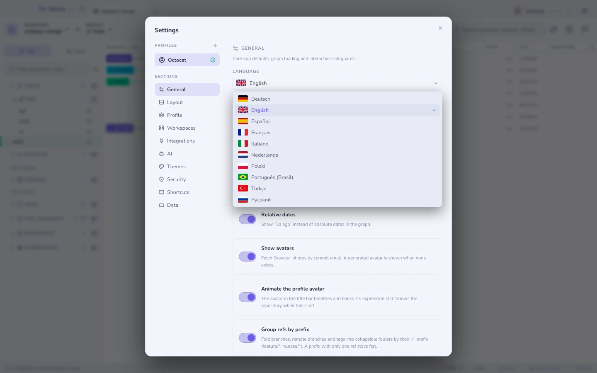
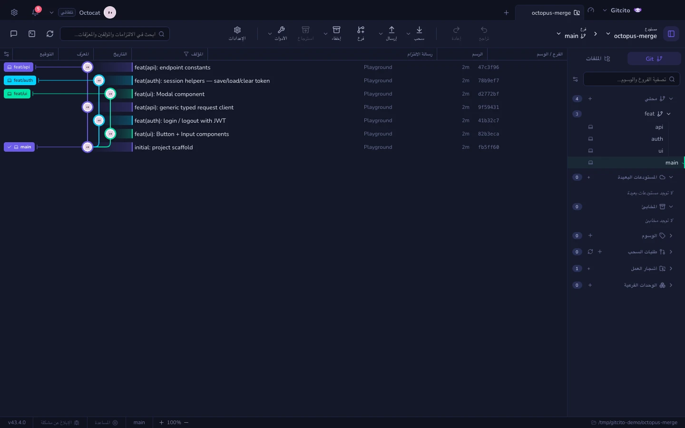

# اللغات والاتجاه من اليمين إلى اليسار

واجهة Gitcito مترجمة. واللغة إعداد في Gitcito لا في نظام
التشغيل — فمطوّر على macOS إنجليزي يفضّل القراءة باليابانية يضبطها هنا، ومطوّر
على نظام عبري يفضّل التطبيق بالإنجليزية لا يُفرض عليه غير ذلك.

**الإعدادات ← عام ← اللغة.**

## ما يأتي مع التطبيق

| | | | |
|---|---|---|---|
| English | Español | Deutsch | Français |
| Português (Brasil) | Italiano | Nederlands | Polski |
| Türkçe | Русский | Українська | 简体中文 |
| 日本語 | 한국어 | العربية | עברית |

كل صف في المنتقي مكتوب بلغته هو. فمن يبحث عن الكورية يفتش عن 한국어، لا عن كلمة
«Korean» بلغة يحاول أن يغادرها.

### عن الأعلام

العَلَم يسمّي بلدًا؛ واللغة المحلية تسمّي لغة. والاثنان لا يتطابقان حقًا —
فالعربية لغة رسمية في أكثر من عشرين دولة، والبرتغالية على قارتين. تتبع الأيقونات
العرف نفسه الذي يتبعه منتقي اللغات في كل نظام تشغيل: المنطقة الأساسية للغة. وهي
موجودة كي *تُعرَف من نظرة واحدة*، لا كي تدّعي شيئًا عن مِلكية لغة لأحد.

وهي مرسومة رسمًا متجهيًا لا كرموز تعبيرية، عن قصد. فويندوز لا يأتي برموز أعلام
تعبيرية أصلًا — إذ يُعرَض `🇩🇪` هناك مربعًا يحوي الحرفين "DE".

## من اليمين إلى اليسار

تعكس العربية والعبرية الواجهة كلها: ينتقل الشريط الجانبي إلى اليمين، وتنقلب
اللوحات وأشرطة الأدوات، والأيقونات التي تشير إلى جهة تشير إلى الجهة الأخرى.

والتبديل فوري ولا يحتاج إلى إعادة تشغيل.

### ما لا ينعكس عن قصد

بعض المحتوى يبقى من اليسار إلى اليمين مهما كانت اللغة التي تقرأ بها. فعكسه سيكون
خطأً صريحًا، ولذلك تبقى هذه كما هي:

| يبقى من اليسار إلى اليمين | لماذا |
|-----------|-----|
| الرسم البياني للالتزامات | مواضع المسارات تُحسب بالبكسل؛ وحاوية معكوسة ستخالف الخطوط المرسومة |
| الفروق ومحتويات الملفات | الشيفرة تُكتب من اليسار إلى اليمين، والفرق المعكوس غير قابل للقراءة |
| مخرجات blame والتعارضات | السبب نفسه — فالنص شيفرة مصدرية لا نثر |
| الطرفية المدمجة | ترسم شبكتها الخاصة؛ ومخرجات git من اليسار إلى اليمين |
| المسارات وبصمات SHA والمراجع والأوامر | `refs/heads/main` يُقرأ في اتجاه واحد لا غير |

وكل واحد من هذه معزول، حتى إن مقطعًا عربيًا *داخله* — اسم فرع أو رسالة التزام أو
اسم ملف — لا يستطيع أن يعيد ترتيب النص من حوله.

### الحدود

هذا كلام صريح عن الموضع الذي يتوقف عنده كل هذا:

- **رسائل الالتزام وأسماء الفروع ومحتويات الملفات لا يعيد Gitcito توجيهها
  أبدًا.** تُعرض كما كتبها صاحبها. فرسالة التزام بالعبرية داخل قائمة معزولة
  باتجاه من اليسار إلى اليمين تُعرض بالعبرية، لكن الصف المحيط بها لا ينقلب
  استيعابًا لها.
- **الأسطح الخارجية تحتفظ باتجاهها الخاص** — فالطرفية هي xterm، ومعاينات
  Markdown تعرض المستند كما كُتب.
- **أسماء الملفات مختلطة الاتجاه صعبة.** فمسار فيه مجلد عربي داخل شجرة إنجليزية
  يُعزل بدل أن يُعاد ترتيبه، وهذا هو الصواب، لكنه قد يبدو مفاجئًا في المرة
  الأولى.

## هذا الدليل مترجَم أيضًا

ليست الأزرار وحدها. فكل صفحة تقرؤها موجودة بكل لغة تعرضها القائمة أعلاه — الشروح،
والجداول التي تبيّن ما يفعله كل خيار، والأقسام التي تقول ما ترفض ميزةٌ ما فعله. وتبديل
لغة الواجهة يبدّل الدليل معها، في التطبيق وفي الموقع سواء.

ويحق للترجمة أن تكون ناقصة. فإن لم تكن صفحة قد تُرجمت بعد، ستحصل على الإنجليزية
بدل صفحة غائبة، ويحتفظ الشريط الجانبي بالشكل نفسه في كل لغة، حتى تبقى لقطة شاشة
أو تعليمة متطابقة مع ما تراه أمامك.

وفي الموقع تحمل كل صفحة مبدّل لغة يُبقيك في الصفحة التي كنت تقرؤها، لأن تغيير
اللغة ليس كالبدء من جديد.

**ما الذي تُرجم آليًا، وما ثمن ذلك.** الإنجليزية والإسبانية كُتبتا يدويًا. أما
البقية فترجمها نموذج بالاستناد إلى مسرد مصطلحات، ثم فحصها سكربت: كل صفحة، وكل
رابط، وكل مسار صورة، وكل كتلة شيفرة، بايتًا ببايت مقابل الإنجليزية. هذا يمسك
البنية المكسورة، ولا يمسك جملة صحيحة لكنها متخشبة. فإن كانت صفحة تُقرأ بشكل
رديء بلغتك، فتلك علة تستحق الإبلاغ عنها.

## إضافة لغة

القواميس ملف واحد لكل لغة تحت `src/renderer/src/i18n/`، والملف الإنجليزي هو
المرجع الذي تُفحص كل اللغات الأخرى تجاهه بالأنواع — فالمفتاح الناقص خطأ ترجمة، لا
سقوط صامت إلى الإنجليزية. وتتحقق مجموعة الاختبارات أيضًا من أن كل `{placeholder}`
يُدرجه نص ما ينجو من الترجمة، حتى لا تفقد جملة بصمة التزامها في طريقها إلى لغة
أخرى.

والدليل يعمل بالطريقة نفسها: `docs/help/` يحوي الصفحات الإنجليزية،
و`docs/help/<locale>/` يحوي كل ترجمة، ملفًا واحدًا لكل صفحة بالاسم نفسه. ويتحقق
`npm run lint:docs` من أن لكل صفحة مترجَمة أصلًا إنجليزيًا، وأن كتلة front matter
فيها كاملة، وأن روابطها وصورها تُحَلّ من مستوى مجلد أعمق.

والمساهمات مرحَّب بها — صفحة واحدة في كل مرة أمر جيد، وتصحيح ترجمة ركيكة لا يقل
نفعًا عن إضافة ترجمة ناقصة.

**انظر أيضًا:** [السمات والمظهر](themes.md) · [الملفات الشخصية](profiles.md)
