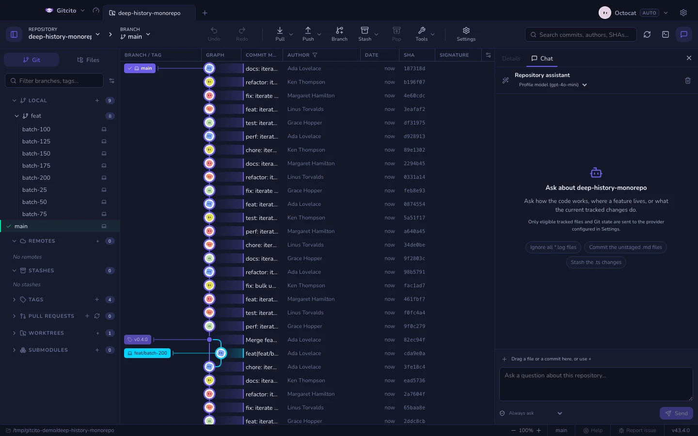

# دردشة المستودع

بعض الأسئلة يُجاب عنها بالسؤال أسرع من البحث. *أين يحدث تحديث الرمز فعلياً؟ ماذا
غيّر هذا الالتزام في جملة واحدة؟ ولماذا يوجد هذا الملف؟* دردشة المستودع تجيب عن
ذلك اعتماداً على المستودع المفتوح، وتعرض الأسطر التي بنت عليها إجابتها.

تتشارك العمود الأيمن مع **التفاصيل**: تبدّل بينهما الألسنة في الأعلى، فلا يفقد
الرسم البياني تحديده حين تسأل شيئاً.

## ما الذي تقرأه

تُبنى كل إجابة على مرحلتين. تختار الأولى مجموعة صغيرة من المسارات وعمليات البحث
الحرفية من قائمة الملفات المتعقبة في المستودع نفسه. وتجيب الثانية اعتماداً على
المقتطفات التي أعادتها الأولى فقط، ولا يجوز لها الاستشهاد بغيرها: الملف أو السطر
المُختلق خطأ في التحقق، لا إجابة تبدو معقولة.

| مشمول | مستبعد |
|---|---|
| الملفات المتعقبة كما هي في شجرة العمل | الملفات غير المتعقبة |
| فروق الملفات المتعقبة، المُدرجة وغير المُدرجة | كل ما تطابقه قاعدة تجاهل، حتى لو كان متعقباً |
| الفرع، والتقدّم/التأخّر، وقائمة المسارات المتغيّرة | [الملفات التي تبدو أسراراً](security.md)، والملفات الثنائية، والمسارات المولّدة |

قراءة شجرة العمل تعني أن بإمكانك السؤال عن تعديلات لم تلتزم بها بعد. وتعني أيضاً
أن تلك التعديلات تغادر جهازك عند السؤال: يستقبلها المزوّد المضبوط في
[ميزات الذكاء الاصطناعي](ai.md).

فارق دقيق واحد: مع تفعيل اقتراح الإجراءات (انظر «تنفيذ الإجراءات من الدردشة»
أدناه)، تُضمَّن **أسماء** الملفات غير المتعقبة في حالة المستودع — «أدرج الملف
الجديد» يحتاج إليها — لكن محتواها يبقى غير مقروء أبداً.

## تثبيت السياق

النموذج هو من يقرر ما يقرأ. والتثبيت وسيلتك لتجاوز قراره: ما يُثبَّت يُقرأ **أولاً**
ويأخذ الحصة الأكبر من ميزانية السياق.

أربع طرق للتثبيت، وكلها تصل إلى صف الشرائح نفسه فوق صندوق الرسالة:

| افعل هذا | تحصل على |
|---|---|
| انقر شريحة مقترحة | الملف المفتوح في العارض، أو الالتزام المحدد في الرسم البياني |
| اسحب صفاً من لسان **الملفات** | ذلك الملف |
| اسحب صفاً من **الرسم البياني للالتزامات** | ذلك الالتزام: رسالته وفروقه على شكل مقاطع |
| **+** ← *اختيار ملف…*، أو السحب من Finder أو مستكشف الملفات | أي ملف على القرص، بما في ذلك خارج المستودع |

تبقى الشرائح مثبّتة للأسئلة اللاحقة؛ يزيل `×` واحدة، ومسح المحادثة يزيلها كلها.
الحد الأقصى ثماني شرائح.

يسهم الالتزام المثبّت برسالته وبما يصل إلى اثني عشر مقطعاً من الفروق. والمقاطع التي
تمس مساراً مستبعداً تُحذف من تلك الفروق، لا الالتزام كله.

## الإعدادات

**الإعدادات ← الذكاء الاصطناعي ← دردشة المستودع**:

| الإعداد | ما يفعله |
|---|---|
| **اطرح أسئلة عن المستودع** | إيقافه يزيل اللسان وزر شريط الأدوات وهدف الاختصار، وتبقى بقية ميزات الذكاء الاصطناعي تعمل |
| **نموذج الدردشة** | نموذج للدردشة وحدها. الفراغ يعني نموذج الملف الشخصي؛ فالسؤال أقل كلفة من المراجعة، ونموذج أصغر يكفي غالباً |
| **المحتوى المُلتزم فقط** | يجيب انطلاقاً من آخر التزام بدل شجرة العمل، فلا تغادر التعديلات غير المُلتزمة هذا الجهاز |
| **اقتراح إجراءات Git في الدردشة** | إيقافه يعيد الدردشة قراءةً محضة: لا بطاقات إجراءات ولا قائمة موافقة منسدلة |
| **كيف تُنفَّذ الإجراءات المقترحة** | وضع الموافقة — انظر «أوضاع الموافقة» أدناه. الإجراءات المدمّرة تطلب التأكيد في كل الأحوال |

وعند إيقاف الذكاء الاصطناعي كلياً تختفي الدردشة معه: لا لوحة تعرض إجابة لا يستطيع
أحد تقديمها.

يمكن أيضاً تبديل نموذج الدردشة من رأس اللوحة نفسها، بجوار اسم المزوّد؛ وهو الإعداد
نفسه من دون فتح الإعدادات.

يفتح زر العصا السحرية بجوار عنوان اللوحة **معالج إعداد الذكاء الاصطناعي** —
مسار موجَّه يولّد ملفات إعداد المساعد (التعليمات والوكلاء والخطافات) لهذا
المستودع. انظر [ميزات الذكاء الاصطناعي](ai.md).

## التعامل مع الرسائل

الرسائل نص عادي. حدّد أي جزء منها وانسخه، أو انقر بزر الفأرة الأيمن على فقاعة:
**نسخ** يأخذ التحديد، و**نسخ الرسالة** الرسالة كاملة — تُنسخ الإجابة بصيغة
Markdown المصدرية — وإذا وقع النقر على رابط، فإن **نسخ الرابط** يأخذ عنوانه.

تُفتح الروابط دائمًا في متصفحك الافتراضي، وليس داخل Gitcito أبدًا — روابط
Markdown في الإجابات والعناوين `https://` في رسائلك على حد سواء.

عندما تذكر رسالة صورة — مسارًا في المستودع مثل `docs/logo.png` أو عنوان URL
ينتهي بامتداد صورة — فإن تمرير المؤشر فوق الذكر يعرض معاينة صغيرة. تُقرأ
مسارات المستودع من شجرة العمل لديك؛ والذكر الذي لا يقود إلى صورة قابلة للقراءة
لا يعرض شيئًا.

## تنفيذ الإجراءات من الدردشة

اطلب تغييراً بدل معلومة — *أدرج ملفات Markdown، التزم بهذا كإصلاح، ضع مخرجات
البناء في قائمة التجاهل* — فيصل الرد ومعه **بطاقة إجراءات**. تعرض المحادثة
الفارغة بضعة طلبات نموذجية كشرائح أسفل المقدمة؛ والنقر على إحداها يملأ صندوق
الكتابة لتتمكن من تحريرها قبل الإرسال. تسرد البطاقة الخطوات الملموسة
التي يريد المساعد اتخاذها، صف لكل إجراء، مع زرَّي **تنفيذ** و**رفض**. لا شيء في
البطاقة قد حدث بعد؛ فالنموذج لا يملك إلا الاقتراح، وكل اقتراح يُفحص مقابل شجرة
العمل قبل أن تراه أصلاً — الإجراء الذي يسمّي ملفاً لا وجود له يُرفض ولا يُعرض.

يمكن لدردشة المستودع اقتراح تعديلات نصية دقيقة، وإنشاء ملف كامل أو استبداله،
وحذف الملفات، ثم متابعة إجراءات Git التي يوفرها مساعد **تشغيل**. يحسب Gitcito
الفرق القابل للتوسيع محلياً. يجب أن تكون الملفات الموجودة ضمن الأدلة التي قرأها
المساعد؛ وتُرفض الأهداف غير الآمنة أو السرية أو المتجاهلة أو المولدة أو الثنائية
أو القديمة أو الكبيرة جداً أو التي تمر عبر رابط رمزي. تبقى عمليات push وpull
وreset وrebase والعمليات القسرية في واجهتها المخصصة.

تُراجع دفعة الملفات كاملة قبل أول كتابة ويُتراجع عنها إذا فشلت خطوة. وقبل
الالتزام يتحقق Gitcito من وجود تغييرات في منطقة التجهيز. تعرض البطاقة كل إجراء
مكتمل أو فاشل أو متجاوز وتحفظ النتيجة الجزئية. بعد ذلك تلخص مكالمة منفصلة بلا
إجراءات النتيجة الفعلية.

### أوضاع الموافقة

القائمة المنسدلة ذات الدرع أسفل صندوق الكتابة (وهي أيضاً في **الإعدادات ← الذكاء
الاصطناعي ← دردشة المستودع**) تقرر كيف تُنفَّذ البطاقة:

| الوضع | ما يُنفَّذ |
|---|---|
| **السؤال دائماً** | لا شيء حتى تضغط **تنفيذ** على البطاقة |
| **تنفيذ الإجراءات الآمنة تلقائياً** | الاقتراحات المكوّنة حصراً من ترتيب قابل للتراجع — الإدراج وإلغاؤه والتجاهل والفروع والوسوم — تُنفَّذ فور وصولها؛ وما عداها ينتظر الزر |
| **تنفيذ كل الإجراءات تلقائياً** | كل اقتراح يُنفَّذ فور وصوله، باستثناء المدمّر منها |

الاقتراح الذي **يتخلص من تعديلات غير مُلتزم بها يسأل أولاً دائماً**، في كل
الأوضاع، ويسمّي التأكيدُ الملفاتِ التي ستضيع. وتُبلغ البطاقة عمّا حدث فعلاً — كم
إجراءً نُفِّذ، أو الخطأ الذي أوقفها — ويُخبَر المساعد بالنتيجة، فيعرف السؤال
اللاحق هل نُفِّذت خطته أم رُفضت.

### إصلاح الأخطاء مع المساعد

حين تفشل عملية Git ودردشة الذكاء الاصطناعي متاحة، يظهر على تنبيه الخطأ زر بريق:
يفتح الدردشة وقد لُصق الفشل في صندوق الكتابة، فيصبح «لماذا فشل هذا وماذا أفعل»
نقرة واحدة. المسودة قابلة للتحرير — لا يُرسل شيء حتى تضغط إرسال.

## ما ترفضه

- **الملفات التي تبدو أسراراً لا تُقرأ أبداً**، مثبّتة كانت أو لا: تعود الشريحة
  موسومة بأنها متجاوَزة، مع السبب. التثبيت ليس طريقاً للالتفاف على
  [إخفاء الأسرار](security.md).
- **الملفات الثنائية وما يتجاوز 512 كيلوبايت** من خارج المستودع تُتجاوَز بالطريقة
  نفسها. أما داخل المستودع فتسري القواعد المعتادة.
- **لا تكتب من تلقاء نفسها أبداً.** لا أدوات لدى النموذج، نص فقط: يصل التغيير
  بطاقةَ اقتراح، ولا يُنفَّذ إلا وفق قواعد الموافقة التي اخترتها (انظر «أوضاع
  الموافقة» أعلاه)، والخطوة المدمّرة تؤكَّد دائماً. ومع إيقاف **اقتراح إجراءات
  Git في الدردشة** لا تقترح حتى.
- **تعيش المحادثات في الذاكرة وحدها.** لكل مستودع خيطه المستقل، وإغلاق Gitcito
  يتخلص منها.

## كيف تفتحها

| المفاتيح | ما تفعله |
|---|---|
| زر فقاعة الحوار في شريط الأدوات | يُظهر لسان الدردشة أو يخفيه |
| <kbd>⌘⌥B</kbd> / <kbd>Ctrl+Alt+B</kbd> | يُظهر اللوحة اليمنى كاملة أو يخفيها |
| <kbd>⌘⏎</kbd> / <kbd>Ctrl+Enter</kbd> | يُرسل الرسالة |

انظر [لوحة المفاتيح والاختصارات](keyboard.md) لبقية التفاصيل، بما فيها إعادة تعيين
مفاتيح اللوحات.

**انظر أيضاً:** [ميزات الذكاء الاصطناعي](ai.md) · [الأمان والأسرار](security.md) ·
[ويكي المستودع](repo-wiki.md)
