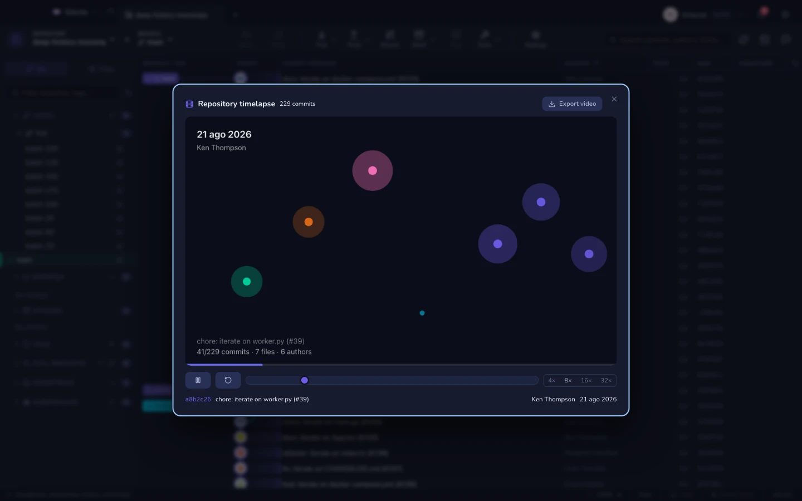

# الشريط الزمني

شاهد المستودع وهو ينمو.

كل ملف نقطة، موضوعة بحسب مجلدها الأعلى: تُولد حين يُضاف، وتنبض حين يمسّها
التزام، وتنتفخ كلما حُرِّر مرة بعد مرة، وتخبو حين يُحذف. ويجلس في الأعلى التاريخ
والمؤلف والعنوان وعدّادات جارية للالتزامات والملفات والمؤلفين، مع شريط تقدّم
على طول الأسفل.

## أدوات التحكم

- **تشغيل / إيقاف مؤقت**، وسرعات من **4× إلى 32×**، وإعادة من البداية.
- والمؤشر يبحث بـ **إعادة التشغيل من البداية**، فالتصفح رجوعًا يهبط على العالم
  الصحيح بالضبط لا على تقريب له.

## تصدير فيديو

**تصدير فيديو** يسجّل اللوحة من طرف إلى طرف ويسألك أين تحفظ ملف `.webm`.

ويحدث التسجيل في الصفحة نفسها (`MediaRecorder`) — فلا مرمّز تثبّته، ولا ffmpeg،
ولا شيء يُرفع إلى أي مكان. ولا يُكتب شيء على القرص حتى تختار مسارًا.

> المستودع ذو الشكل الحقيقي يصنع فيلمًا أفضل من المستودع المرتَّب. فإعادات
> التسمية والحذف والمجلد الذي ينفجر فجأةً هي ما يجعله يستحق المشاهدة.

**انظر أيضًا:** [آلة الزمن](time-machine.md) · [الرؤى](insights.md)
