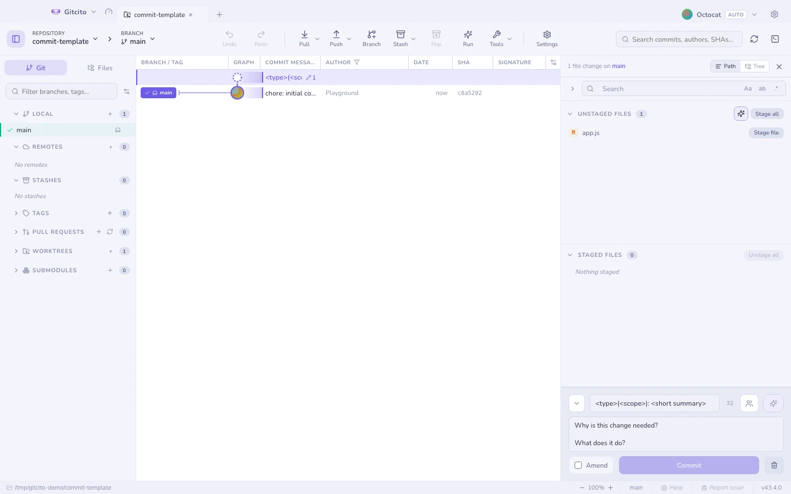

# Committen

## Nachrichtenstile

Wähle einen in den Einstellungen; der Editor passt sich daran an.

| Stil | Sieht so aus |
|---|---|
| **Conventional** | `feat(api)!: add rate limiting` — mit einer Typ-Auswahl |
| **Gitmoji** | `✨ add rate limiting` — mit einer Emoji-Auswahl |
| **Ticket** | `ABC-123: add rate limiting` — aus dem Branch-Namen vorbefüllt |
| **Plain** · **Auto** | Was immer du tippst; bei Auto entscheidet die KI über die Form |
| **Caveman** · **Haiku** | Genau das, wonach es klingt |

## Was der Editor für dich erledigt

- <kbd>↑</kbd> <kbd>↓</kbd> holt deine **letzten Nachrichten** zurück.
- Eine **Co-Autoren-Auswahl** fügt `Co-authored-by:`-Trailer aus den eigenen
  Mitwirkenden des Repositorys ein.
- `commit.template` / `.gitmessage` **befüllt** die Nachricht vor,
  Kommentarzeilen entfernt.
- Während eines Merge, Cherry-Pick oder Revert ist die Nachricht **vorbefüllt**,
  so wie git es täte.
- Entwürfe **bleiben** pro Repository erhalten, ein Tab-Wechsel verliert also
  nie eine Nachricht.

## Der Linter

Eine laufende, nicht blockierende Prüfung: Länge der Betreffzeile (mit
Zeichenzähler), ein Punkt am Ende, ein nicht-imperativer oder kleingeschriebener
Betreff, zu breite Zeilen im Textkörper. Hinweise, niemals eine Schranke — er
hält dich nicht vom Committen ab.

## Amend

Amend schreibt den letzten Commit mit dem um, was gerade gestaged ist. Gitcito
zeigt dir zuerst die vorhandene Nachricht, damit du sie bearbeitest, statt sie
neu zu tippen.

**Siehe auch:** [Staging](staging.md) · [Absorbieren](absorb.md) · [Changelog-Generator](changelog.md)
