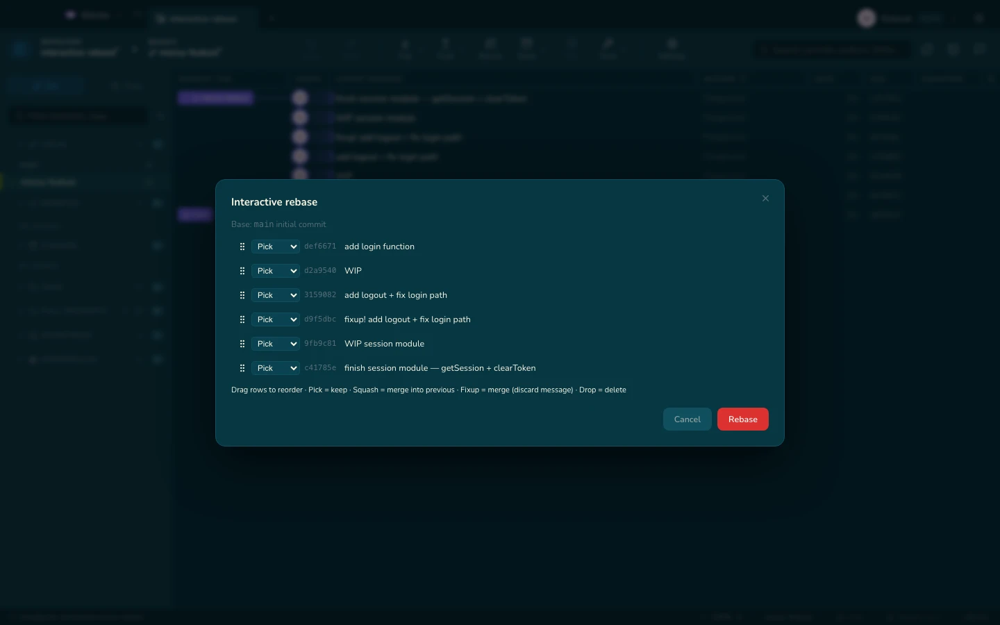

# Interaktiver Rebase

Die Todo-Liste von `git rebase -i`, als Liste, die du ziehen kannst.

| Aktion | Bedeutet |
|---|---|
| **pick** | So lassen, wie er ist |
| **reword** | Die Änderung behalten, die Nachricht bearbeiten |
| **squash** | In den Commit darüber einfalten, beide Nachrichten zusammenführen |
| **fixup** | In den Commit darüber einfalten, diese Nachricht verwerfen |
| **edit** | Hier anhalten, damit du nachbessern kannst |
| **drop** | Den Commit wegwerfen |

Zieh Zeilen, um sie umzusortieren. Der Editor öffnet sich nie in einem Terminal
— Gitcito schreibt die Todo-Liste für dich.

## Autosquash, ein Klick

- **Gestagte Änderungen in diesen Commit einarbeiten** erzeugt den `fixup!` für
  dich.
- **Fixups ab hier automatisch zusammenfassen** faltet jeden `fixup!` /
  `squash!` in sein Ziel.

Wenn du statt einer einzelnen Korrektur einen ganzen Stapel Review-Fixes hast,
findet [Absorbieren](absorb.md) heraus, zu welchem Commit jeder Hunk gehört —
damit du es nicht musst.

> Ein Rebase schreibt Historie um. Alles, was schon gepusht wurde, braucht
> danach einen Force-Push, und wer es reviewt hat, will
> [was sich geändert hat seit](range-diff.md) sehen.

**Siehe auch:** [Absorbieren](absorb.md) · [Was sich geändert hat seit](range-diff.md) · [Wiederherstellung](recovery.md)
