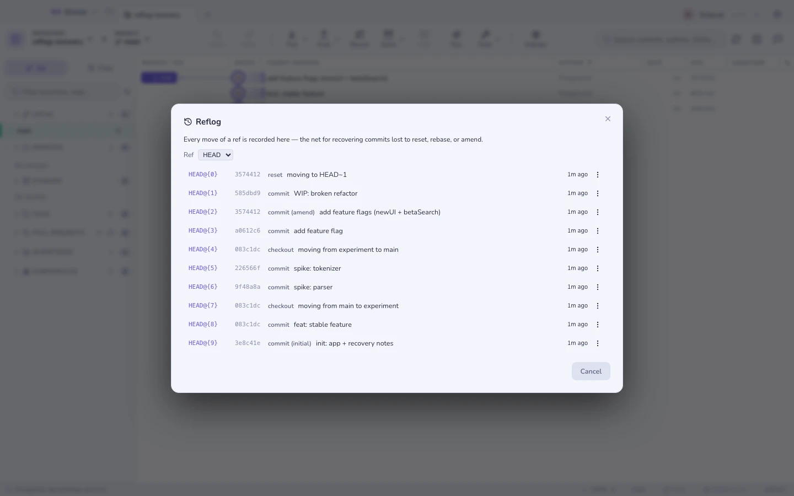
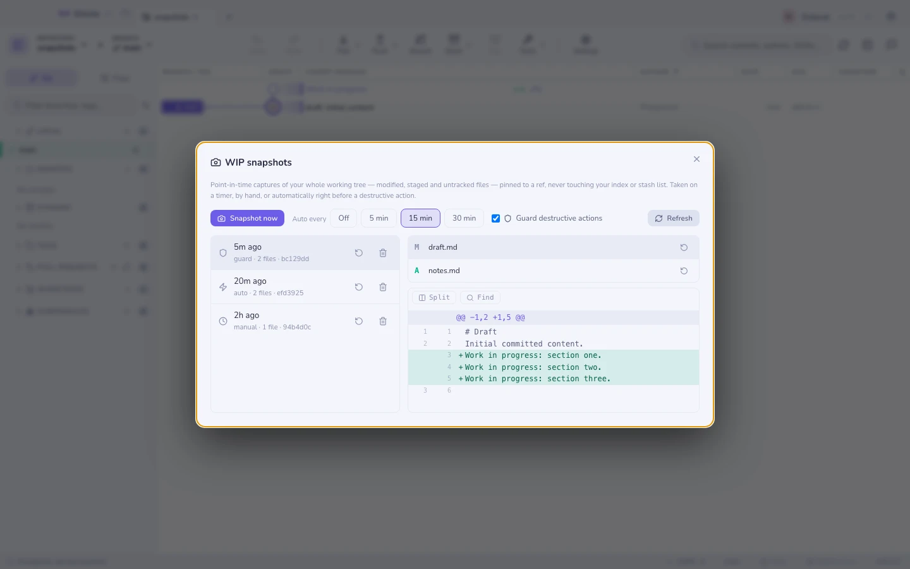
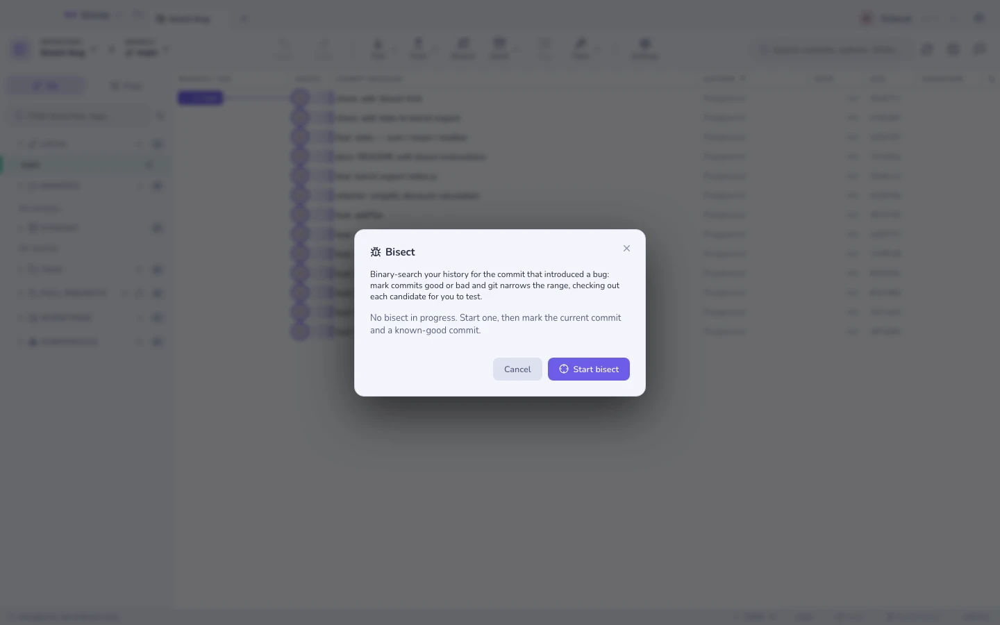
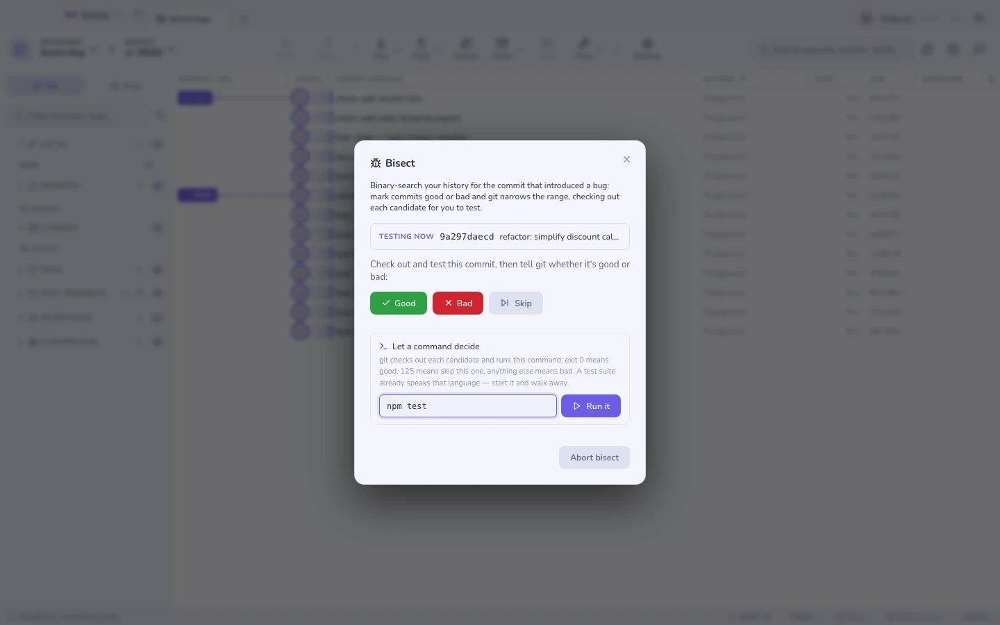

# Wiederherstellung & das Reflog

Git verliert selten etwas. Das Schwierige ist, es wiederzufinden.

## Reflog

Jede Bewegung von `HEAD` — und von jedem Branch — samt dem, was sie ausgelöst
hat: Checkout, Reset, Rebase, Amend, ein erzwungener Fetch. Von jedem früheren
Eintrag aus kannst du ihn **auschecken**, **einen Branch davon abzweigen** oder
**hart dorthin zurücksetzen**.



Das ist der „ich habe gerade den falschen Branch zurückgesetzt“-Knopf.

## WIP-Schnappschüsse

Nicht committete Arbeit ist das Einzige, was das Reflog nicht retten kann, also
macht Gitcito Schnappschüsse davon: das **gesamte Arbeitsverzeichnis —
geänderte, gestagte und ungetrackte Dateien** — committet über einen
Wegwerf-Index und festgepinnt unter `refs/gitcito/wip`. Weder dein echter Index
noch deine Stash-Liste werden angefasst.



Drei Dinge nehmen einen auf:

| Auslöser | Wann |
|---------|------|
| **Wächter** | Automatisch, direkt vor einer destruktiven Aktion — Verwerfen, Bereinigen, Hard Reset, Wiederherstellen aus einem Commit. Standardmäßig an; im Schnappschuss-Dialog umschaltbar. |
| **Timer** | Alle 5 / 15 / 30 Minuten, solange das Repo geöffnet ist. |
| **Von Hand** | Der Knopf **Jetzt Schnappschuss aufnehmen**. |

Der Wächter ist der entscheidende: Der Moment, in dem Arbeit gewöhnlich für
immer verloren geht, ist die Sekunde nach einem Verwerfen, das du nicht gemeint
hast. Mit eingeschaltetem Wächter ist dieser Zustand ein Schnappschuss — öffne
die Liste, klick auf Wiederherstellen, atme wieder durch.

Wähl einen Schnappschuss aus, um die erfassten Dateien zu sehen, die Änderung
jeder Datei in der Vorschau zu betrachten und eine **einzelne Datei** oder das
ganze Arbeitsverzeichnis wiederherzustellen. Wiederherstellen kopiert Dateien
aus dem Schnappschuss über die aktuellen Kopien — vorher wird ein
Wächter-Schnappschuss aufgenommen, sodass sich eine Wiederherstellung selbst
rückgängig machen lässt.

**Grenzen, die man kennen sollte.** Ein Timer- oder Wächter-Durchlauf, der
nichts Neues findet, zeichnet nichts auf. Wiederherstellen überschreibt Dateien
und legt sie neu an, löscht aber nie eine Datei, die du nach dem Schnappschuss
erstellt hast. Ignorierte Dateien werden nicht erfasst. Schnappschüsse sind
lokale versteckte Refs: nie gepusht, sicher vor `git gc`, die neuesten 50
werden behalten.

## Geführtes Bisect

Markier Commits als gut und schlecht, sieh zu, wie der Bereich enger wird, und
lande beim ersten schlechten Commit. Gitcito verfolgt mit, wie viele Schritte
noch bleiben, damit du weißt, ob du zwei Fragen von der Antwort entfernt bist
oder zehn.



### Einen Befehl entscheiden lassen

Sobald der Bereich abgesteckt ist, übergibt **Einen Befehl entscheiden lassen**
die gesamte Suche an `git bisect run`. Git checkt jeden Kandidaten aus, führt
deinen Befehl aus und liest dessen Exit-Code:

| Exit-Code | Bedeutet |
|-----------|-------|
| `0` | Gut — der Fehler steckt nicht hier |
| `125` | Lässt sich nicht testen; überspringen |
| alles andere | Schlecht |

Eine Testsuite spricht diese Sprache bereits, deshalb ist `npm test` meist schon
die ganze Antwort. Gitcito bietet die Skripte dieses Projekts als Ein-Klick-
Vorlagen an, streamt die Ausgabe während des Laufs und landet beim ersten
schlechten Commit, ohne dass du eine einzige Frage beantwortest.



**Worauf du achten solltest.** Der Befehl läuft bei *jedem* Commit, den git
testet — ein Befehl, der deployt, veröffentlicht oder außerhalb des Repositorys
schreibt, tut das also mehrfach. Beschränk ihn auf etwas, das nur liest und
berichtet. **Stoppen** beendet den Lauf und lässt die Sitzung offen, sodass du
von Hand weitermarkieren kannst; **Bisect abbrechen** beendet das Bisect ganz.

Ein Befehl, der aus einem unabhängigen Grund fehlschlägt — etwa eine an dieser
Stelle der Historie fehlende Abhängigkeit — markiert einen guten Commit als
schlecht und schickt die Suche in die falsche Richtung. Ein Wrapper-Skript, das
mit `125` beendet, ist gits Ausweg daraus.

## Eine übrig gebliebene Sperrdatei

Git legt eine `.lock`-Datei neben das, was es gleich schreibt, und entfernt sie,
wenn der Schreibvorgang durch ist. Ein Prozess, der mit ihr in der Hand stirbt —
ein abgestürzter Editor, ein während `git commit` geschlossenes Terminal, ein
Fetch, der beim Aufräumen von Remote-Refs abgeschossen wurde — lässt die Sperre
zurück, und von da an scheitert jeder Schreibvorgang an derselben Zeile:

```
error: could not delete references: cannot lock ref 'refs/remotes/origin/x':
Unable to create '…/refs/remotes/origin/x.lock': File exists.
```

Das Repository ist nicht beschädigt. Es liegt schlicht eine Datei im Weg.

Gitcito versucht es zuerst ein paar Mal erneut, denn eine Sperre in der Hand
eines *laufenden* git löst sich meist binnen Millisekunden. Wenn nicht, öffnet
der Fehler einen Dialog statt einer Textwand: jede Sperre, die noch auf der
Platte liegt, wie alt sie jeweils ist, und eine Schaltfläche, die sie entfernt
und die gescheiterte Aktion erneut ausführt.

**Das Alter ist das ganze Argument.** Eine Sperre, die jünger als 30 Sekunden
ist, gehört vermutlich einem git, das noch arbeitet — Gitcito weigert sich, sie
zu löschen, und bietet stattdessen Warten und Wiederholen an. Ältere werden zum
Entfernen angeboten, die ältesten zuerst, und der Dialog sagt klar, was vorher
zu prüfen ist: dass gerade kein Editor, kein Terminal und kein anderer
Git-Client in diesem Repository arbeitet. Eine Sperre unter einem laufenden
Schreibvorgang wegzunehmen ist der Weg zu einem zerrissenen Index.

Der Suchlauf deckt das eigene Git-Verzeichnis des Repositorys und sein
Common-Verzeichnis ab, findet also auch die Sperren eines verknüpften Worktrees.
Submodule werden übersprungen — sie gehören zu einem anderen Repository und
werden aufgeräumt, indem man dieses öffnet.

## Undo / Redo

Die meisten Operationen legen einen Eintrag auf einen Undo-Stapel, sodass
<kbd>⌘Z</kbd> die letzte davon rückgängig macht, wo git es zulässt.

**Siehe auch:** [Was sich geändert hat seit](range-diff.md) · [Stashes](stashes.md)
