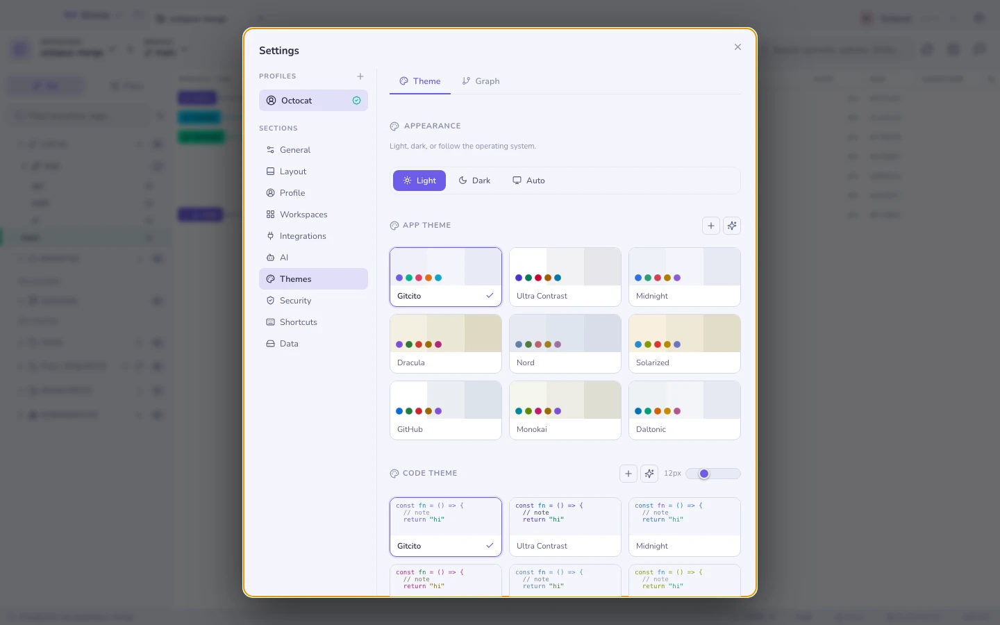

# Themes & Erscheinungsbild

Eingebaute Themes — Gitcito, Nord, Dracula, Solarized, GitHub, Monokai,
Midnight, Contrast und Daltonic — jedes mit einer hellen und einer dunklen
Variante.

- **Hell, dunkel oder dem Betriebssystem folgen**, live umgeschaltet.
- **Eigene Themes** und **KI-generierte** aus einem Prompt.
- Anpassbare **Code-Schriftgröße**.
- Ein eigener **Graph-Stil**: Spurenpalette, Eckenstil, Zeilendichte und
  Linienstärke, mit einer Live-Vorschau als Mini-Graph.

## Layout

Seitenleiste links oder rechts, überall größenveränderbare Panels, eine
einklappbare Seitenleiste für die Momente, in denen der Graph das ganze Fenster
verdient, und eine Terminal-Platzierung pro Repository.

**Siehe auch:** [Der Commit-Graph](graph.md) · [Profile](profiles.md)
