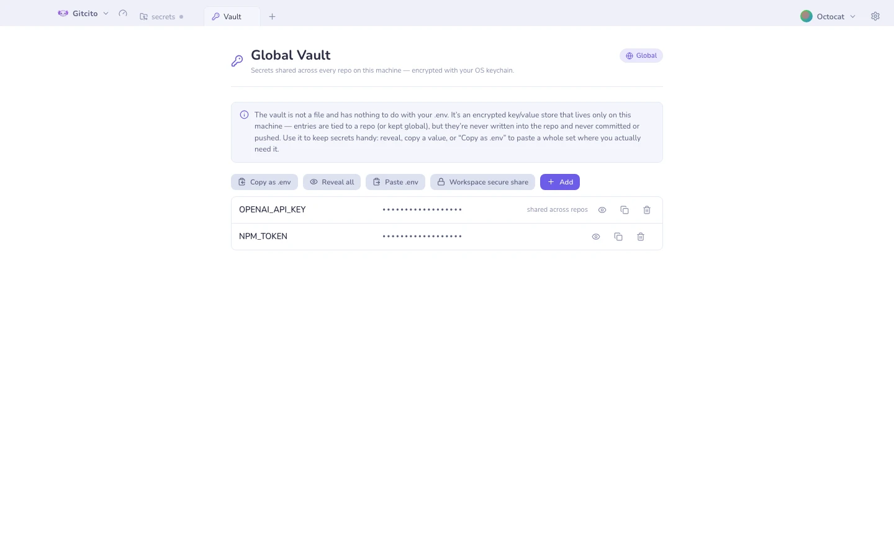

# Tresor

Die `.env`-Werte, die ein Projekt braucht, müssen irgendwo liegen. Der Tresor ist
dieses Irgendwo, ohne dass sie im Repository landen.

- **Verschlüsselt gespeichert** mit dem Schlüsselbund deines Betriebssystems.
- **Zwei Geltungsbereiche**: Einträge, die an ein Repository gebunden sind, und
  ein **globaler** Satz, den du von überall referenzieren kannst.
- **Keine Datei, und nichts mit deiner `.env` zu tun.** Einträge sind einem
  Repository *zugeordnet*, werden aber nie hineingeschrieben, nie committet, nie
  gepusht.
- **Nichts verlässt jemals deinen Rechner.** Kein Sync, keine Cloud.

## Benutzung

Öffne ihn mit <kbd>⌘⇧V</kbd>, über das Werkzeugmenü, über die Einstellungen oder
über die Befehlspalette. Wechsle zwischen beliebigen bekannten Repositorys, zeige
oder kopiere einen Wert, oder kopiere mit **Als .env kopieren** einen ganzen Satz
direkt in die Zwischenablage.

## Ihn zwischen Rechnern bewegen

[Sicheres Teilen](secure-share.md) kann den Tresor in ein verschlüsseltes Bundle
packen — und nur dann, wenn du ausdrücklich darum bittest, Secrets einzuschließen.

**Siehe auch:** [Sicherheit & Secrets](security.md) · [Sicheres Teilen](secure-share.md)
