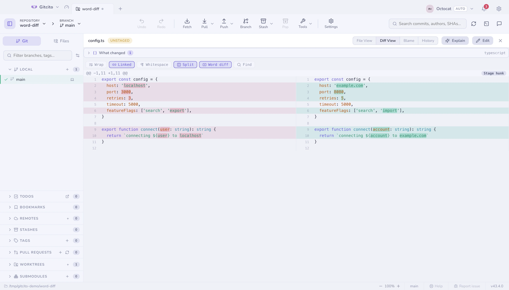
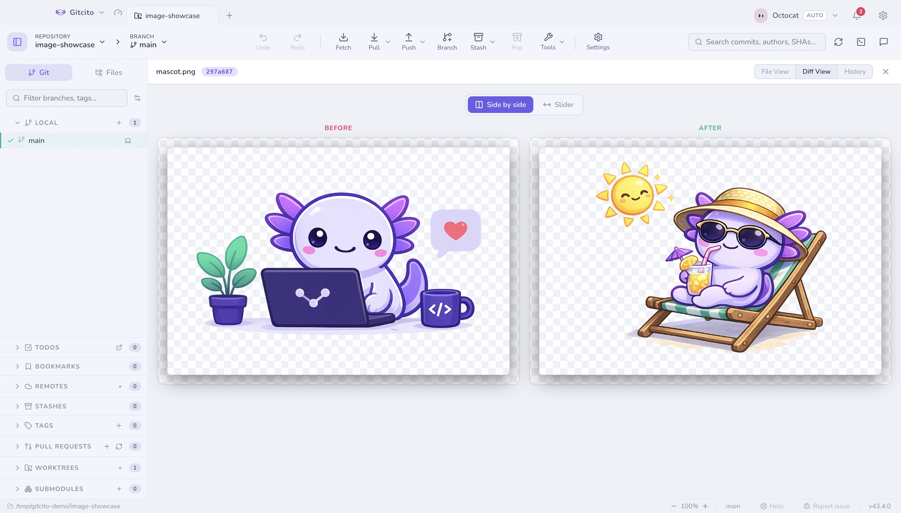
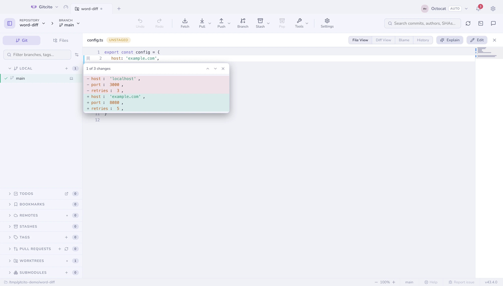
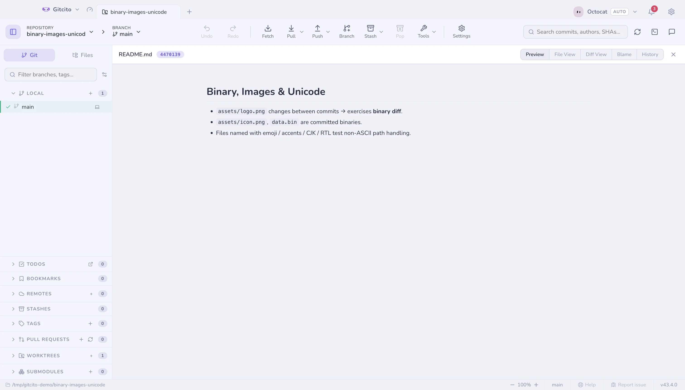
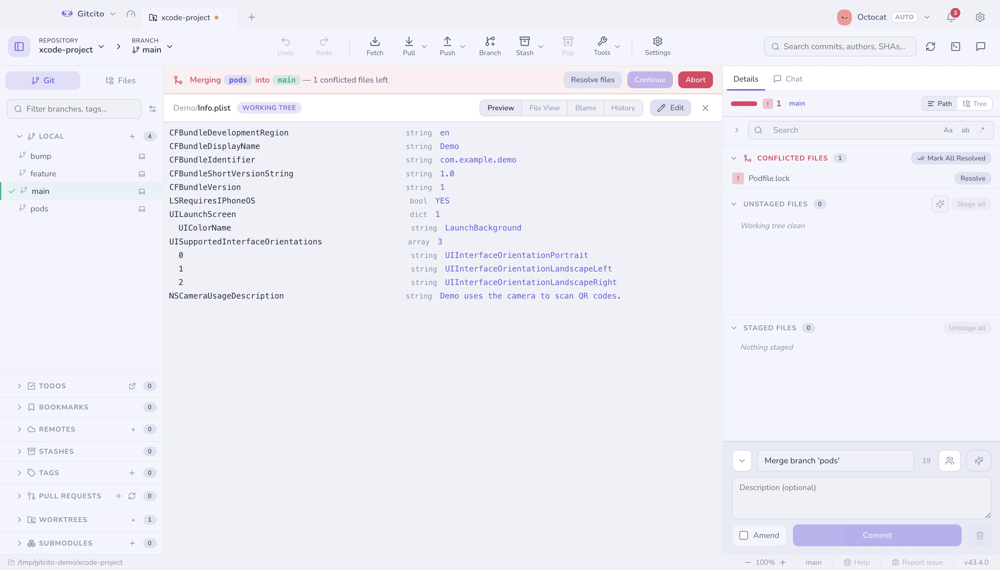
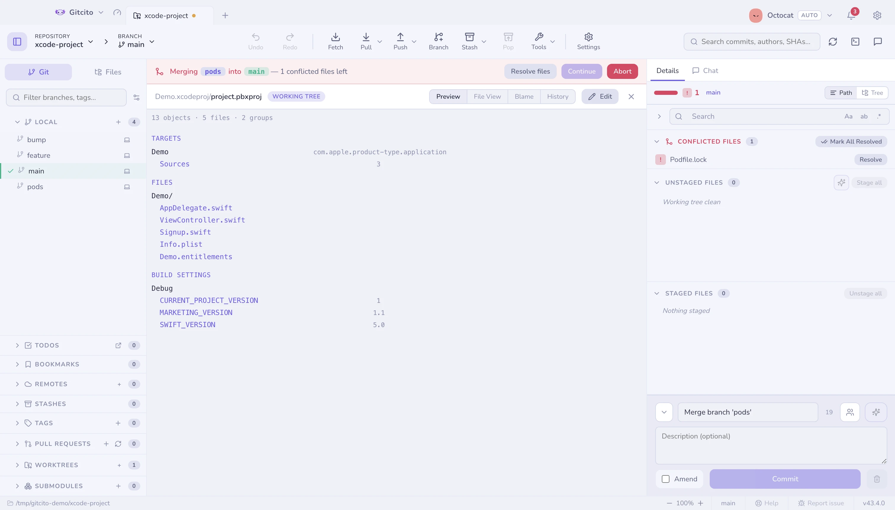
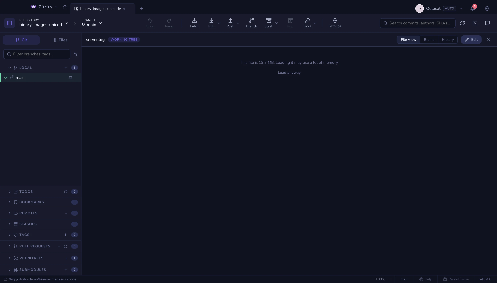
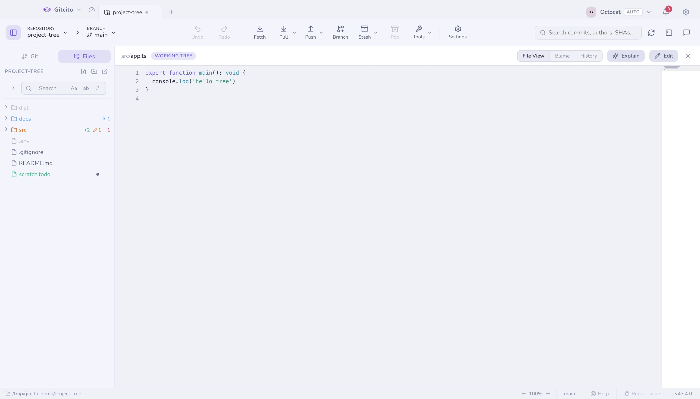
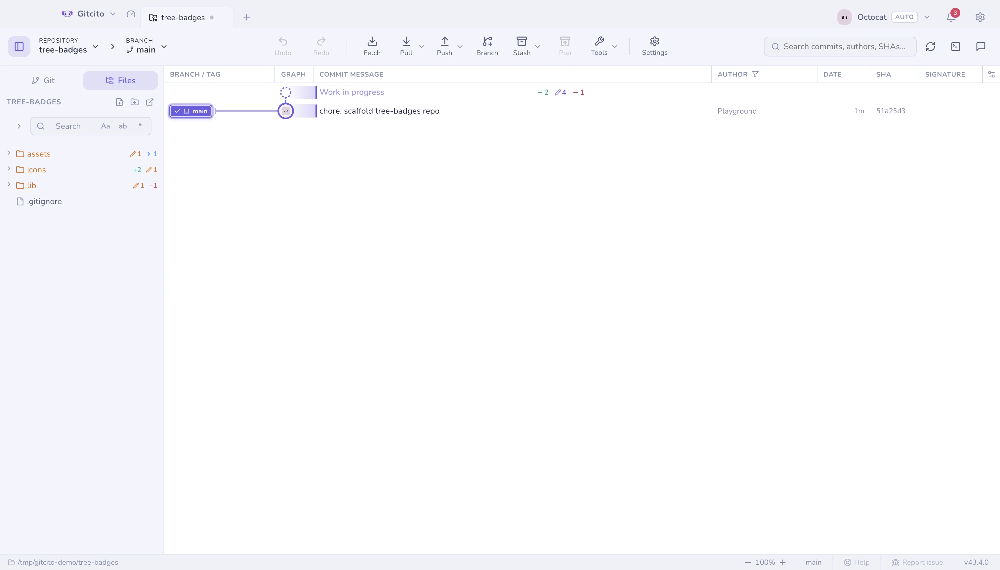

# Diffs & previews

## Reading a diff

| Toggle | What it does |
|---|---|
| **Unified ↔ split** | Side-by-side when you want to compare, stacked when you want to read |
| **Word-level** | Highlights just the changed tokens inside an edited line — red on the old, green on the new |
| **Ignore whitespace** | Hides reindentation so the real change surfaces |
| **Wrap** (split only) | Folds long lines inside their column instead of scrolling them |
| **Linked** (split, wrap off) | Scrolls both halves together, vertically and sideways — off, each column scrolls on its own |
| <kbd>⌘F</kbd> | Find inside the diff, with next/previous stepping |

Wrap is off by default, so one line stays on one row and the two sides remain
comparable row for row; each half carries its own sideways scrollbar. Turn
it on when you would rather read a long line than chase it — the cost is that a
line folding over three rows on one side no longer sits opposite its
counterpart. Every toggle remembers its state across files and sessions.

With wrap off the two halves scroll **linked** by default — vertically, which
keeps the rows facing each other, and sideways, so column 90 on the left sits
above column 90 on the right. Unlink them when the sides have drifted apart —
an indented block against an unindented one, a rename that shifted every line —
or when you want to compare two distant regions of the same file, and park each
half where its own content is.

The native Rust **Changes** view keeps the staged/unstaged file groups on the
left and the selected file's diff on the right. The diff pane has its own scroll
area, so moving through a large patch does not move the file list out of view.
Its gutter shows old and new line numbers; additions, deletions and hunk headers
use soft theme-aware tints so line type reads without washing out the code.

Above every diff sits the [semantic summary](semantic-diff.md) — what changed,
symbol by symbol, rather than line by line.

## Image diffs

Changed images get a real comparison: side by side, or a swipe handle to drag
between before and after.

## Change gutter & minimap

The **File view** of a working-tree file — staged or not, tracked or brand new
— carries a colored bar next to every line touched since HEAD (or the index,
for staged files): green for an insertion, blue for a modification, a small
red wedge where lines were removed without replacement. Click a bar to see
that change without leaving the file — the popup shows the removed and added
lines, with next/previous to step through every change in the file.

The **minimap**, off by default, adds a scaled overview of the whole file at
the right edge — click or drag it to jump around, the way a scrollbar would if
it could also show you the shape of the file. Both are per-machine toggles
under **Settings → General → File viewer**.

Neither reads history: switch to Diff, Blame or an older commit and the gutter
disappears — those views already show every change directly.

## Preview anything

The **Preview** mode renders the file instead of showing its source: Markdown,
Word (`.docx`), Excel (`.xlsx`), PDF, video, audio, images, and
syntax-highlighted code for everything else.

### Apple property lists

`Info.plist` and `*.entitlements` are XML, and XML is not what anyone is trying
to read. Preview shows the key/value outline instead — the shape Xcode's own
plist editor shows — with the nesting intact and each value's type beside it.

Two limits. A **binary** plist (`bplist00`) is recognised and named, not decoded
— run `plutil -convert xml1` on it if you want it here, though a binary plist in
a repository is usually a build artefact that should not be committed. And
`<data>` values are shown as a byte count rather than as base64: a blob tells
you nothing, and a provisioning profile rendered into a pane you might be
sharing tells everyone else too much.

### Xcode projects

A `project.pbxproj` is one flat dictionary of objects that point at each other
by id, so reading it in order tells you almost nothing about the project. The
preview walks those references and rebuilds the three things you actually came
for: the **targets** with their build phases, the **group tree** as the Xcode
navigator draws it, and the **build settings** per configuration.

It is a reader, not an editor — nothing here writes to the project. For what
happens when two branches both edit one, see
[resolving conflicts](conflicts.md).

## Very large files

Previews and the file view load a file fully into memory, so both refuse files
past a size cap (32 MB for previews, 16 MB for text) and tell you how big the
file is instead. **Load anyway** overrides the cap for that one file — nothing
is off limits, big loads are just opt-in. Files and diffs past a few thousand
lines still render completely, but rows scrolled out of view are no longer
laid out and painted, so a giant lockfile diff stops costing a laptop's worth
of memory.

## Files tab

The left sidebar's **Files** tab browses the working tree itself, with status
badges on folders (added / modified / deleted) that aggregate what is inside
them.

The native Rust preview groups files into expandable folders and searches
paths recursively. Each folder summarizes descendant changes by status.
In that view, drag the divider beside the tree to resize it from 220 to 460
points. It starts at 310 points; the width stays within the current window.
Markdown files render in the preview pane, with a toggle back to source.
Standalone PNG, JPEG, GIF and WebP files render as images; preview caps files at
1 MB and images at 12 megapixels. GIF shows its first frame. Embedded Markdown
images and richer document formats are not supported in the native view yet.
Changed tracked images compare `HEAD` against the working copy side by side or
with a draggable swipe handle; new images show the working copy alone.
Source files use syntax highlighting when their extension is recognised.
The right pane separates Preview, Blame and History into segmented tabs. Pick a
history row to open that commit in Changes; choose a file to return to Preview.
Its Diff view can ignore whitespace changes in staged and unstaged patches; that
toggle lasts for the current app session. Find in Diff supports Cmd/Ctrl+F,
previous/next matches, and scrolling to the selected match.
Its Word diff toggle highlights the differing span inside paired removed and
added lines; toggle state lasts for the current session.
Split mode labels old and new panes and aligns rows. **Linked** scroll is on by
default and synchronizes vertical and horizontal positions; turn it off to
scroll each pane independently. Both controls last for the session. **Wrap** is
off by default; turning it on wraps long lines, which can make paired rows
differ in height. The Linked control is hidden while Wrap is on.

**See also:** [Semantic diff](semantic-diff.md) · [Staging](staging.md)
