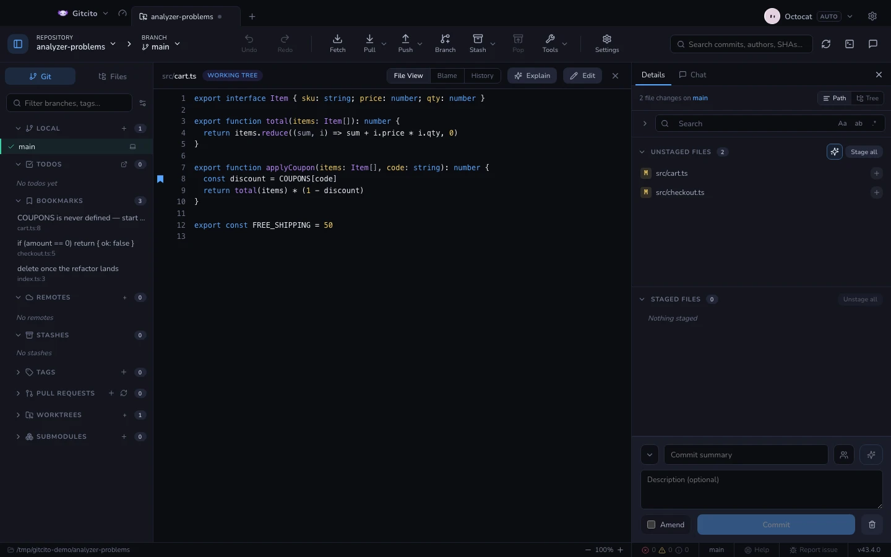

# Marcadores

Un sitio al que quieres volver: la línea donde vive el bug, la función que estás
renombrando a medias, lo que hay que borrar cuando aterrice el refactor. Haz clic
derecho en una línea del visor de archivos y elige **Marcar esta línea**; aparece
en la barra lateral, y al pulsarla vuelves ahí.

Una línea marcada lleva una marca en el margen, y al pasar por encima de
cualquier línea aparece una tenue en la que puedes hacer clic — el menú
contextual es para cuando ya sabes que la función existe.

Los marcadores son privados de esta máquina y de este repositorio. No se escribe
nada dentro del repo, así que no se pueden commitear, ni subir, ni verlos nadie
más — exactamente como las [tareas](todos.md).

## La línea se mueve. Ese es todo el problema.

`cart.ts:42` se pudre en cuanto alguien inserta una línea encima, y un marcador
que abre en silencio la línea equivocada es peor que no tener marcador. Por eso
se guarda el **texto** de la línea junto a su número, y al abrirlo se relocaliza:

1. la línea recordada, si todavía tiene ese texto;
2. si no, la línea más cercana con el mismo texto — la más cercana, para que una
   línea repetida por todo el archivo caiga en la copia más próxima a donde
   estaba;
3. si no, la línea más cercana que coincide ignorando espacios, que sobrevive a
   un reindentado o a un formateador;
4. y si tampoco, dice que **la línea ya no está** y abre donde estaba, en vez de
   adivinar.

Cuando se mueve, el marcador se cura solo: se guarda el nuevo número de línea,
así que la próxima vez ya parte de donde está de verdad. Se puede añadir una
**nota** desde su menú contextual — sin ella, la etiqueta es el propio texto de
la línea.

## Los límites

- **Un marcador apunta al árbol de trabajo**, no a un commit. Sigue tus
  ediciones; no viaja hacia atrás por la historia.
- **Un archivo reescrito pierde sus marcadores.** Si ni el texto exacto ni su
  forma sin espacios aparecen en unos cientos de líneas alrededor, no queda nada
  honesto a lo que apuntar.
- **Renombrar un archivo rompe sus marcadores.** La ruta es la clave; git puede
  detectar un renombrado en un diff, pero un marcador no es parte de un diff.
- **Una línea en blanco no tiene texto que buscar**, así que su marcador depende
  solo del número y no se mueve con nada.

**Ver también:** [Tareas](todos.md) · [Problemas](problems.md)
