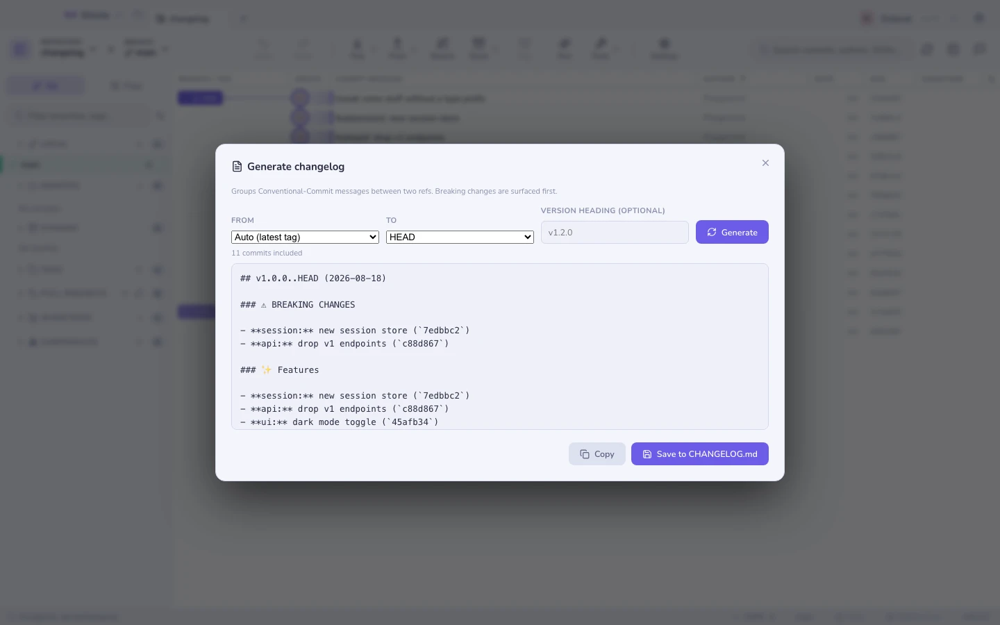

# Generador de changelog

Dale dos refs — por defecto **última etiqueta → HEAD** — y convierte los commits
que hay entre ellas en un changelog, agrupado por tipo de Conventional Commit.

- Los **cambios que rompen compatibilidad** salen primero, vengan del tipo que
  vengan.
- Después Features, Fixes, Performance, y así.
- Los commits que no siguen ninguna convención acaban en **Otros** en vez de
  desaparecer — un changelog que pierde commits en silencio es peor que uno
  desordenado.

Copia el resultado, o **añádelo directamente al principio de `CHANGELOG.md`**.

> Escribir tus mensajes en [estilo Conventional](committing.md) es lo que hace
> esto útil. El generador es tan bueno como los asuntos que lee.

**Ver también:** [Hacer commits](committing.md) · [Hosting y pull requests](hosting.md)
