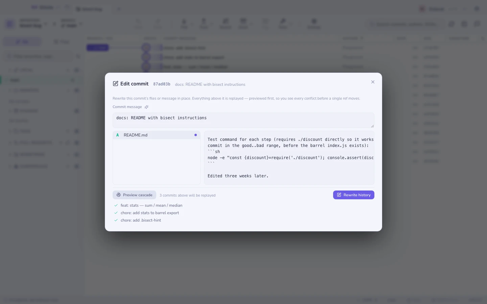
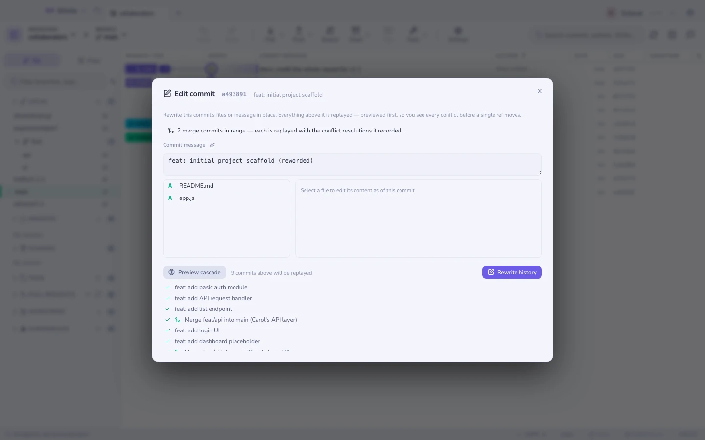

# Edita cualquier commit

La errata está en un commit de hace tres semanas. El arreglo habitual es un
rebase interactivo: parar en el commit, editar, continuar, rezar. El arreglo de
Gitcito es: clic derecho en el commit, **Editar este commit**, cambiar el
texto, listo. El botón del lápiz en el panel de detalles del commit abre el
mismo editor.

## Qué hace

Elige cualquier commit que sea ancestro de `HEAD` — con historia lineal o sin
ella. El modal muestra sus archivos y su mensaje; edita cualquiera de los dos.
A partir de ahí pasan dos cosas:

1. **Previsualizar la cascada** reproduce cada commit por encima del editado
   *en memoria* (una cadena de cherry-picks con `merge-tree` — sin checkout,
   sin árbol de trabajo, sin refs). Cada descendiente aparece en verde o en
   rojo, así que sabes **antes de que nada se mueva** si la edición se propaga
   limpiamente o choca con un cambio posterior.
2. **Reescribir la historia** lo hace de verdad: la misma cadena se construye
   con plumbing y después la rama se mueve con `reset --keep` — tus cambios
   sin commitear se arrastran, o el reset aborta y no ha pasado nada. Antes se
   toma una [instantánea guardián](recovery.md), y deshacer restaura la cadena
   antigua.

La autoría y las fechas de cada commit reproducido se conservan; solo cambian
los hashes — eso es lo que significa reescribir la historia.

## Merges en el rango

Un merge entre el commit y `HEAD` ya no desactiva la edición. La cascada
reproduce un merge reaplicando su **resultado registrado** — el árbol que el
merge realmente commiteó, resoluciones de conflictos incluidas — sobre el
padre reescrito, así que las resoluciones que alguien hizo a mano sobreviven
a la reescritura al pie de la letra. Sin rerere, sin volver a mergear, sin
worktree: el mismo plumbing en memoria que el resto de la cascada, y los dos
punteros a los padres se conservan. Una rama lateral que también contiene el
commit editado se reescribe y se reapunta; una que no lo contiene conserva su
identidad intacta. El banner del modal dice cuántos merges lleva el rango, y
los pasos de merge muestran un icono de merge en la previsualización.

La advertencia honesta: un merge reproducido solo es tan bueno como su
resultado registrado. Si tu edición choca con líneas que el propio merge
resolvió, la previsualización se pone en rojo exactamente igual que cualquier
otro paso en conflicto — nada se adivina.

## Cuando la cascada da conflicto

Un commit posterior tocó las mismas líneas que estás editando. La
previsualización marca ese commit en rojo con los archivos en conflicto y la
reescritura se niega a ejecutarse — nada queda aplicado a medias, nunca. O
editas de otra forma, o afrontas el conflicto de cara con un
[rebase interactivo](rebase.md).

## Límites

- **El commit debe ser ancestro de `HEAD`.** Un commit en una rama lateral
  sin mergear no tiene camino hasta tu rama actual por el que reproducirse.
- Los archivos binarios y los que superan 2 MB se muestran pero no se pueden
  editar.
- Un commit que ya está en un remoto se puede editar, pero tu siguiente push
  tendrá que ser un **force push** — el modal avisa antes de que te
  comprometas a eso.
- Los archivos eliminados en el commit no se pueden editar (no hay contenido
  que editar).

**Ver también:** [Rebase interactivo](rebase.md) · [Recuperación y el reflog](recovery.md) · [Absorber](absorb.md)
