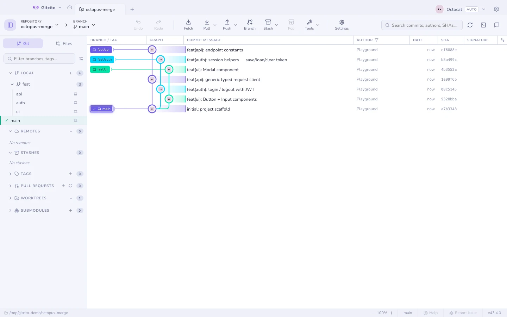
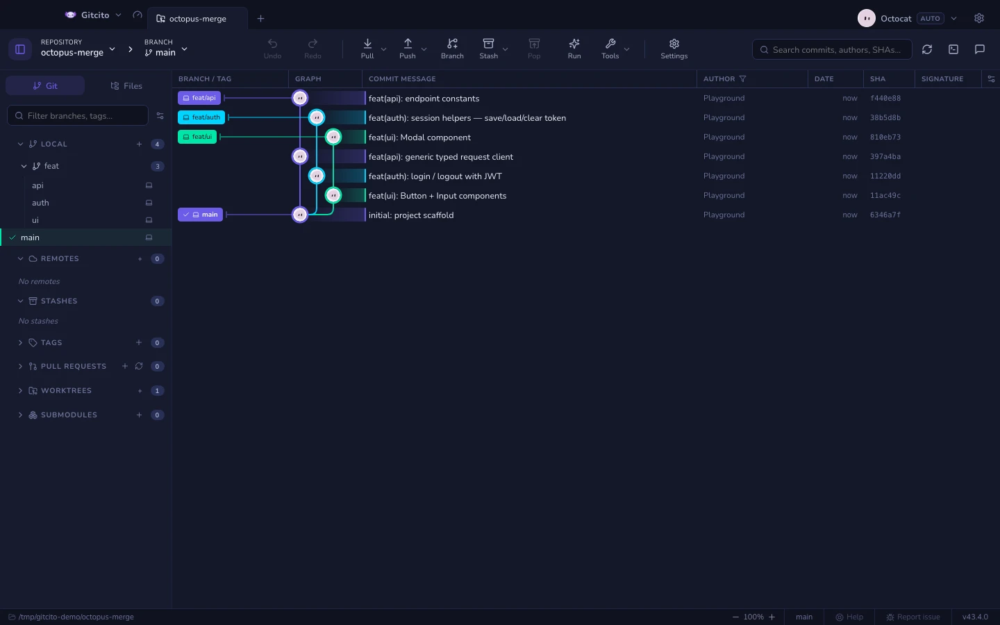
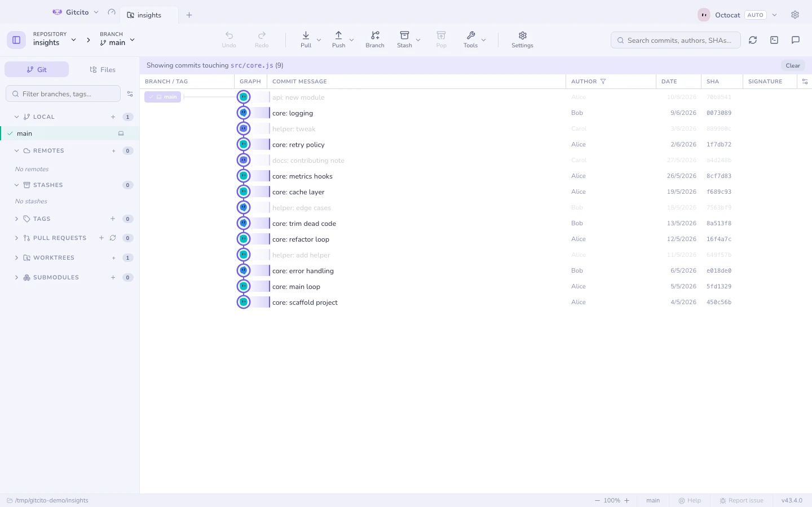
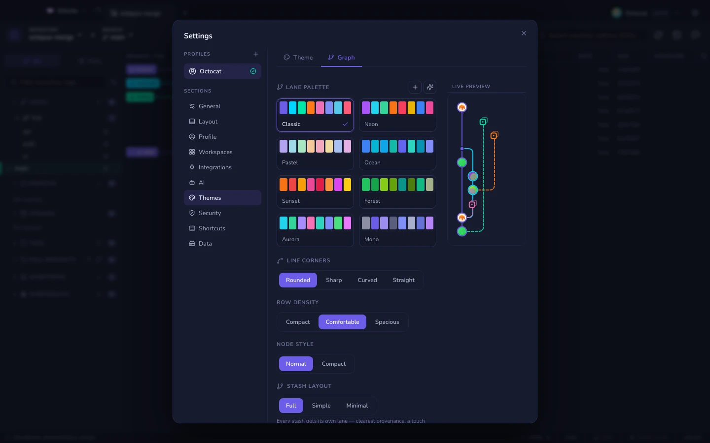
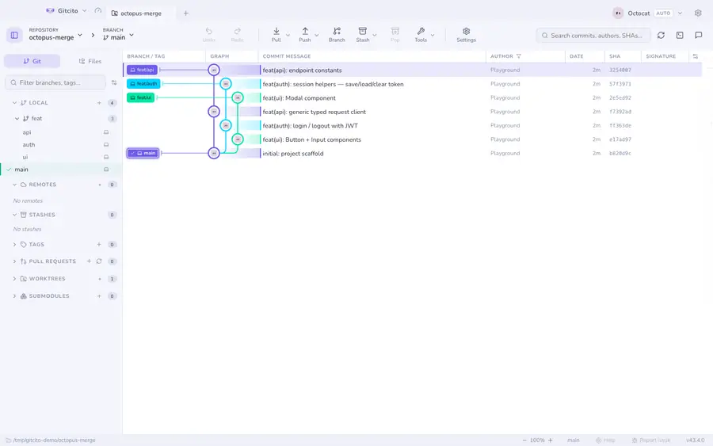

# El grafo de commits

Ramas, fusiones y fusiones pulpo dibujadas como es debido, en claro o en oscuro.
El renderizado va por ventanas, así que un repositorio con cien mil commits se
desplaza igual que uno con cien.

| | |
|---|---|
|  |  |

## Moverse por él

- <kbd>↑</kbd> <kbd>↓</kbd> (o <kbd>j</kbd> <kbd>k</kbd>) recorren la selección.
- <kbd>⌘</kbd>/<kbd>Ctrl</kbd>+clic mete o saca un commit de una **selección
  múltiple**; <kbd>⇧</kbd>+clic coge un rango. Con varios seleccionados, haz
  clic derecho para hacerles cherry-pick sobre la rama actual, aplastar un tramo
  contiguo, exportar un único parche combinado, o copiar sus SHA.
- Los commits que llegaron en tu **último fetch o pull** se marcan como nuevos.
- Clic derecho en un commit para **Enmendar**, **Deshacer**, **Restablecer al
  commit…** y **Ver en GitHub**, además de checkout, cherry-pick, revert, rama,
  etiqueta y copiar. Las acciones inseguras siguen visibles y se deshabilitan.

## Que muestre lo que tú quieres

- **Vista lineal** (first-parent) esconde todo lo que se fusionó, dejando sólo
  el tronco.
- **Filtrar por ruta**: clic derecho en un archivo o carpeta → *Filtrar el grafo
  por esta ruta*, y sólo se quedan encendidos los commits que la tocaron.

- **Columnas**: muestra, esconde, redimensiona y reordena las columnas de rama,
  mensaje, autoría, fecha, SHA, firma y despliegue.
- **Estilo**: Ajustes → Temas → **Grafo** — paleta de carriles (8 integradas,
  personalizada o generada por IA), estilo de las esquinas, densidad de filas y
  grosor de línea, con una vista previa en miniatura en vivo.

## Detalles del commit

Al seleccionar un commit se ven sus archivos modificados (en árbol o en plano),
la autoría, el SHA, los coautores y su firma. Las referencias `#123` y las
`@menciones` se enlazan automáticamente a tu hosting.

La lista de archivos se selecciona en grupo con los gestos habituales (clic con
<kbd>⌘</kbd>/<kbd>Ctrl</kbd>, clic con <kbd>⇧</kbd>,
<kbd>⇧</kbd>+<kbd>↑</kbd>/<kbd>↓</kbd>). Clic derecho sobre la selección →
*Restaurar {n} archivos al árbol de trabajo* toma esos archivos exactamente
como estaban en este commit: tras una única confirmación sobrescribe las copias
de trabajo, sin tocar HEAD ni el índice.

**Ver también:** [Blame e historial de archivo](blame.md) · [Búsqueda](search.md) · [Máquina del tiempo](time-machine.md)
