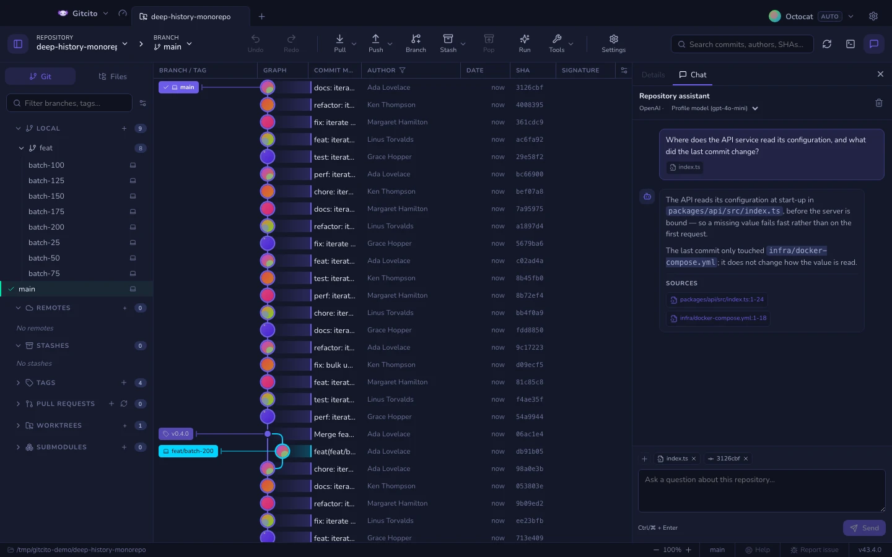
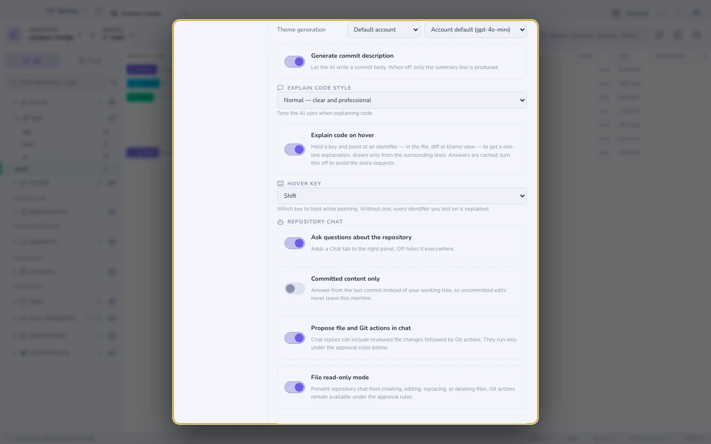
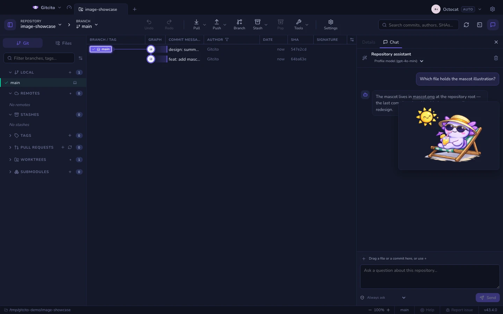

# Chat del repositorio

Hay preguntas que se responden antes preguntando que buscando. *¿Dónde ocurre
realmente el refresco del token? ¿Qué cambió este commit, en una frase? ¿Por qué
existe este archivo?* El chat del repositorio responde sobre el repositorio
abierto y muestra las líneas en las que se basó.

Comparte la columna derecha con **Detalles**: las pestañas de arriba alternan
entre ambos, así el grafo no pierde su selección cuando preguntas algo.

## Qué lee

Cada respuesta se construye en dos pasadas. La primera elige un conjunto pequeño
de rutas y búsquedas literales dentro de la lista de archivos rastreados del
propio repositorio. La segunda responde usando solo los fragmentos que esa
pasada trae, y solo puede citar esos fragmentos: un archivo o una línea
inventados son un error de validación, no una respuesta plausible.

| Incluido | Excluido |
|---|---|
| Archivos rastreados, tal como están en tu copia de trabajo | Archivos sin rastrear |
| Diffs preparados y sin preparar de archivos rastreados | Todo lo que coincida con una regla de ignorados, aunque esté rastreado |
| Rama, adelanto/retraso y la lista de rutas cambiadas | [Archivos que parecen secretos](security.md), binarios, rutas generadas |

Que use la copia de trabajo significa que puedes preguntar por cambios sin
confirmar. También significa que esos cambios salen de tu equipo al preguntar:
los recibe el proveedor configurado en [Funciones de IA](ai.md).

## Fijar contexto

El modelo decide qué leer. Fijar es cómo lo anulas: lo fijado se lee **primero**
y se lleva la parte mayor del presupuesto de contexto.

Cuatro formas de fijar, todas al mismo grupo de fichas sobre el cuadro de texto:

| Haz esto | Obtienes |
|---|---|
| Pulsa una ficha sugerida | El archivo abierto en el visor, o el commit seleccionado en el grafo |
| Arrastra una fila de la pestaña **Archivos** | Ese archivo |
| Arrastra una fila del **grafo de commits** | Ese commit: su mensaje y su diff por fragmentos |
| **+** → *Elegir un archivo…*, o arrastra desde el Finder/Explorador | Cualquier archivo del disco, incluso fuera del repositorio |

Las fichas siguen fijadas para las preguntas de seguimiento; la `×` de una ficha
la quita, y borrar la conversación las quita todas. El tope son ocho.

Un commit fijado aporta su mensaje y hasta doce fragmentos de diff. Los
fragmentos que tocan una ruta excluida se descartan de ese diff, no el commit
entero.

## Ajustes

**Ajustes → IA → Chat del repositorio**:

| Ajuste | Qué hace |
|---|---|
| **Haz preguntas sobre el repositorio** | Desactivado quita la pestaña, el botón de la barra y el destino del atajo. El resto de la IA sigue funcionando |
| **Modelo del chat** | Un modelo solo para el chat. Vacío significa el del perfil: preguntar cuesta menos que revisar, y suele bastar uno más pequeño |
| **Solo contenido confirmado** | Responde con el último commit en vez de la copia de trabajo: los cambios sin confirmar nunca salen del equipo |

Con la IA desactivada por completo, el chat desaparece con ella: no queda un
panel ofreciendo respuestas que nadie puede dar.

El modelo del chat también se cambia desde la cabecera del propio panel, junto
al nombre del proveedor: es el mismo ajuste, sin abrir los Ajustes.

## Trabajar con los mensajes

Los mensajes son texto normal. Selecciona cualquier parte y cópiala, o haz clic
derecho en una burbuja: **Copiar** toma la selección, **Copiar mensaje** el
mensaje completo — una respuesta se copia como su fuente Markdown — y, si el
clic cayó sobre un enlace, **Copiar enlace** toma su dirección.

Los enlaces se abren en tu navegador predeterminado, nunca dentro de Gitcito —
tanto los enlaces Markdown de las respuestas como las direcciones `https://`
escritas en tus propios mensajes.

Cuando un mensaje menciona una imagen — una ruta del repositorio como
`docs/logo.png`, o una URL que termina en una extensión de imagen — pasar el
cursor sobre la mención muestra una pequeña vista previa. Las rutas del
repositorio se leen de tu árbol de trabajo; una mención que no corresponde a
una imagen legible simplemente no muestra nada.

## Qué se niega a hacer

- **Los archivos que parecen secretos nunca se leen**, estén fijados o no: la
  ficha vuelve marcada como omitida, con el motivo. Fijar no es una forma de
  saltarse el [enmascarado de secretos](security.md).
- **Los binarios y los archivos de más de 512 KB** de fuera del repositorio se
  omiten igual. Dentro del repositorio rigen las reglas habituales.
- **Nunca escribe.** Ni prepara, ni confirma, ni cambia de rama: no tiene
  herramientas, solo texto. Una respuesta que afirme haber hecho algo está
  describiendo, no informando.
- **Las conversaciones viven solo en memoria.** Cada repositorio mantiene su hilo
  aparte; al salir de Gitcito se descartan.

## Cómo abrirlo

| Teclas | Qué hace |
|---|---|
| El botón de bocadillo en la barra de herramientas | Alterna la pestaña Chat |
| <kbd>⌘⌥B</kbd> / <kbd>Ctrl+Alt+B</kbd> | Alterna todo el panel derecho |
| <kbd>⌘⏎</kbd> / <kbd>Ctrl+Enter</kbd> | Envía el mensaje |

Consulta [Teclado y atajos](keyboard.md) para el resto, incluido cómo reasignar
los interruptores de panel.

**Ver también:** [Funciones de IA](ai.md) · [Seguridad y secretos](security.md) ·
[Wiki del repositorio](repo-wiki.md)
