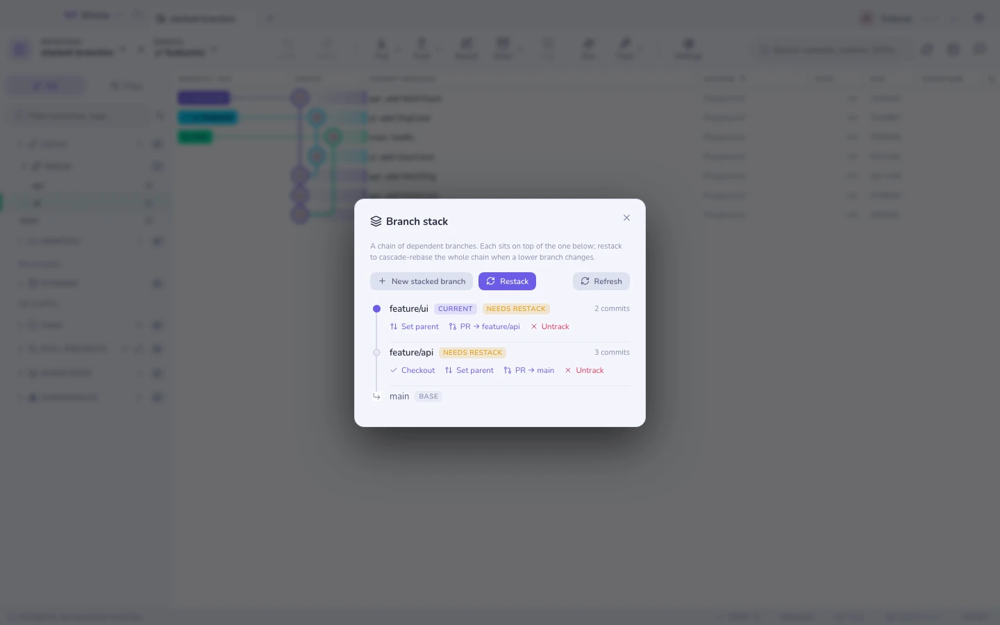

# Ramas apiladas

Una pila es una cadena de ramas en la que cada una se construye sobre la de
abajo: `main → api → ui`. Revisar tres PR pequeños es mejor que revisar uno
descomunal.

Gitcito muestra la pila de abajo → arriba con el número de commits en cada
nivel, y te deja **abrir un PR por nivel**, cada uno apuntando a su padre en
lugar de a `main`.

## Restack

Cuando una rama de abajo cambia — has atendido los comentarios de revisión en
`api` — todas las ramas por encima están ahora construidas sobre la base
equivocada. **Restack** rehace la cadena entera en cascada con `rebase --onto`,
de modo que reescribir un padre no duplica sus commits dentro de los hijos.

## Dónde viven los enlaces

Los enlaces al padre se guardan en la **config de git**, así que viajan con el
repositorio y sobreviven a un reclonado. No hay nada en ningún servicio.

**Ver también:** [Rebase interactivo](rebase.md) · [Hosting y pull requests](hosting.md)
