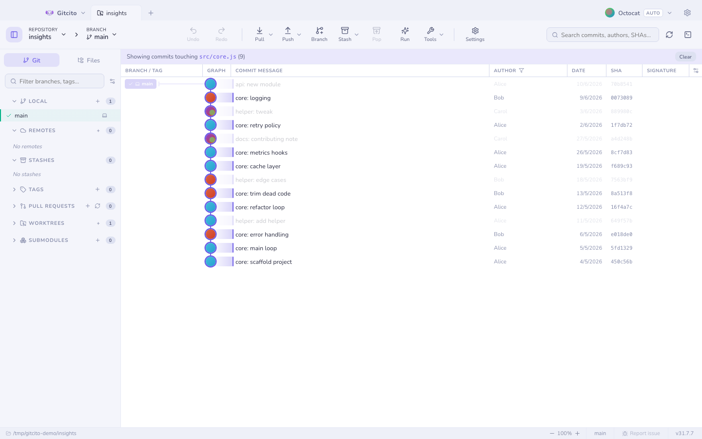

# The commit graph

Branches, merges and octopus merges drawn properly, in light or dark. Rendering
is windowed, so a repository with a hundred thousand commits scrolls like one
with a hundred.

| | |
|---|---|
|  |  |

## Moving around

- <kbd>↑</kbd> <kbd>↓</kbd> (or <kbd>j</kbd> <kbd>k</kbd>) walk the selection.
- <kbd>⌘</kbd>/<kbd>Ctrl</kbd>-click toggles a commit into a **multi-selection**;
  <kbd>⇧</kbd>-click takes a range. With several selected, right-click to
  cherry-pick them onto the current branch, squash a contiguous run, export one
  combined patch, or copy their SHAs.
- Commits that arrived in your **last fetch or pull** are flagged as new.

## Making it show what you want

- **Linear view** (first-parent) hides everything merged in, leaving the trunk.
- **Filter by path**: right-click a file or folder → *Filter graph by this
  path*, and only the commits that touched it stay lit.

- **Columns**: show, hide, resize and reorder branch, message, author, date,
  SHA, signature and deployment columns.
- **Style**: Settings → Themes → **Graph** — lane palette (8 built-ins, custom,
  or AI-generated), corner style, row density and line thickness, with a live
  mini-graph preview.

## Commit details

Selecting a commit shows its changed files (tree or flat), author, SHA,
co-authors, and its signature. `#123` references and `@mentions` are autolinked
to your host.

**See also:** [Blame & file history](blame.md) · [Search](search.md) · [Time machine](time-machine.md)
