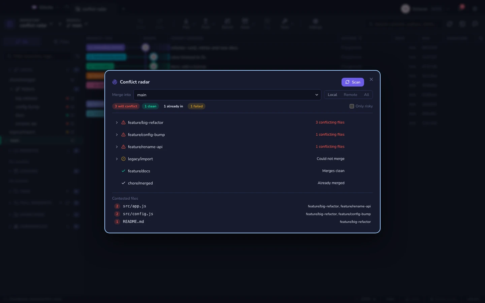
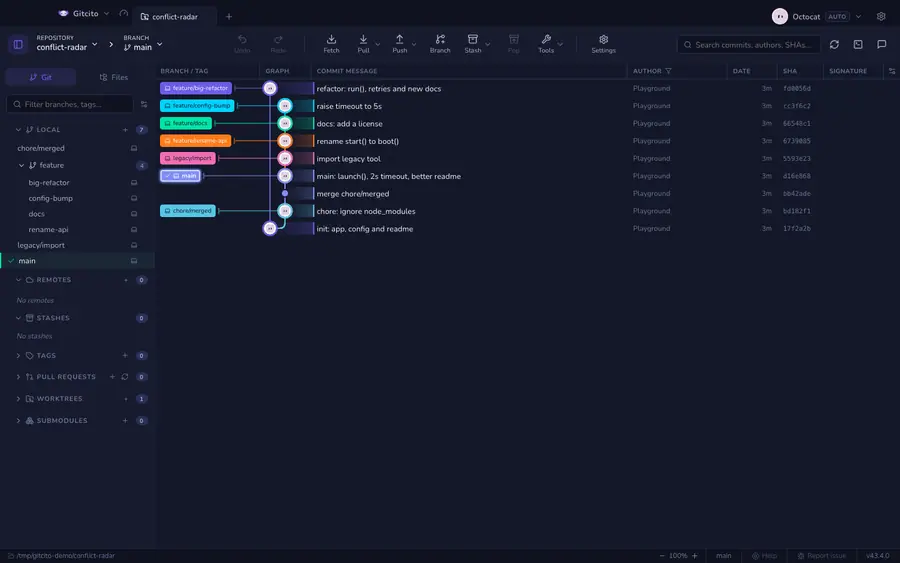

# מכ״ם התנגשויות

לגלות שענף מתנגש על ידי מיזוג שלו היא דרך יקרה לשאול שאלה. המכ״ם עונה עליה קודם.

Gitcito ממזג כל ענף לתוך בסיס שתבחרו **בתוך מסד האובייקטים**
(`git merge-tree --write-tree`). בלי צ׳קאאוט, בלי שינוי באינדקס, בלי שינוי בעץ
העבודה, ובלי שום דבר לנקות אחר כך. העבודה שלא נכנסה לקומיט יכולה להישאר בדיוק
היכן שהיא בזמן שהסריקה רצה.

## שימוש

פתחו אותו מתפריט הכלים, מ־<kbd>⌘K</kbd> ← *מכ״ם התנגשויות*, או לחצו לחיצה ימנית
על ענף כדי לסרוק את הכול מול **אותו** ענף.

הוא סורק ברגע שהוא נפתח, כשהענף הנוכחי שלכם הוא הבסיס.

| פסק דין | המשמעות |
|---|---|
| **יתנגש** | מיזוג שלו דורש ידיים. הנתיבים המדויקים מפורטים. |
| **ממזג נקי** | הוא היה מוחל בלי קרב. |
| **כבר בפנים** | הבסיס כבר מכיל אותו — אין מה למזג. |
| **נכשל** | git סירב: היסטוריות לא קשורות, ref חסר. הסיבה מוצגת. |

הענפים ממוינים מהגרוע ביותר, והגרוע שבגרועים — זה שנוגע בהכי הרבה קבצים — עולה
לראש.

## קבצים שנויים במחלוקת

מתחת, **קבצים שנויים במחלוקת** מדרג נתיבים לפי כמה ענפים כותבים אותם מחדש. שני
ענפים שנלחמים על קובץ אחד הם שיחה שכדאי לקיים עכשיו; חמישה הם בעיית תכנון.

## אחרי סריקה

שורות הענפים בסרגל הצד עונדות נקודה צבעונית: אדום יתנגש, ירוק נקי, ענבר הוא ענף
ש־git סירב לו. ענפים שכבר מוכלים בבסיס לא מקבלים נקודה — שורה של נקודות אפורות
על כל מה שכבר מוזג היא סתם רעש.

> סריקה לא משנה דבר. `git status` נשאר נקי ו־HEAD לא זז.

**ראו גם:** [מה השתנה מאז](range-diff.md) · [מיזוג וריבייס](merging.md)
