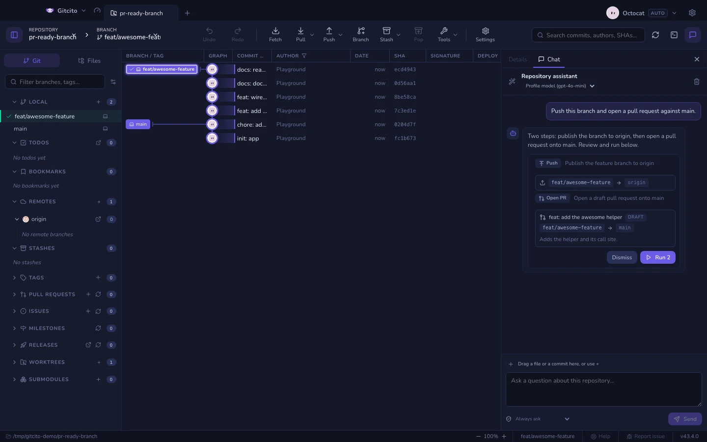

# צ׳אט המאגר

יש שאלות שמהיר יותר לשאול מאשר לחפש. *איפה באמת מתבצע רענון הטוקן? מה שינה
הקומיט הזה, במשפט אחד? למה הקובץ הזה קיים?* צ׳אט המאגר עונה על כך מתוך המאגר
הפתוח, ומראה את השורות שעליהן התבסס.

הוא חולק את הטור הימני עם **פרטים**: הלשוניות למעלה מחליפות ביניהם, כך שהגרף אינו
מאבד את הבחירה שלו כששואלים משהו.

## מה הוא קורא

כל תשובה נבנית בשני מעברים. הראשון בוחר מספר קטן של נתיבים וחיפושים מילוליים מתוך
רשימת הקבצים הנעקבים של המאגר עצמו. השני עונה רק לפי הקטעים שהמעבר הראשון החזיר,
ורשאי לצטט רק אותם: קובץ או שורה מומצאים הם שגיאת אימות, לא תשובה שנשמעת סבירה.

**מבט שני.** המעבר הראשון נאלץ לנחש מתוך שמות בלבד אילו קבצים חשובים — וזה בדיוק
הניחוש שנכשל בשאלה "מאיפה זה נקרא". לכן מותר לתשובה לשאול בחזרה במקום לנחש: היא
יכולה לנקוב בעוד נתיבים, בעוד חיפושים מילוליים או בגיבובי קומיטים מההיסטוריה
האחרונה, והשאלה נשאלת שוב יחד עם מה שאלה מביאים. זה קורה לכל היותר פעמיים — כל
סבב הוא קריאת מודל נוספת שאתם ממתינים לה — ובאחרון היא חייבת לענות עם מה שיש לה.
אתם לא רואים מכל זה דבר מלבד המתנה מעט ארוכה יותר ותשובה טובה יותר.

| נכלל | לא נכלל |
|---|---|
| קבצים נעקבים, כפי שהם בעץ העבודה | קבצים שאינם נעקבים |
| הפרשים מוכנים ולא מוכנים של קבצים נעקבים | כל מה שתופס כלל התעלמות, גם אם הוא נעקב |
| ענף, לפני/אחרי, ורשימת הנתיבים שהשתנו | [קבצים שנראים כמו סודות](security.md), קבצים בינאריים, נתיבים מיוצרים |

הקריאה מעץ העבודה מאפשרת לשאול על עריכות שטרם נשמרו בקומיט. היא גם אומרת שהעריכות
האלה עוזבות את המחשב בעת השאלה: מקבל אותן הספק שהוגדר ב[יכולות AI](ai.md).

ניואנס אחד: כשהצעות הפעולה מופעלות (ראו "הרצת פעולות מהצ׳אט" בהמשך), **שמות**
הקבצים שאינם נעקבים כן נכללים במצב המאגר — "הכינו את הקובץ החדש" זקוק להם — אבל
התוכן שלהם עדיין לא נקרא לעולם.

## הצמדת הקשר

המודל הוא שמחליט מה לקרוא. הצמדה היא הדרך לעקוף אותו: מה שמוצמד נקרא **ראשון**
ומקבל את החלק הגדול יותר של תקציב ההקשר.

ארבע דרכים להצמיד, וכולן מגיעות לאותה שורת תוויות מעל תיבת ההודעה:

| עשו כך | תקבלו |
|---|---|
| לחיצה על תווית מוצעת | הקובץ הפתוח במציג, או הקומיט שנבחר בגרף |
| גרירת שורה מלשונית **קבצים** | אותו קובץ |
| גרירת שורה מ**גרף הקומיטים** | אותו קומיט — ההודעה שלו וההפרש כמקטעים |
| **+** ← *בחירת קובץ…*, או גרירה מ‑Finder/סייר הקבצים | כל קובץ בדיסק, גם מחוץ למאגר |

התוויות נשארות מוצמדות לשאלות ההמשך; ‏`×` מסיר אחת, וניקוי השיחה מסיר את כולן.
המכסה היא שמונה.

קומיט מוצמד תורם את ההודעה שלו ועד שנים־עשר מקטעי הפרש. מקטעים שנוגעים בנתיב מוחרג
נופלים מאותו הפרש, לא הקומיט כולו.

## הגדרות

**הגדרות ← AI ← צ׳אט המאגר**:

| הגדרה | מה עושה |
|---|---|
| **שאלו שאלות על המאגר** | כיבוי מסיר את הלשונית, את כפתור סרגל הכלים ואת יעד הקיצור. שאר יכולות ה‑AI ממשיכות לעבוד |
| **מודל הצ׳אט** | מודל לצ׳אט בלבד. ריק פירושו המודל של הפרופיל — שאלה זולה מביקורת, ומודל קטן יותר בדרך כלל מספיק |
| **תוכן מקומיט בלבד** | עונה לפי הקומיט האחרון במקום לפי עץ העבודה: עריכות שלא נשמרו בקומיט לא עוזבות את המחשב |
| **הצעת פעולות קבצים ו-Git בצ׳אט** | כיבוי מחזיר את הצ׳אט לקריאה בלבד: בלי כרטיסי פעולות, בלי תפריט אישור נפתח |
| **מצב קריאה בלבד לקבצים** | הפעלה חוסמת יצירה, עריכה, החלפה ומחיקה של קבצים, אך פעולות Git נשארות זמינות. מופעל כברירת מחדל |
| **איך רצות פעולות מוצעות** | מצב האישור — ראו "מצבי אישור" בהמשך. פעולות הרסניות מבקשות אישור בכל מקרה |
| **לאפשר לצ׳אט להציע פעולות מרוחקות** | כבוי כברירת מחדל. הפעלה מוסיפה משיכה, עדכון, דחיפה, פתיחת בקשת משיכה ושליחת ערימה |

כשה‑AI כבוי לגמרי, הצ׳אט נעלם איתו — אין פאנל שמציע תשובה שאיש אינו יכול לתת.

אפשר להחליף את מודל הצ׳אט גם מכותרת הפאנל עצמו, לצד שם הספק — אותה הגדרה, בלי
לפתוח את ההגדרות.

כפתור השרביט שלצד כותרת הפאנל פותח את **אשף תצורת ה‑AI** — תהליך מודרך שמייצר
קובצי תצורה לעוזר (הנחיות, סוכנים, הוקים) עבור המאגר הזה. ראו
[יכולות AI](ai.md).

## עבודה עם הודעות

הודעות הן טקסט רגיל. בחרו כל חלק והעתיקו אותו, או לחצו לחיצה ימנית על בועה:
**העתקה** לוקחת את הבחירה, **העתקת ההודעה** את ההודעה כולה — תשובה מועתקת
כמקור ה-Markdown שלה — ואם הלחיצה נחתה על קישור, **העתקת הקישור** לוקחת את
הכתובת.

קישורים נפתחים תמיד בדפדפן ברירת המחדל, לעולם לא בתוך Gitcito — גם קישורי
Markdown בתשובות וגם כתובות `https://` בהודעות שלכם.

כשהודעה מזכירה תמונה — נתיב במאגר כמו `docs/logo.png` או כתובת URL המסתיימת
בסיומת תמונה — ריחוף מעל האזכור מציג תצוגה מקדימה קטנה. נתיבי המאגר נקראים
מעץ העבודה; אזכור שאינו מוביל לתמונה קריאה פשוט לא מציג דבר.

## הרצת פעולות מהצ׳אט

בקשו שינוי במקום עובדה — *הכינו את קובצי ה‑Markdown, שמרו את זה בקומיט כתיקון,
הוסיפו את תוצרי הבנייה לרשימת ההתעלמות* — והתשובה מגיעה עם **כרטיס פעולות**.
שיחה ריקה מציעה כמה בקשות לדוגמה כתוויות מתחת לפתיח; לחיצה על אחת ממלאת את
תיבת הכתיבה, כך שאפשר לערוך אותה לפני השליחה. הכרטיס מונה את הצעדים
הקונקרטיים שהעוזר רוצה לבצע, שורה לכל פעולה, עם כפתורי **הרצה**
ו**דחייה**. שום דבר בכרטיס עוד לא קרה; המודל יכול רק להציע, וכל הצעה נבדקת מול
עץ העבודה לפני שתראו אותה בכלל — פעולה שנוקבת בשם קובץ שאינו קיים נדחית, לא
מוצגת.

צ׳אט המאגר יכול להציע עריכות מדויקות, יצירה או החלפה מלאה של קבצים ומחיקתם,
ואחריהן פעולות Git: תבניות התעלמות, הצגה לקומיט, ביטול הצגה, קומיט, החבאה,
השלכת שינויים, ענף, מעבר ענף, תגית — ומכיוון שמוצגים לו רשימת הענפים והקומיטים
האחרונים — גם merge, rebase, revert ו-cherry-pick. את ה-diff הנפתח מחשב Gitcito
מקומית. קבצים קיימים חייבים להגיע מראיות שנקראו; יעדים לא בטוחים, סודיים, מוחרגים,
מיוצרים, בינאריים, מיושנים, גדולים מדי או שמגיעים דרך קישור סימבולי — נדחים.
reset, שכתוב היסטוריה, מחיקת ענפים וכל פעולה כפויה נשארים רק בממשק הייעודי שלהם.

merge או rebase עלולים להיעצר בהתנגשות. אז ההרצה נעצרת שם, הכרטיס מסמן את השורה
ככושלת ושומר את מניין מה שכבר רץ, וכרזת ההתנגשות משתלטת בדיוק כמו באותה פעולה
שהופעלה מסרגל הכלים.

כל קבוצת הקבצים נבדקת שוב לפני הכתיבה הראשונה ומשוחזרת אם שלב נכשל. לפני קומיט
Gitcito גם מוודא שיש שינויים ב-stage. הכרטיס מסמן פעולות שהושלמו, נכשלו או דולגו
ושומר תוצאה חלקית. לאחר מכן קריאת מודל נפרדת ללא פעולות מסכמת את התוצאה בפועל.

**הוא יכול גם לכתוב `.gitcito.json`.** לצ׳אט נמסר המבנה של
[קובץ ההגדרות של המאגר עצמו](repo-config.md), ולכן *הוסף קישורי כרטיסים ל-JIRA-1234*
או *הגן על ענפי ה-release* הופך לפעולת קובץ שנכתבת מול הסכימה האמיתית ולא למפתחות
שנראים סבירים שהטוען היה דוחה. נדרש שפעולות הקבצים יהיו מופעלות — אותו מתג של מצב
קריאה בלבד לקבצים.

**שורות שזקוקות לתמונה מקבלות אחת.** שורת סיכום אחת מספיקה ל"הצג שני קבצים
לקומיט" ורחוקה מלהספיק ל"פתח ארבע בקשות משיכה על ערימה", ולכן שורות שמתארות צורה
גם מציירות אותה: הענף שדחיפה תפרסם וכמה הוא מקדים, שני המצביעים של merge או
rebase, הקומיטים ש-revert או cherry-pick היו משחזרים לפי נושאם, בקשת המשיכה כפי
שתיראה, וערימה כסולם — עם הבסיס של כל שלב והאם השליחה תפתח אותו, תכוון אותו מחדש
או תשאיר אותו כמו שהוא.

### פעולות שיוצאות מהמחשב

משיכה, עדכון, דחיפה, פתיחת בקשת משיכה ושליחת ערימה **כבויות כברירת מחדל**, מאחורי
**לאפשר לצ׳אט להציע פעולות מרוחקות**. פרסום עבודה ראוי להחלטה מודעת, וכשההגדרה
כבויה המודל אפילו לא יודע שהפעולות האלה קיימות: הוא לא יכול להציע אחת ולקבל
סירוב — וזו בדיוק התקלה שמלמדת אנשים להדליק הגדרות בלי לקרוא.

כשההגדרה דלוקה:

| פעולה | עושה |
|---|---|
| **משיכה** / **עדכון** | אותם fetch ו-pull של סרגל הכלים; מצב העדכון (מיזוג, קידום מהיר בלבד, ריבייס) הוא חלק מההצעה |
| **דחיפה** | מפרסמת ענף אחד למאגר מרוחק אחד. **לעולם לא בכפייה**: דחיפה כפויה אינה קיימת באוצר המילים של הצעה, ולכן אי אפשר להציע אותה |
| **פתיחת PR** | פותחת בקשת משיכה אחת, טיוטה או לא, מול ה-origin של המאגר. הכרטיס שומר אחר כך את הקישור |
| **שליחת ערימה** | [שליחת ערימת ה-PR](stacks.md) המלאה: דחיפת כל שלב, פתיחה או כיוון מחדש של בקשת משיכה לכל שלב, כתיבת מקטע הניווט ורישום הערימה ב-GitHub |

דחיפה מוצעת עוברת קודם את אותן הגנות שעוברת דחיפה מסרגל הכלים: אישור ענף מוגן,
האזהרה על פרסום [קבצים שנראים כמו אישורי גישה](security.md) ורשימת הבדיקה של
המאגר לפני דחיפה. אלה תיבות דו-שיח, ולכן עונים עליהן לפני שהתוכנית מתחילה, לא
מתוכה.

### ביטול תוכנית

תוכנית מאושרת כמקשה אחת, ולכן מבוטלת כמקשה אחת. לפני הפעולה הראשונה שיכולה לשנות
משהו, Gitcito רושם היכן היה הענף ולוקח תצלום של עץ העבודה; הכרטיס שהסתיים מציע אז
**ביטול התוכנית**. הוא מחזיר את הענף לאותו קומיט ומשחזר את העץ, מה שזורק את כל מה
שהתוכנית ייצרה — ולכן הוא מבקש אישור תחילה ונוקב בקומיט שאליו חוזרים. בקשות משיכה
שנפתחו נשארות פתוחות: תצלום מקומי אינו מחזיר מה שכבר יצא לשרת.

### מצבי אישור

תפריט המגן הנפתח מתחת לתיבת הכתיבה (וגם ב**הגדרות ← AI ← צ׳אט המאגר**) קובע איך
כרטיס רץ:

| מצב | מה רץ |
|---|---|
| **לשאול תמיד** | שום דבר עד שתלחצו **הרצה** על הכרטיס |
| **הרצה אוטומטית של פעולות בטוחות** | הצעות שמורכבות רק מסידור הפיך — הכנה, ביטול הכנה, התעלמות, ענף, תיוג — רצות עם הגעתן; כל השאר ממתין לכפתור |
| **הרצה אוטומטית של כל הפעולות** | כל הצעה רצה עם הגעתה, חוץ מההרסניות |

הצעה שתזרוק **שינויים שלא נשמרו בקומיט תמיד שואלת קודם**, בכל מצב, והאישור נוקב
בשמות הקבצים שיאבדו. הכרטיס מדווח מה קרה בפועל — כמה פעולות רצו, או השגיאה
שעצרה אותן — והעוזר מקבל את התוצאה, כך ששאלת המשך יודעת אם התוכנית שלה בוצעה
או נדחתה.

### תיקון שגיאות עם העוזר

כשפעולת git נכשלת וצ׳אט ה‑AI זמין, טוסט השגיאה מקבל כפתור ניצוץ: הוא פותח את
הצ׳אט כשהכישלון מודבק בתיבת הכתיבה, כך ש"למה זה נכשל ומה עושים" הוא לחיצה אחת.
הטיוטה ניתנת לעריכה — שום דבר לא נשלח עד שתלחצו שליחה.

## על מה הוא מסרב

- **קבצים שנראים כמו סודות אינם נקראים לעולם**, מוצמדים או לא: התווית חוזרת מסומנת
  כמדולגת, עם הסיבה. הצמדה אינה דרך לעקוף את [הסתרת הסודות](security.md).
- **קבצים בינאריים וקבצים מעל 512 קילו-בייט** שמגיעים מחוץ למאגר מדולגים באותו אופן.
  בתוך המאגר חלים הכללים הרגילים.
- **הוא לעולם אינו כותב בעצמו.** למודל אין כלים, רק טקסט: שינוי מגיע ככרטיס
  הצעה, רץ רק לפי כללי האישור שלכם (ראו "מצבי אישור" למעלה), וצעד הרסני תמיד
  מבקש אישור. כש**הצעת פעולות Git בצ׳אט** כבויה, הוא אפילו לא מציע.
- **השיחות חיות בזיכרון בלבד.** לכל מאגר שרשור נפרד; יציאה מ‑Gitcito מוחקת אותן.

## איך פותחים

| מקשים | מה עושים |
|---|---|
| כפתור בועת הדיבור בסרגל הכלים | מציג או מסתיר את לשונית הצ׳אט |
| <kbd>⌘⌥B</kbd> / <kbd>Ctrl+Alt+B</kbd> | מציג או מסתיר את כל הפאנל הימני |
| <kbd>Enter</kbd> | שולח את ההודעה |
| <kbd>Shift+Enter</kbd> | מוסיף שורה חדשה |

ראו [מקלדת וקיצורים](keyboard.md) לשאר, כולל שינוי השיוך של מתגי הפאנלים.

**ראו גם:** [יכולות AI](ai.md) · [אבטחה וסודות](security.md) ·
[ויקי המאגר](repo-wiki.md)
