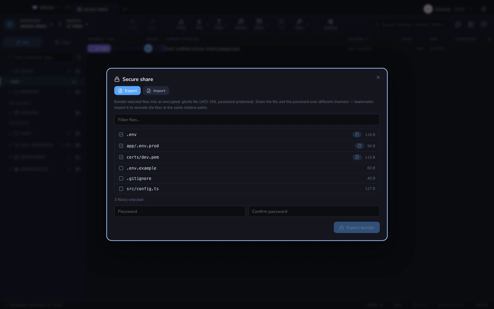
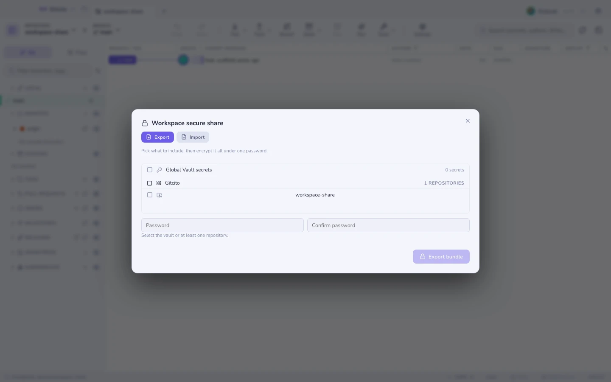

# שיתוף מאובטח

הקמה של מכונה חדשה פירושה בדרך כלל להקליד הכול מחדש. שיתוף מאובטח אורז את זה
לחבילה מוצפנת אחת במקום.

## מה יכול להיכנס

| מקטע | תוכן |
|---|---|
| **הגדרות** | ערכות נושא, פריסה, קיצורים, העדפות |
| **כספת** | סודות גלובליים וסודות לכל מאגר |
| **מאגרים** | המאגרים של סביבת עבודה, מותאמים לפי רימוט או תיקייה בעת הייבוא |

סודות נכללים רק כשאתם **מסמנים את התיבה**. חבילה בלי הסימון הזה אינה מכילה שום
אישורים בכלל.

## ייבוא

מסך הייבוא מראה מה בפנים **לפני** שמוחל משהו, מקטע אחר מקטע, והמאגרים מותאמים למה
שכבר יש לכם — קודם לפי כתובת הרימוט, אחר כך לפי תיקייה — כך שייבוא אינו משכפל שוב
את כל העולם.

**ראו גם:** [כספת](vault.md) · [אבטחה וסודות](security.md)
