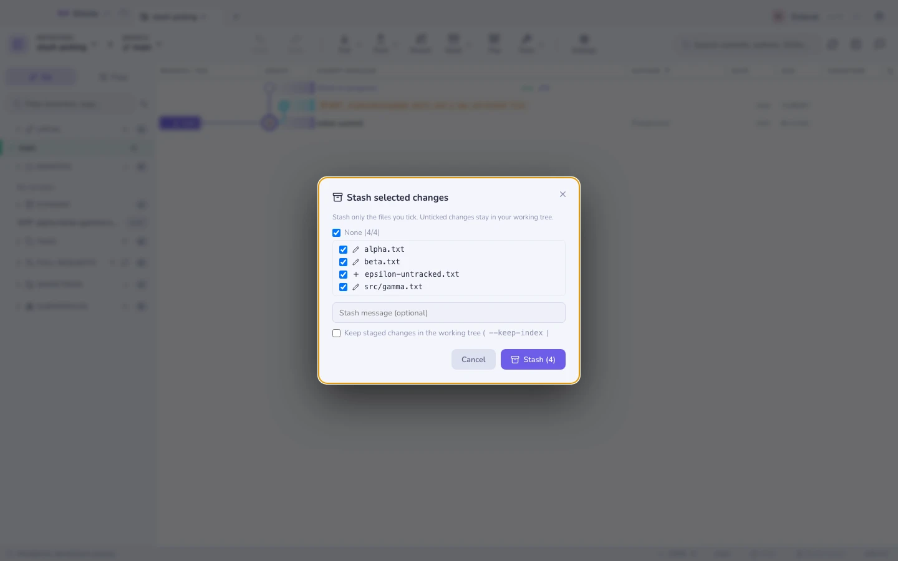

# סטאשים

סטאש ב־Gitcito אינו הכול־או־כלום.

| פעולה | מה היא עושה |
|---|---|
| **סטאש** | הכול, כולל קבצים שאינם במעקב אם תרצו, עם הודעה |
| **סטאש חלקי** | סמנו רק את הקבצים שאתם רוצים; לבחירתכם `--keep-index` |
| **החלה / שליפה** | הסטאש כולו, או **רק חלק מהקבצים שלו** |
| **סטאש ← ענף** | `git stash branch` — פתח המילוט כשסטאש לא מוכן להיות מוחל נקי |

בחירת סטאש מציגה את הקבצים והדיפים שלו, בדיוק כמו קומיט.

## כשסטאש לא מוכן להיות מוחל

אם החלת סטאש הייתה דורסת קבצים שאינם במעקב, git נעצר. Gitcito מציע לדרוס אותם
ולנסות שוב, במקום להשאיר אתכם לפענח את הלחש.

אם העץ זז רחוק מדי, **סטאש ← ענף** יוצר מחדש את הענף שממנו הסטאש נלקח, מחיל אותו
שם נקי, וזורק את הסטאש.

## לא לבלבל עם תמונות מצב

[תמונות מצב של עבודה בתהליך](recovery.md) הן אוטומטיות ומוסתרות; סטאשים הם מכוונים
ומופיעים ברשימה. תמונות מצב לעולם אינן נוגעות ברשימת הסטאשים שלכם.

**ראו גם:** [שחזור](recovery.md) · [העלאה לסטייג׳](staging.md)
