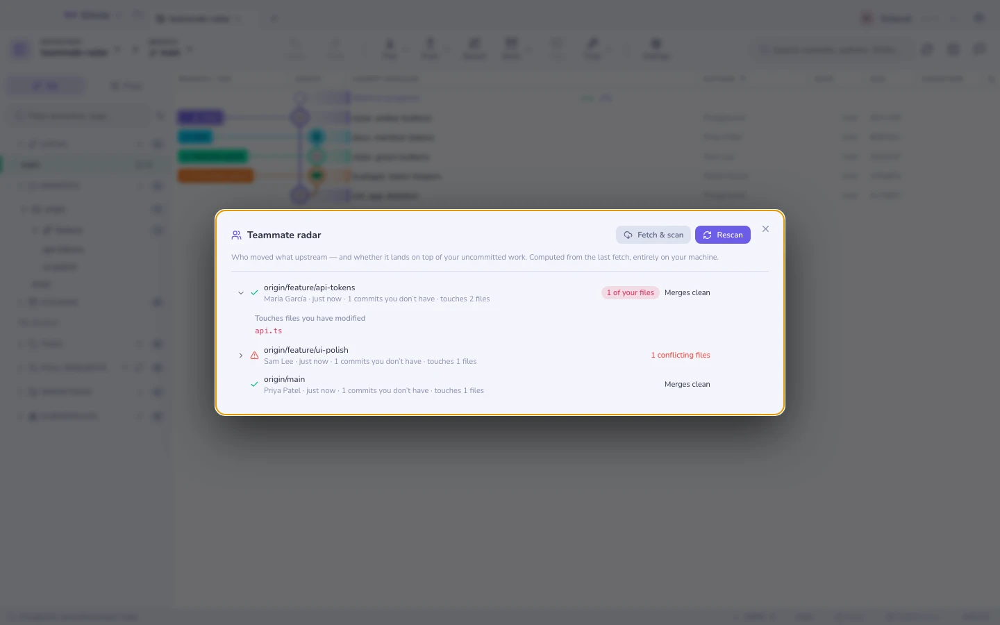

# מכ״ם עמיתים

אתם עורכים את `api.ts`. גם מישהו אחר עורך אותו, על ענף שעוד לא הסתכלתם עליו.
הדרך הרגילה לגלות היא התנגשות מיזוג בשבוע הבא; דרכו של המכ״ם היא רשימה, היום.

הכול מחושב מן ה**הבאה האחרונה** שלכם — refs של מעקב מרוחק, `merge-tree`
בזיכרון, ותו לא. בלי שרת, בלי סוכן על המכונות של העמיתים, ובלי רשת מעבר להבאה
שממילא עשיתם.

## מה שורה מספרת

לכל ענף מרוחק שיש בו קומיטים ש־`HEAD` שלכם לא מכיל:

| עמודה | המשמעות |
|--------|---------|
| מי ומתי | הקומיטר האחרון על אותו ענף, ולפני כמה זמן |
| קומיטים / קבצים | כמה נכנס, ובכמה קבצים זה נוגע |
| **חפיפה** | אילו מהקבצים האלה **מלוכלכים בעץ העבודה שלכם ממש עכשיו** — התגית האדומה |
| סיכון | האם מיזוג הענף לתוך `HEAD` יתנגש (אותו מנוע כמו [מכ״ם ההתנגשויות](conflict-radar.md)) |

השורות ממוינות לפי כמה הן מתנגשות בכם: חפיפה קודם, אחר כך התנגשויות חזויות,
אחר כך טריות. הרחיבו שורה לרשימות הקבצים המדויקות; **השוואה** פותחת את השוואת
הענפים המלאה.

## מתי הוא מדבר

אחרי כל הבאה — ידנית או אוטומטית — המכ״ם סורק בשקט. הוא מציג הודעה רק כאשר
קומיטים מה־upstream נוגעים בקבצים ששיניתם **וגם** הקבוצה הזאת באמת השתנתה מאז
הסריקה הקודמת. אין קבצים מלוכלכים, אין רעש: עץ עבודה נקי לא יכול להתנגש בשום
דבר.

## מגבלות

- הוא רואה את מה שההבאה האחרונה ראתה. עמית שעוד לא דחף הוא בלתי נראה — זה קורא
  refs, לא מחשבות.
- החפיפה היא ברמת הנתיב, לא ברמת השורה: נגיעה באותו קובץ היא התרעה, לא הוכחה
  להתנגשות. עמודת ה**סיכון** היא התשובה ברמת השורה, אבל רק בין מצבים שנכנסו
  לקומיט.
- ענפים שרדומים יותר מכ־45 יום מדולגים, ורק 30 הענפים שזזו לאחרונה נסרקים.

**ראו גם:** [מכ״ם התנגשויות](conflict-radar.md) · [הבאה, משיכה ודחיפה](syncing.md) · [מה השתנה מאז](range-diff.md)
