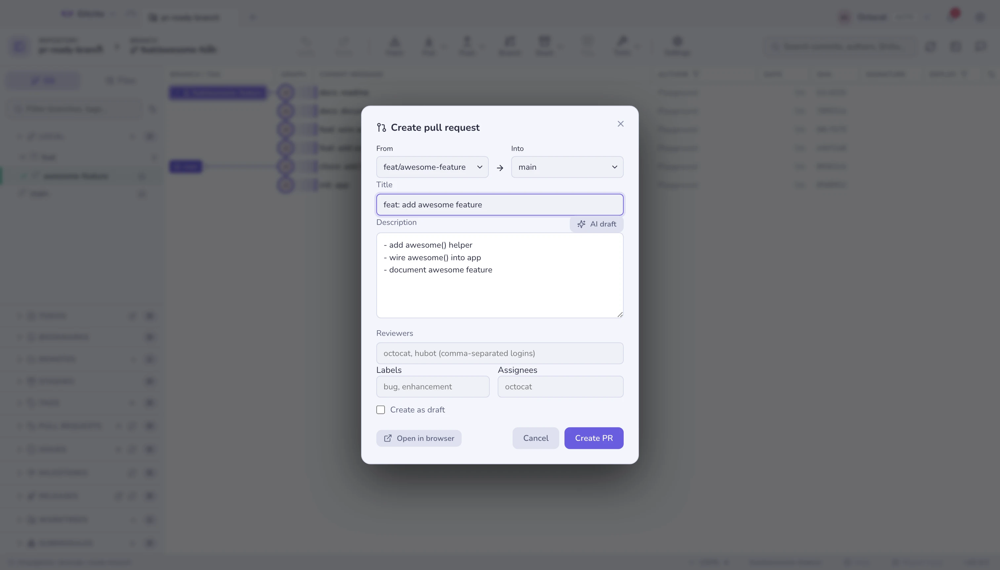
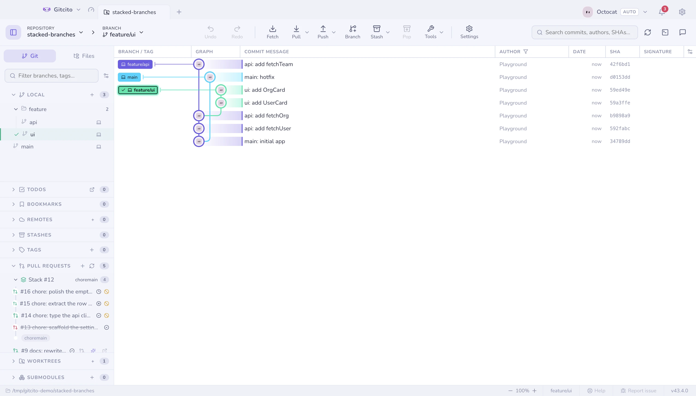

# Hosting & pull requests

## Creating

Create a pull (or merge) request without leaving the app: branch dropdowns,
title and body prefilled from the branch's commits, a draft toggle, and — on
GitHub — reviewers, labels and assignees applied on create.

Works on **GitHub, GitLab, Bitbucket and Azure DevOps**. Open PRs/MRs for all
four are listed in the sidebar.

Start one from branch-compare, the graph, the `+` in the PR panel, or from an
issue (which fills in `Closes #N`).

## Stacks in the list

Pull requests that sit on each other collapse into one row with a stack icon,
the branch the chain lands on, and how many are in it. Expand it to see the
chain in reading order — leaf first, down to the base — with a small arrow under
each one naming what it merges into, so the direction is on screen rather than
inferred from four base branches.

Two things put a group there: GitHub's own stack number, when the pull requests
belong to a [native stack](stacks.md), and otherwise the refs themselves — a
pull request whose base is another's head sits on it. The second rule is why
this also works on GitLab, Bitbucket and Azure DevOps, and for chains opened
before any of that existed.

Each row carries the state of its head's **checks** — hover for the counts —
and, on GitHub, the levels that are already closed or merged, which a list of
open pull requests would otherwise hide. A level above a **closed** one is
marked blocked: its own checks may be green, but the branch it targets is never
going to land. The row's actions appear on hover, so the title keeps the width.

Reading the checks costs one request per pull request, and only when the list is
refreshed.

## Reviewing — GitHub and GitLab

The Rust preview can submit a GitHub review from a pull request's detail view:
comment, approve, or request changes. It uses the authenticated GitHub CLI
(`gh`) and requires a comment for comment and request-changes reviews. The
Rust preview can also merge an open pull request with a merge commit, squash,
or rebase. It confirms the selected strategy and head commit before submission,
and rejects the merge if that head changed. It does not delete the remote
branch. Update branch brings the latest base changes into the PR head, by merge
commit or rebase. Check rows open their log page when GitHub provides a details
URL. The detail view also shows conversation comments and submitted reviews
with author, date, state, and Markdown formatting. Inline review threads are
grouped by file and line, show resolved or outdated state, and include replies.
When GitHub grants permission, you can resolve an open thread or reopen a
resolved one from the thread itself, or reply inline without leaving the detail
view.
The native preview loads up to 100 threads and 100 comments per thread. Its
file checklist tracks viewed state on GitHub and shows review progress; file
pages load until complete, with a retry message if pagination fails.

| | |
|---|---|
| **Conversation** | Comments and review state |
| **Checks** | CI check-runs (GitHub) or pipeline jobs (GitLab) with pass/fail/pending and view-logs links |
| **Files viewed** | A per-file ✓ checklist with progress |
| **Inline threads** | Line comments grouped by `file:line`, and replies |
| **Actions** | Comment, approve, request changes, and merge / squash |

If someone force-pushes mid-review, [what changed since](range-diff.md) shows
you exactly what moved.

GitLab differences, stated plainly: GitLab has no single "submit review" call,
so **approve** uses its approval endpoint and **request changes** removes your
approval and posts your comment. **Rebase-merge** is not offered — GitLab
decides merge-commit vs fast-forward from the project's settings, so the merge
menu shows merge and squash only. Inline threads show the file and line but not
the surrounding diff hunk, which GitLab's API does not return. Review/merge
works for projects on **gitlab.com**; self-hosted instances are not supported
yet. Bitbucket and Azure DevOps still open in the browser for review.

## Issues — GitHub

The Rust preview can list issues, open their details, create an issue, comment,
and close or reopen it. Filter the issue list by title, number, state, author,
label, or assignee. It also lists milestones with due dates, completion
progress, and their issues. These workflows use the GitHub CLI (`gh`), so sign
in with `gh auth login` first. The Electron app also supports Projects v2
fields and creating a branch from an issue; those workflows are not in the
Rust preview yet.

## Milestones and releases — GitHub

The Rust preview shows milestone due dates, issue progress, and release notes.
Both views are read-only. Electron also supports planning fields and issue
branch creation.

## Notifications — GitHub

The Rust preview loads your GitHub inbox with unread/all filters, opens selected
threads in the browser, and can mark one thread or the whole inbox as read. It
uses the GitHub CLI account (`gh auth login`) and refreshes the inbox every five
minutes while the app is running.

In the Rust preview, **Settings → Integrations → GitHub notifications** can
raise desktop alerts for new review requests and CI activity. The first inbox
poll seeds notification history without replaying old items. Clicking an alert
opens its GitHub thread when the operating system supports notification actions.
Switching the active `gh` account seeds that account's inbox quietly too.

Your whole inbox — review requests, mentions, CI activity — across every
repository, with unread/all filters and mark-as-read. In Electron, the toolbar
bell carries an unread badge, and optional desktop notifications fire when a
review is requested or CI finishes.

## Tokens

Per-profile tokens for multiple accounts or orgs, stored with your OS keychain.
Gitcito can also borrow whatever your **git credential helper** already holds,
so an org you have already authenticated for often needs no setup at all. See
[Security & secrets](security.md).

**See also:** [Stacked branches](stacks.md) · [AI features](ai.md)
