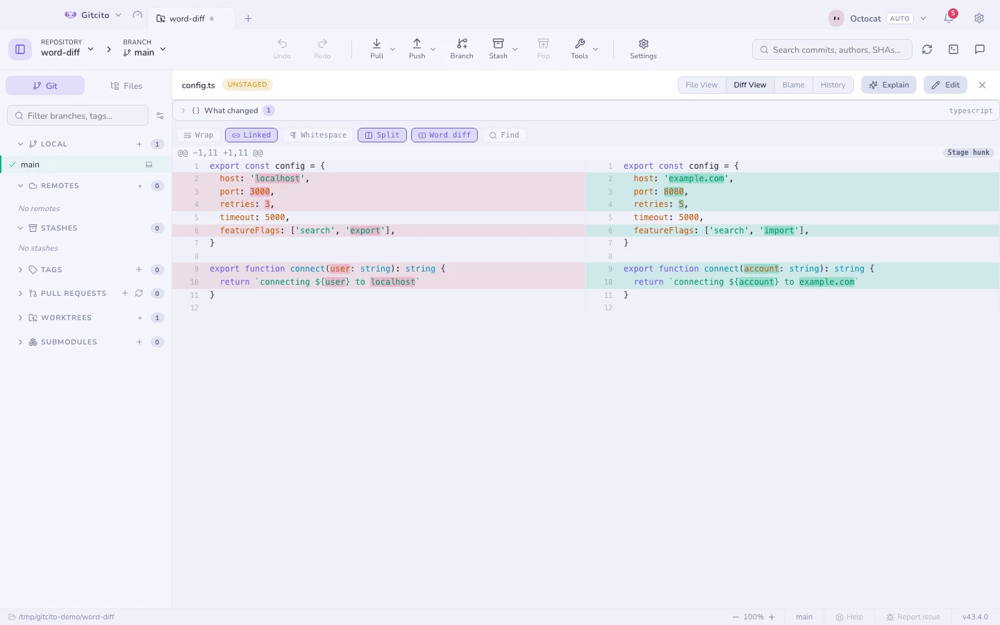
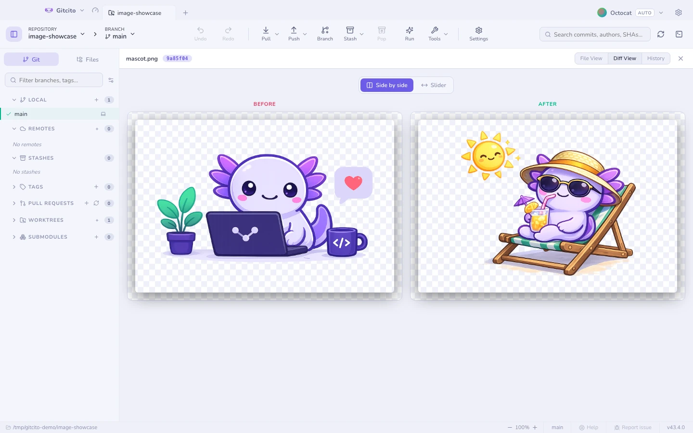
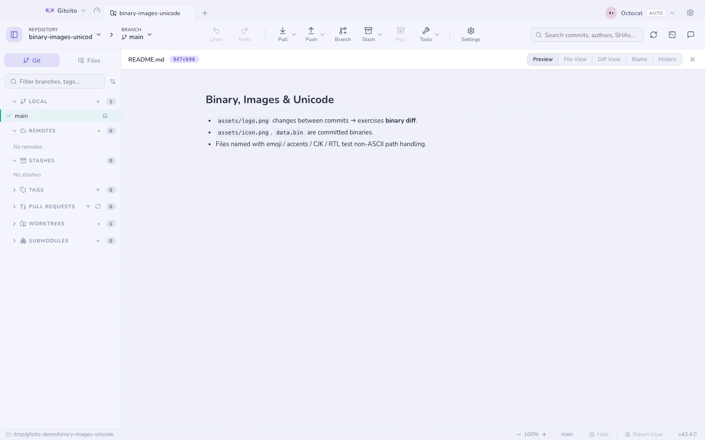
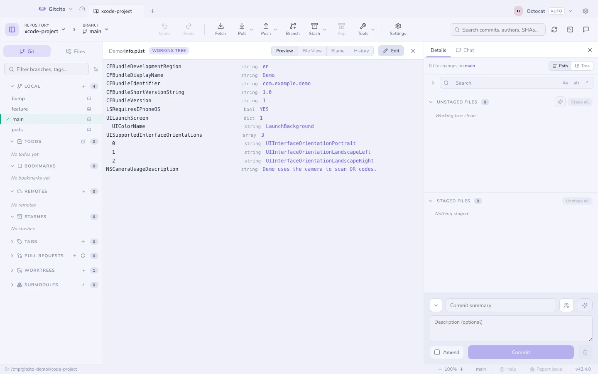
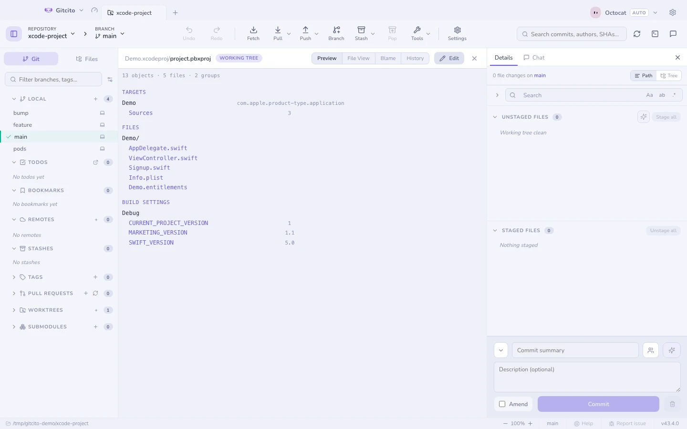
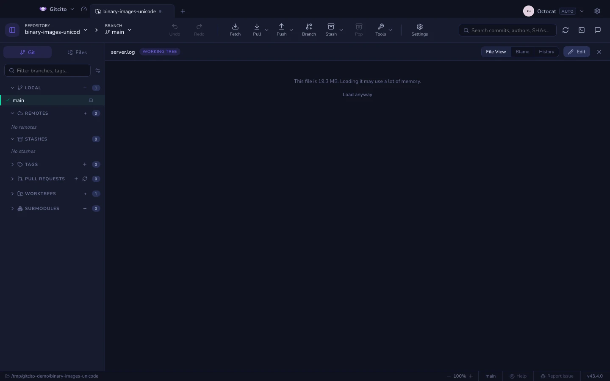
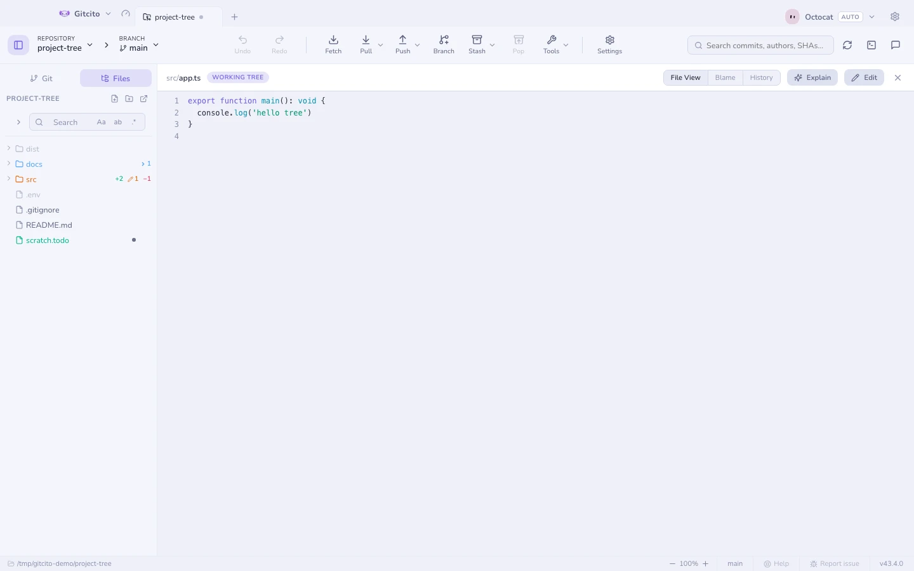
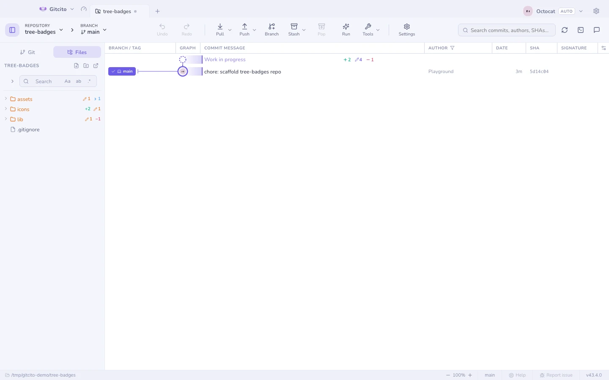

# Diff e anteprime

## Leggere un diff

| Interruttore | Cosa fa |
|---|---|
| **Unificato ↔ affiancato** | Affiancato quando vuoi confrontare, impilato quando vuoi leggere |
| **A livello di parola** | Evidenzia solo i token cambiati dentro una riga modificata — rosso sul vecchio, verde sul nuovo |
| **Ignora gli spazi** | Nasconde le reindentazioni così emerge la modifica vera |
| **A capo** (solo vista affiancata) | Manda a capo le righe lunghe dentro la loro colonna invece di scorrerle |
| **Collegato** (affiancata, senza a capo) | Fa scorrere le due metà insieme, in verticale e in orizzontale — disattivato, ogni colonna scorre per conto suo |
| <kbd>⌘F</kbd> | Cerca dentro il diff, con avanti/indietro |

L'andata a capo è disattivata: una riga resta su una riga, così i due lati
restano confrontabili riga per riga, e ogni metà scorre in orizzontale con la
propria barra. Attivala quando preferisci leggere una riga lunga invece di
inseguirla — in cambio, una riga ripiegata su tre righe non sta più di fronte
alla sua controparte. Ogni interruttore ricorda il proprio stato tra file e
sessioni.

Senza andata a capo le due metà scorrono **collegate** per impostazione
predefinita — in verticale, il che tiene le righe una di fronte all'altra, e in
orizzontale, così la colonna 90 a sinistra sta sopra la 90 a destra. Scollegale
quando i lati si sono allontanati — un blocco indentato contro uno non
indentato, una rinomina che ha spostato ogni riga — o quando vuoi confrontare
due regioni distanti dello stesso file, e lascia ogni metà dov'è il suo
contenuto.

Sopra ogni diff sta il [riepilogo semantico](semantic-diff.md) — cos'è cambiato,
simbolo per simbolo, invece che riga per riga.

## Diff di immagini

Le immagini modificate ottengono un confronto vero: affiancate, oppure con una
maniglia da trascinare fra il prima e il dopo.

## Anteprima di qualsiasi cosa

La modalità **Anteprima** renderizza il file invece di mostrarne il sorgente:
Markdown, Word (`.docx`), Excel (`.xlsx`), PDF, video, audio, immagini, e codice
con evidenziazione della sintassi per tutto il resto.

### Property list di Apple

`Info.plist` e `*.entitlements` sono XML, e l'XML non è ciò che qualcuno sta
cercando di leggere. L'anteprima mostra invece lo schema chiave/valore — la forma
che mostra l'editor di plist di Xcode — con l'annidamento intatto e il tipo di
ogni valore accanto.

Due limiti. Una plist **binaria** (`bplist00`) viene riconosciuta e nominata, non
decodificata — passala a `plutil -convert xml1` se la vuoi qui, anche se una
plist binaria in un repository di solito è un artefatto di build che non
andrebbe versionato. E i valori `<data>` compaiono come conteggio di byte invece
che in base64: un blob non ti dice nulla, e un profilo di provisioning
visualizzato in un pannello che magari stai condividendo dice troppo agli altri.

### Progetti Xcode

Un `project.pbxproj` è un dizionario piatto di oggetti che si puntano a vicenda
per identificatore, quindi leggerlo in ordine non dice quasi nulla del progetto.
L'anteprima segue quei riferimenti e ricostruisce le tre cose per cui eri
venuto: i **target** con le loro fasi di build, l'**albero dei gruppi** come lo
disegna il navigatore di Xcode e le **impostazioni di build** per configurazione.

È un lettore, non un editor: nulla di tutto questo scrive nel progetto. Per cosa
succede quando due rami ne modificano uno, vedi
[risolvere i conflitti](conflicts.md).

## File molto grandi

Le anteprime e la vista file caricano l'intero file in memoria, quindi
entrambe rifiutano i file oltre un limite di dimensione (32 MB per le
anteprime, 16 MB per il testo) e indicano invece quanto è grande il file.
**Carica comunque** annulla il limite per quel file — nulla è fuori portata, i
caricamenti grandi sono solo opzionali. File e diff oltre qualche migliaio di
righe vengono ancora renderizzati per intero, ma le righe fuori dalla vista non
vengono più impaginate né disegnate: un diff gigante di un lockfile smette di
costare la memoria di un intero laptop.

## Scheda File

La scheda **File** della barra laterale sinistra naviga l'albero di lavoro vero e
proprio, con badge di stato sulle cartelle (aggiunto / modificato / eliminato)
che riassumono ciò che contengono.

**Vedi anche:** [Diff semantico](semantic-diff.md) · [Staging](staging.md)
