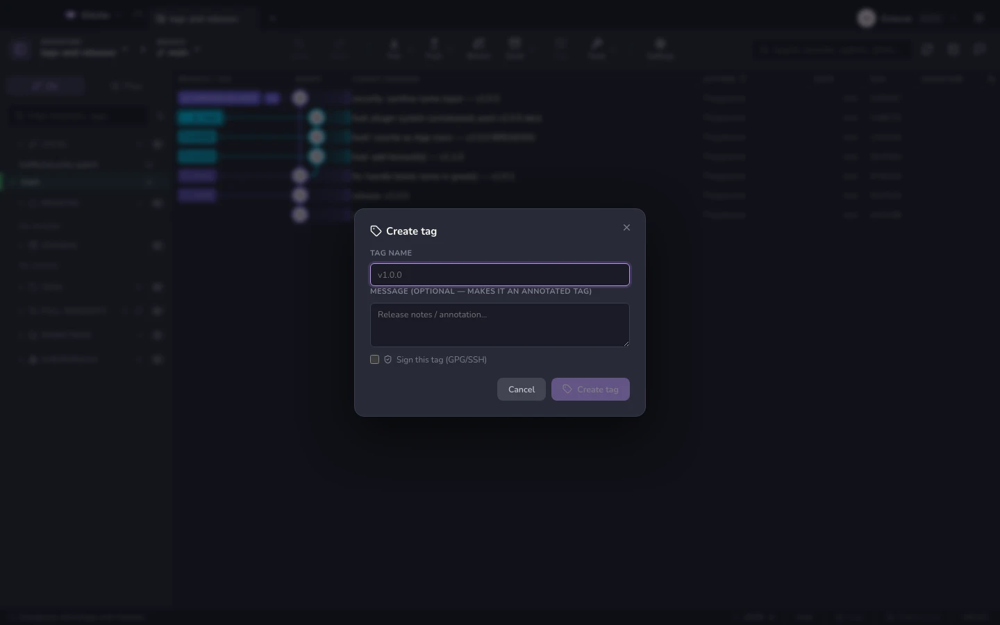

# Tag e release

Crea un tag da qualsiasi commit:

| Tipo | Quando |
|---|---|
| **Leggero** | Un puntatore. Basta e avanza per un segnalibro personale |
| **Annotato** | Porta con sé un messaggio, un autore e una data — quello che una release dovrebbe essere |
| **Firmato** | Annotato, più una firma GPG/SSH |

Elimina i tag in locale, pubblicali, o eliminali sul remote. I tag remoti si
possono sfogliare senza doverli prima recuperare tutti.

Su GitHub, le **release** pubblicate compaiono nella barra laterale con la loro
pagina di changelog — vedi [Hosting](hosting.md). Per redigere le note, usa il
[generatore di changelog](changelog.md).

**Vedi anche:** [Commit firmati](signing.md) · [Generatore di changelog](changelog.md)
