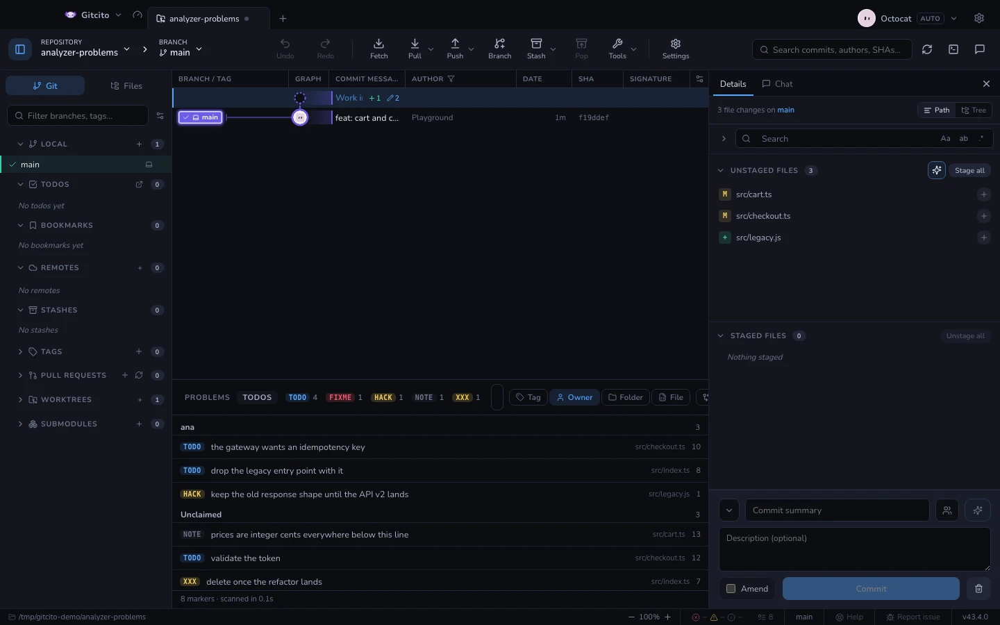

# コード内の TODO

TODO は、誰かが自分自身と交わして、そのまま見失った約束です。問題のある場所に書
かれる——つまり、二度と誰も見に来ない場所に書かれる——ものであり、それが重要になる
頃には書いた本人は別のチームにいます。grep は見つけてくれますが、grep の出力が千
行あるなら、見つからなかったのと同じです。

アナライザードックの **TODO** タブはそれらをすべて読み、grep にはできないことを
します。まとめるのです。ステータスバーかコマンドパレット（`コード内の TODO`）から
ドックを開き、2 つめのタブに切り替えてください。

ステータスバーはアナライザーのエラーや警告の隣にマークの件数を表示します。その
カウンターをクリックすると、このタブが開きます。

## 何がマークとして数えられるか

Git が追跡している（あるいは追跡するであろう）ファイルの、コメントの中にあるタグです。

| 書き方 | 読み取り |
|--------|----------|
| `// TODO: 出す` | タグ `TODO`、担当なし |
| `//todo 出す` | 同じ——コロンも空白も省略できます |
| `# todo 出す` | 同じ——大文字小文字も言語も関係ありません |
| `/* TODO(cgm): 出す */` | タグ `TODO`、担当 `cgm` |
| `-- TODO (CGM) 出す` | 同じ担当：`cgm`、`(CGM)`、`[cgm]` は同一人物です |
| `<!-- TODO: @cgm 出す -->` | これも同じ |

タグは `TODO`、`FIXME`、`BUG`、`HACK`、`XXX`、`NOTE`、`OPTIMIZE`、`REVIEW`、
`REFACTOR`、`DEPRECATED`、`QUESTION`、`IDEA`、`WIP`、`TEMP` です。最初の 4 つに色
が付くのは、「壊れている」と「思いつき」が一覧の中で同じ見た目であってはならない
からです。

タグはコメント開始記号——`//`、`#`、`--`、`;`、`%`、`/*`、`*`、`<!--`、`"""`——の
後ろになければなりません。それ以外は数えません。`todo = [l for l in lines]` はコード
であり、変数への代入を負債として並べるパネルは二度と信用されません。同じ規則が
`reviewNotes` という名前の関数も一覧から外します。

## まとめ方こそが機能

軸は 4 つ、それぞれ 1 クリックです。

| グループ化 | 答える問い |
|------------|------------|
| **タグ** | このリポジトリはどんな種類の負債を抱えているか |
| **担当** | 誰が何を置いていったか——そして担当なしの山には何があるか |
| **フォルダー** | ツリーのどの一角が腐りかけているか |
| **ファイル** | 行き先が分かっているときの、ふつうの一覧 |

**担当なし** は残りものではなく、れっきとしたグループです。誰も名前を書かなかった
マークこそ、誰にも拾われないマークであり、その数が見えること自体に意味があります。

上部のタグチップは一覧を絞り込みます。行の担当バッジをクリックしても同じで、検索
ボックスは本文・ファイル・タグ・担当のいずれにも一致します。**変更したファイルの
み** は、編集したがまだコミットしていないファイルに絞ります——プッシュ前の最後の
確認であり、1 時間前に置いた `// FIXME` が永続化する直前です。

行をクリックすると、その行でファイルが開きます。

## できないこと

- **読むだけで、書き込みは一切しません。** 「完了にする」はありません。TODO を閉じ
  る方法は、その行を消してコミットすることです。Gitcito が代わりに保持するチェック
  リストは [Todos](todos.md) で、まったく別物です——ソースではなくアプリの中に住む
  private なメモです。
- **無視されたファイルは飛ばします。** `node_modules` も同様で、中のタグが何と書い
  てあっても変わりません。未追跡ファイルは含まれます。5 分前に書かれたマークこそ、
  いちばん見る価値があるからです。
- **コメントと文字列を区別できません。** `const banner = "// TODO"` という行はスキ
  ャンにとってマークです。40 言語ぶんのパーサーは持っておらず、持っているふりもし
  ません。
- **スキャンはある時点の写真です。** ファイルを編集しても、再スキャンするまでパネ
  ルは以前の数字を保ちます。更新ボタンがすべてです。
- **5,000 件で打ち切ります。** それを超えるリポジトリの負債は、パネルで解決する類
  のものではありません。

## どこで動くのか

作業ツリーに対する `git grep` 1 回だけです。[問題](problems.md) タブが秒を要すると
ころをミリ秒で終えられるのはそのためで、何もコンパイルせず、ツールチェーンも介在
せず、バイナリと無視されたパスは Git がすでに知っているので飛ばせます。
