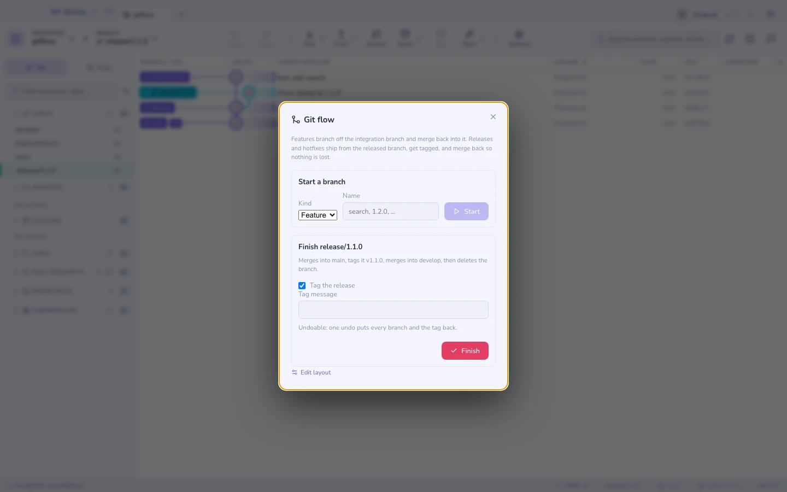

# Git flow

[git-flow のブランチモデル](https://nvie.com/posts/a-successful-git-branching-model/)
は、5 つのルールと大量の帳簿づけでできています。ルールは簡単で、リリース当日の夕方 6 時に
人が間違えるのは帳簿づけのほうです。ホットフィックスを `main` にマージして `develop` を
忘れる、あるいは違うブランチにタグを打つ、といった具合に。

`⌘K` → **Git flow** が、その帳簿づけを引き受けます。



## 構成

| ブランチ | 中身 |
|--------|-------|
| **リリース済みブランチ**（`main`） | 本番にあるもの。すべてのリリースはここにタグが打たれます。 |
| **統合ブランチ**（`develop`） | リリースとリリースの間に、完了した作業が積み上がる場所。 |
| `feature/*` | 1 単位の作業。develop から分岐します。 |
| `release/*` | 安定化中のバージョン。develop から分岐します。 |
| `hotfix/*` | 緊急の修正。**main** から分岐します。本番は develop を待てないからです。 |

Gitcito は、`git flow` CLI が使うのと同じ `gitflow.*` の git 設定キー
（`gitflow.branch.master`、`gitflow.prefix.feature` など）を読み書きします。誰かが
すでに `git flow init` を実行したリポジトリはすぐに認識されますし、ここで設定した
リポジトリはあとから CLI でもそのまま使えます。Gitcito は終始ふつうの git コマンドを
実行するので、CLI をインストールしておく必要はありません。

**セットアップ** はそれらのキーを書き込み、統合ブランチがまだ存在しなければリリース済み
ブランチから作ります。ほかには何も触れません。名前や接頭辞はあとから **構成を編集** で
変えられます。

## 開始する

種類を選び、名前を打ち、**開始** を押します。ダイアログは、決断する前に、これから作る
ブランチとその分岐元を見せます。

```
feature/search   from develop
hotfix/1.0.1     from main
```

名前はあなたが打ったもので、接頭辞は構成から来ます。

## 完了する

**完了** こそ自動化する価値のある部分です。すべて起こらなければならない手順がいくつも
あるからです。

| 種類 | Gitcito がすること |
|------|-------------------|
| 機能 | `--no-ff` で develop にマージし、ブランチを削除し、develop に留まります |
| リリース | main にマージし、タグを打ち、develop にマージし、ブランチを削除し、develop に留まります |
| ホットフィックス | main にマージし、タグを打ち、develop にマージし、ブランチを削除し、**main** に留まります |

`--no-ff` は意図的です。あとから [グラフ](graph.md) でそのブランチが見えるようにして
いるのは、このマージコミットだからです。これがないと短い機能ブランチは一直線の中に
消えてしまい、このモデルは存在理由を失います。

タグは `<version tag prefix><name>` です。既定の接頭辞なら `release/1.1.0` は
`v1.1.0` になります。**リリースにタグを打つ** のチェックを外せば省略でき、既定以上の
ものが欲しければタグメッセージを書けます。

### やらないこと

- **作業ツリーが汚れていれば止まります。** 先にコミットするか [スタッシュ](stashes.md)
  してください。完了は 2 つのブランチをマージし、HEAD を 2 回動かします。コミットして
  いない作業の周りでそれをやることが、作業を失う道筋です。
- **マージが衝突したら、すべてを巻き戻します。** main へのマージは成功したのに develop
  へのマージが衝突した場合、そのままでは中途半端なリリースだけが残ります。Gitcito は
  すべてのブランチを元の位置に戻し、コンフリクトを報告します。そのブランチを手で
  マージし、[コンフリクトリゾルバ](conflicts.md) で解決すれば、あとは自分の手で流れを
  仕上げられます。
- **プッシュは決してしません。** 完了はローカルの操作です。準備ができたら main、
  develop、新しいタグをプッシュしてください — [同期](syncing.md) を参照。

### 取り消し

**取り消し** 一発ですべてが戻ります。両方のブランチが以前のコミットへ戻り、タグは削除
され、完了したブランチが元の先頭で作り直されます。完了を気軽に試せるのは、まさにこれが
あるからです。

## 使わないほうがよいとき

git flow が向いているのは、バージョン付きのリリースとサポート対象の本番ブランチを持つ
ソフトウェアです。`main` から 1 日に何度もデプロイしているなら、リリースブランチと
ホットフィックスブランチは使われない儀式になります。そういう現場には
[スタックブランチ](stacks.md) か、`main` から生やす短命なブランチのほうが合います。
モデルのうち機能ブランチの半分だけなら、単独でも十分に機能します。
