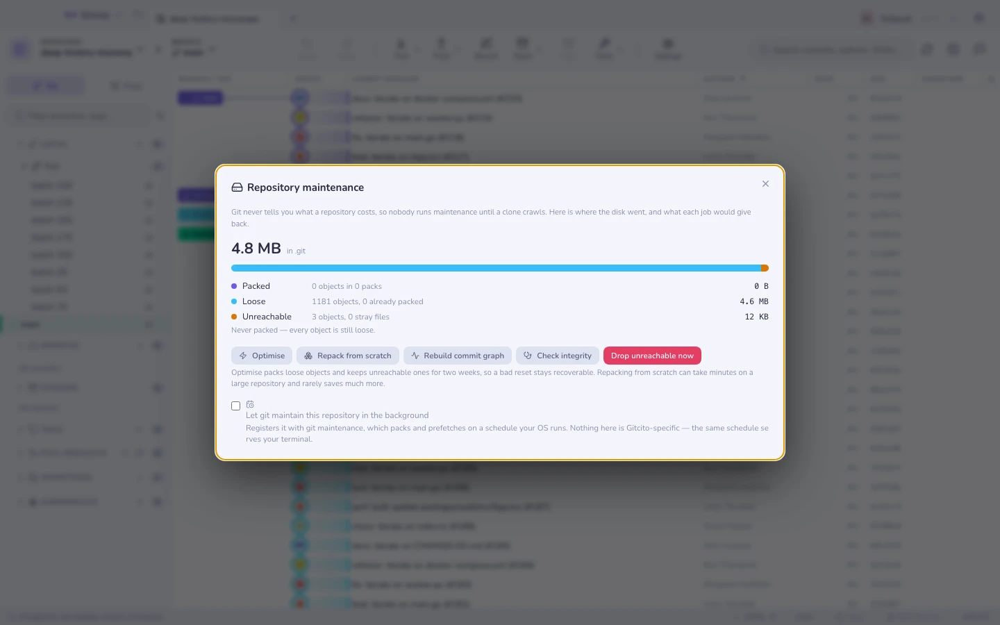

# リポジトリのメンテナンス

git はリポジトリがいくら食っているかを教えてくれません。オブジェクトデータベースが
どんな状態でも動き続けるので、最初に異常に気づくのはたいてい、クローンが這うように
遅いときか、ノート PC のディスクが尽きたときです — コマンド 1 つで直せた時点を、
はるかに過ぎたあとになります。

このパネルは、その足りない計器盤です。容量がどこへ消えたのか、そのうちどれだけが
回収できるのか、そして各ジョブが何をするのかを、実行する前に示します。

`⌘K` → **リポジトリのメンテナンス**。

## 数字の読み方

すべては `git count-objects -v` と、実際の到達可能性の走査から来ています —
推定値は 1 つもありません。

| 行 | 何なのか | なぜ増えるのか |
|-----|-----------|--------------|
| **パック済み** | パックファイルの中にある、圧縮され差分化されたオブジェクト | これが健全な状態 |
| **ルース** | オブジェクト 1 つにつき 1 ファイル、ほとんど圧縮されない | コミットのたび、フェッチのたびに書かれる |
| **到達不能** | もう何からも指されていないオブジェクト | 捨てたコミット、amend したメッセージ、放り出したリベース |

**ルース** の横の数 — *「n 個のオブジェクト、うち m 個はパック済み」* — が見張る価値
のあるものです。その `m` は二重に保存されています。一度はルースとして、もう一度は
パックの中に。純粋な重複であり、それを畳むのが `git gc` です。

**到達不能は、まだゴミではありません。** それらのオブジェクトこそ、リセットで消した
コミットを `git reflog` が取り戻してくれる正体です。git は意図して 2 週間
残しています。

## ジョブ

| ボタン | 実行するもの | コスト |
|--------|------|------|
| **最適化** | `git gc` | 数秒から 1 分。ほとんどの場合これが正解 |
| **一から再パック** | `git gc --aggressive` | 大きなリポジトリでは数分。すべての差分を計算し直す |
| **コミットグラフを再構築** | `git commit-graph write --reachable` | 高速。log とグラフの走査が目に見えて速くなる |
| **整合性をチェック** | `git fsck --dangling` | 大きなリポジトリでは遅い。何も変えない |
| **到達できないものを今すぐ削除** | `git gc --prune=now` | reflog の安全網を壊す |

手を伸ばすべきなのは **最適化** です。ルースなオブジェクトをパックし、2 週間以上
到達不能だったものを捨て、最近の履歴は復旧可能なまま残します。

**一から再パック** は過大評価されています。既存の差分をすべて投げ捨ててゼロから計算
し直すので数分かかり、素の gc と比べて節約できるのはたいてい数パーセントです。巨大
な履歴をインポートした直後に一度やる価値はありますが、日常的にやる価値はありません。

**到達できないものを今すぐ削除** は先に尋ね、確認画面がオブジェクト数と容量を示し
ます。実行後は、1 時間前にリセットで消したコミットは復旧できません — reflog の
エントリはまだ並んでいるかもしれませんが、その背後のオブジェクトはもうありません。

## 整合性をチェック

`git fsck` は、あるオブジェクトから参照されているオブジェクトが実際に存在し、内部的
に整合しているかを検証します。

- **ぶら下がったオブジェクトは正常です。** それが到達不能なもので、名前つきで一覧
  されます。リベースのあとに数百個あるリポジトリは健全です。
- **欠けているオブジェクトは損傷です** — 途中で切れた書き込み、壊れたディスク、中断
  された転送。もし現れたら再パックしないでください。壊れたデータベースを再パック
  すると、復旧できたはずの問題が永久のものになりかねません。リモートから正常なコピー
  をクローンし、未プッシュのブランチは [バンドル](export.md) で持っていきましょう。

## バックグラウンドのメンテナンス

チェックボックスはリポジトリを **`git maintenance`** に登録します。これはあなたの
オペレーティングシステム（launchd、systemd、タスクスケジューラ）が動かすスケジュール
に従って、パックとプリフェッチを行います。

ここに Gitcito 固有のものは何もありません。同じスケジュールはあなたのターミナルにも
効きますし、`git maintenance unregister` はどこからでもそれを取り消せます。チェック
を外すとまさにそれが起き、登録されている他のリポジトリのためにスケジュール自体は
残ります。

## 知っておくべき制限

- **到達不能の数には完全な到達可能性の走査が必要**なので、非常に大きなリポジトリでは
  パネルを開くのに少し時間がかかります。それが推定ではない、正直な数字だからです。
- **サイズはディスクが差し出す量**であって、中身の長さではありません。400 バイトの
  ルースなオブジェクトでも 4 KB のブロックを 1 つ占めます。だからそれが千個あると
  メガバイト単位のコストになり、だからパックする価値があるのです。
- **ワークツリーやサブモジュールは自前の `.git` を持つ**ので、表示されるサイズは
  このリポジトリだけのものです。
- **メンテナンスは履歴を縮められません。** 400 MB の blob がコミットの中にあるなら
  それは到達可能であり、gc は永久に保持します — それは
  [履歴からファイルを削除する](history-purge.md) であって、別物の、はるかに破壊的な
  操作です。
- **Gitcito があなたの背後で gc を走らせることはありません。** git 自身の
  `gc --auto` は従来どおり走ることがあり、失敗すると `.git/gc.log` にメモを残し
  ます。このパネルはそれを表に出します。

関連項目: [履歴からファイルを削除する](history-purge.md) ·
[バンドルとアーカイブ](export.md) · [復旧](recovery.md)
