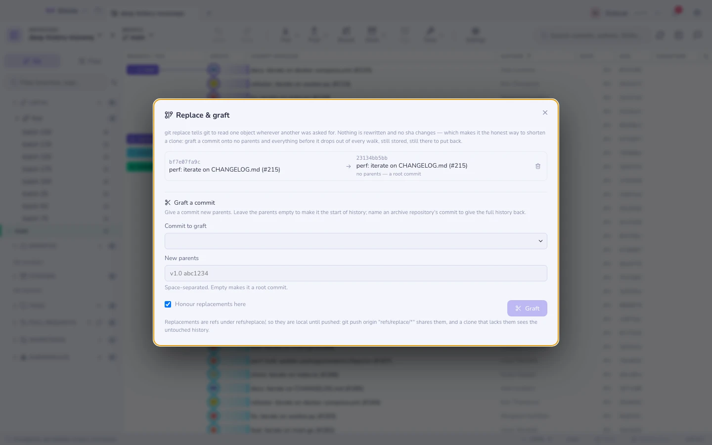

# 置き換えとグラフト

`git replace` は git にこう伝えます。*オブジェクト A を読もうとしたところでは、
代わりに B を読め*。何も書き換えられません。sha は 1 つも変わりません。すべての
コミットはあった場所にそのまま残り — git が通りすがりに別の場所を見るだけです。

小さなクローンが欲しくなるまでは、これは物好きの道具に聞こえます。そうなった途端、
履歴の書き換えに対する誠実な代替案になります。**コミットを「親なし」にグラフトする**
と、それより前のすべてがログからも、グラフからも、そこから作られるすべてのクローン
からも消えます — それでいて保存はされたまま、フェッチも可能なまま、ref を 1 つ消す
だけで戻ってくる状態のままです。

`⌘K` → **置き換えとグラフト**。

## グラフトする

| 与えるもの | 得られるもの |
|---------|-------------|
| コミット 1 つ、**親なし** | そのコミットが履歴の始まりになります |
| コミット 1 つ、**親が 1 つ以上** | 実際にある場所ではなく、そこに接続されます |

面白いのは 2 つめの形です。完全な履歴はアーカイブ用リポジトリに残し、作業用リポジ
トリは切り詰め、アーカイブの先端を指すグラフトで両者を再接続する — 深掘り可能な
浅いクローンを提供するために GitHub が使っているのと同じ手口です。

**親なしへのグラフトは先に確認します。** 「履歴が消えた」と「履歴が隠れている」は
ログから見ると同じに見えますが、まったく別物だからです。オブジェクトは `gc` が刈り
取るまで生き残ります。[メンテナンス](maintenance.md) を参照してください。

## つき合い方

**置き換えは ref です。** `refs/replace/` の下にあります。知っておく価値のある帰結が
3 つあります。

- **プッシュするまでローカル限りです**。`git push origin "refs/replace/*"` で共有でき、
  それなしでクローンした人には手つかずの履歴が見えます。
- **取り消しが効きます** — ref を落とせば本当の祖先関係がただちに戻り、Gitcito は
  グラフトを他の操作と同じく取り消し可能なアクションとして記録します。
- `core.useReplaceRefs=false` は git にすべての置き換えを一度に無視させます。ここの
  トグルはまさにそれを書き込み、オフのときはダイアログがそう伝えます。自分の置き換え
  を黙って無視するリポジトリは、人を混乱させる場所だからです。

コマンドラインからは、`git --no-replace-objects log` が設定を一切変えずに本当の履歴
を見せてくれます。

## 書き換えではなくこちらを選ぶとき

| 目的 | 道具 |
|------|------|
| クローンが大きすぎる、履歴自体は問題ない | **グラフト** — 何も書き換えず、元に戻せます |
| 秘密情報や巨大な blob を*消し去る*必要がある | [履歴からファイルを削除する](history-purge.md) — 本物の書き換え |
| とにかく一度のダウンロード量を減らしたい | `git clone --depth` — 浅いクローン、管理する ref なし |

グラフトは何も削除しません。古いコミットを消したい理由が、そこに決してコミットされる
べきでなかったものが入っているからなら、このページは見当違いです。オブジェクトは
まだそこにあり、sha でフェッチでき、既存のすべてのクローンにも残っています。

## 知っておくべき制限

- **見えているものと保存されているものが一致しなくなります。** それがこの機能であり、
  同時に危険でもあります。置き換えのあるクローンをデバッグする人は、その存在を知って
  いる必要があります。
- **置き換えは既定では持ち運ばれません。** そのため、同僚の `git log` とあなたの
  `git log` が食い違っていても、どちらも正しいということが起こり得ます。
- **置き換えはツールからコミットを隠せますが、git からは隠せません。**
  `git cat-file` や [オブジェクトエクスプローラー](objects.md) は sha を指定すれば
  元のオブジェクトを開きます。
- **Gitcito は `git replace --edit`（オブジェクトの内容を手で書き換えること）を提供
  しません。** それは生のオブジェクトに対するテキストエディタの仕事であり、UI を
  かぶせれば自分の足を撃つ道具になります。

関連項目: [オブジェクトエクスプローラー](objects.md) ·
[履歴からファイルを削除する](history-purge.md) ·
[リポジトリのメンテナンス](maintenance.md)
