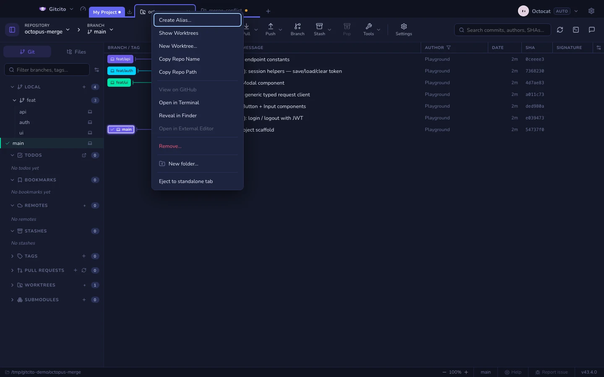
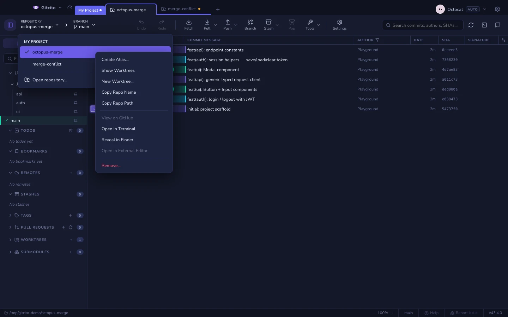

# リポジトリのコンテキストメニュー

リポジトリを右クリックすると — 単独のタブ、グループ内のチップ、入れ子フォルダ内の
チップ、ようこそ画面やランチャーの一覧の行、ツールバーのリポジトリドロップダウンの
行、どこであっても — 同じリポジトリ用のメニューが開きます。グループのチップ自体は
これまでどおりグループメニューを開くので、クリックはリポジトリの上に当てる必要が
あります。

ツールバーのリポジトリドロップダウンには、ブランチドロップダウンがブランチを並べる
のと同じように、開いているすべてのリポジトリが並びます。行を左クリックすると
そのリポジトリに切り替わります。行（または現在のリポジトリを示すピル自体）を
右クリックすると、エイリアス、ワークツリー、GitHub、ターミナル、表示、エディター、
取り除く操作が使えます。いちばん下の **リポジトリを開く…** はランチャーを開きます。

## 各アクションの働き

| アクション | 効果 |
|---|---|
| **エイリアスを作成…** / **エイリアスを変更…** | 表示名だけの話です。Gitcito がディスク上のフォルダをリネームしたり移動したりすることはありません。同じエイリアスが、タブ・グループ・ワークスペースをまたいでそのリポジトリに付いて回ります。 |
| **エイリアスを削除** | エイリアスがあるときに表示されます。フォルダ名に戻します。 |
| **ワークツリーを表示** | このリポジトリにフォーカスし、サイドバーのワークツリーセクションを開きます。 |
| **新しいワークツリー…** | ブランチから使うのと同じワークツリー作成プロンプトです。パスが見つからないときや、マージ／チェリーピック／リベース／リバートの進行中は無効になります。 |
| **リポジトリ名をコピー** | エイリアスではなく、正式なフォルダ名をコピーします。 |
| **リポジトリのパスをコピー** | 絶対パスをコピーします。 |
| **GitHub で見る** | origin が github.com ならそれを、そうでなければ最初に解釈できた GitHub リモートを開きます。どれも導けないときは無効になります。 |
| **ターミナルで開く** | このリポジトリを作業ディレクトリにして Gitcito のターミナルを開きます。 |
| **Finder / エクスプローラーで表示** | プラットフォームのファイルマネージャーでリポジトリのフォルダをハイライトします。 |
| **外部エディターで開く** | 設定で構成したエディターです。設定するまでは、表示はされますが無効のままです。 |
| **取り除く…** | タブを閉じるか、グループからチップを外します。**×** ボタンと同じ、コミットしていない作業の警告を使います。ディスク上のファイルを削除することは決してありません。 |

パスが見つからなかったり無効だったりしても、コピー・エイリアス・取り除く操作は
使えるままで、ディレクトリを開いたり調べたりするものだけがグレーアウトします。

**関連項目:** [ワークスペース、タブ、グループ](workspaces.md) · [ワークツリーとサブモジュール](worktrees.md) · [外部エディター](editor.md) · [ターミナル](terminal.md)
