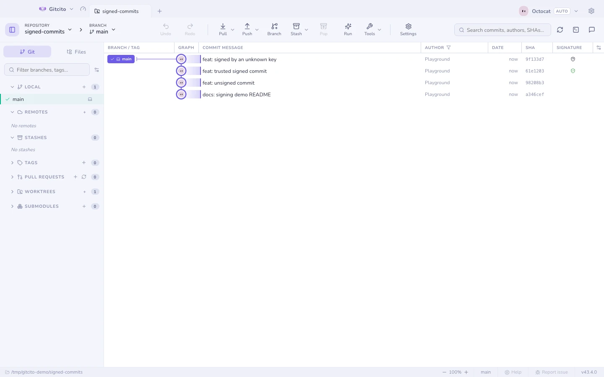
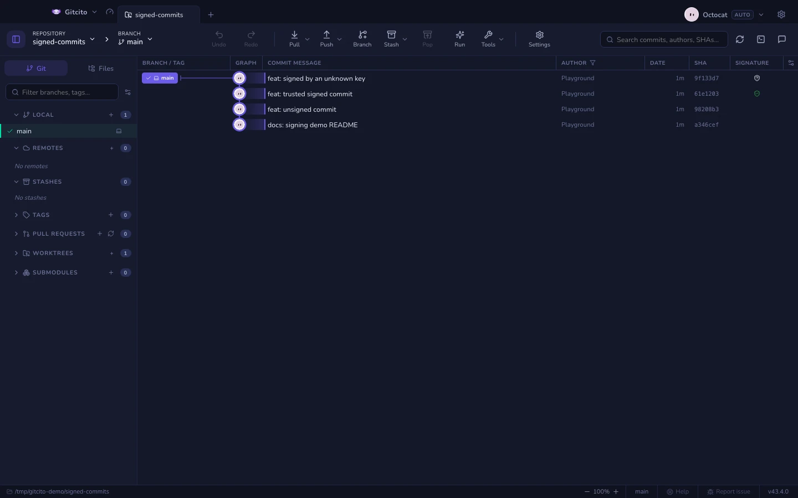

# 署名付きコミット

署名はリポジトリごとに有効にします（**設定 → リポジトリの歯車**）。GPG、SSH、
X.509 のいずれかを、選んだ鍵とともに使えます。Gitcito はそのリポジトリに
`commit.gpgsign`、`gpg.format`、`user.signingkey` を書き込みます — 他のどのツール
も読む、まったく同じ設定です。

| | |
|---|---|
|  |  |

グラフには、並べ替えできる専用の**署名の列**が加わります。

| バッジ | 意味 |
|---|---|
| **検証済み** | git が信頼する鍵による正しい署名 |
| **未検証** | 署名はあるが、鍵が未知か検証されていない |
| **期限切れ** | 署名またはその鍵の有効期限が切れている |
| *（なし）* | 署名なし |

タグにも署名できます — [タグ](tags.md) を参照してください。

**関連項目:** [セキュリティと秘密情報](security.md)
