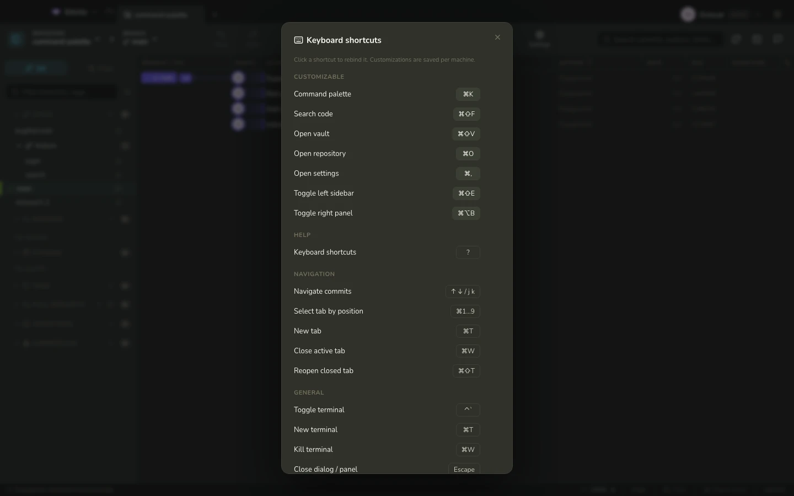
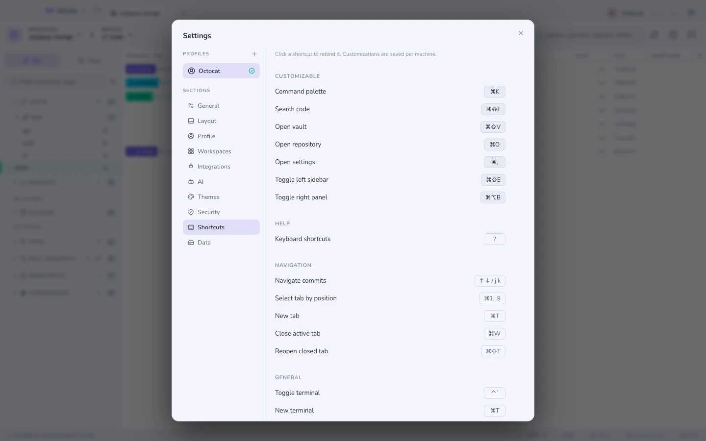

# Keyboard & shortcuts

Press <kbd>?</kbd> anywhere for the cheatsheet.

## The ones worth learning

| Keys | Does |
|---|---|
| <kbd>⌘K</kbd> | [Command palette](search.md) — branches, commits, files, actions |
| <kbd>⌘⇧F</kbd> | [Code search](search.md) across the working tree |
| <kbd>⌘⇧V</kbd> | [Vault](vault.md) |
| <kbd>⌘O</kbd> / <kbd>Ctrl+O</kbd> | Open a repository |
| <kbd>⌘,</kbd> / <kbd>Ctrl+,</kbd> | Open Settings |
| <kbd>⌘F</kbd> | Find inside the file or diff you are reading |
| <kbd>⌘T</kbd> / <kbd>Ctrl+T</kbd> | Open the new-tab repository or group picker |
| <kbd>⌘W</kbd> / <kbd>Ctrl+W</kbd> | Close the active tab |
| <kbd>⌘1</kbd>–<kbd>⌘9</kbd> / <kbd>Ctrl+1</kbd>–<kbd>Ctrl+9</kbd> | Switch to a tab by its position |
| <kbd>⌘⇧T</kbd> | Reopen the last closed tab |
| <kbd>?</kbd> | This cheatsheet |

## Moving without the mouse

| Where | Keys |
|---|---|
| Commit graph | <kbd>↑</kbd> <kbd>↓</kbd> or <kbd>j</kbd> <kbd>k</kbd> |
| File lists (commit, WIP, stash) | the same |
| [Time machine](time-machine.md) | <kbd>←</kbd> <kbd>→</kbd>, <kbd>⇧</kbd> for ten, <kbd>Home</kbd>/<kbd>End</kbd> |
| [Mission control](mission-control.md) | <kbd>↑</kbd><kbd>↓</kbd>, <kbd>Enter</kbd> to open, <kbd>f</kbd>/<kbd>p</kbd> to fetch/pull, <kbd>/</kbd> to filter |
| Commit message box | <kbd>↑</kbd> <kbd>↓</kbd> recalls your recent messages |

## Rebinding

**Settings → Shortcuts**. The core navigation shortcuts (palette, code search,
vault, open repository, settings) are rebindable, with conflict detection and a per-shortcut reset.

**See also:** [Command palette & search](search.md)
