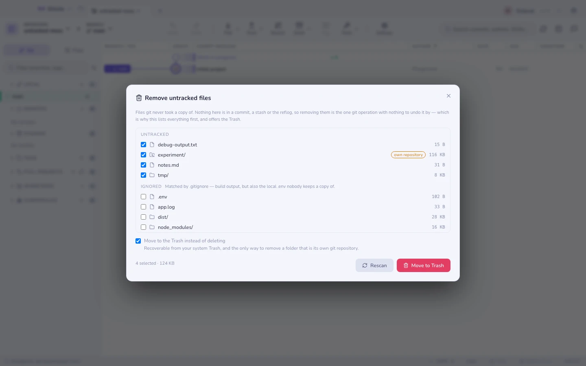

# 추적되지 않는 파일 삭제

작업 트리에는 git이 한 번도 복사해 두지 않은 파일이 쌓여요. 끄적여 둔 메모,
`debug-output.txt`, 실패한 빌드가 남긴 `dist/`, 지난달에 떠난 브랜치에서 온
`node_modules` 같은 것들이요. git에는 이걸 위한 명령이 하나 있는데 — `git clean`
— 이건 **뒤에 아무것도 없는** 유일한 git 작업이에요. 그 내용은 커밋에 들어간 적이
없으니 reflog 항목도, 스태시도, 되돌리기도 없고, 되살려 줄 `git` 주문 같은 것도
없어요.

그래서 이건 사람들이 터미널에서 실행하고 후회하는 작업이에요. Gitcito 버전은 아무
일이 일어나기 전에 목록 전체를 보여줘요.

`⌘K` → **추적되지 않는 파일 삭제**.

## 목록이 뜻하는 것

각 항목은 `git clean`이 닿을 수 있는 경로이고, 디스크상의 크기와 함께 두 그룹으로
나뉘어요.

| 그룹 | 무엇인지 | 기본 선택 여부 |
|-------|-----------|---------------------|
| **추적되지 않음** | 커밋된 적이 없고 `.gitignore`에도 걸리지 않는 것 | 예 |
| **무시됨** | `.gitignore`에 걸리는 것 — 빌드 산출물, 캐시, `.env` | **아니요** |

이 구분이 핵심이에요. 무시된 경로는 대개 쓸모없지만, 가끔은 중요한 무언가의 유일한
사본이기도 해요. 로컬 `.env`, 데이터베이스 덤프, 내려받은 픽스처처럼요.
`.gitignore`에 걸리는 것은 절대 대신 선택해 주지 않아요.

통째로 추적되지 않는 **디렉터리는 한 줄**이에요. 파일마다 한 줄이 아니라요 —
`tmp/`, `dist/`, `node_modules/` — git이 삭제하는 단위가 그것이기도 하고, 4만 개짜리
목록은 아무도 읽지 않는 목록이니까요. 크기는 그 안에 든 것들의 합이에요.

**자체 저장소**로 표시된 폴더는 자기만의 `.git`을 갖고 있어요. 이 저장소 안에
떨어뜨려 둔 클론이거나, 끝내 연결하지 않은 실험이겠죠. git은 그런 것을 삭제하길
거부하고(`-ff`를 요구하는데, Gitcito는 그 플래그를 제공하지 않아요) — 휴지통은 받아
줘요.

## 휴지통이냐 삭제냐

**휴지통으로 보내기**는 기본으로 켜져 있고, git을 전혀 거치지 않아요. 경로들은
시스템 휴지통으로 가고, 거기서 다시 꺼내 놓을 수 있어요. 중첩된 저장소를 삭제하는
유일한 경로이자, 체크박스를 잘못 눌러도 살아남는 유일한 방법이에요.

이걸 끄면 선택한 경로에 정확히 실제 `git clean -f -d -x`가 실행되고, 개수와 전체
크기를 눈앞에 둔 채 확인을 요청해요. 그 뒤로는 아무것도 복구되지 않아요.

## 알아 둘 만한 한계

- **추적되지 않는 파일만요.** 수정된 추적 파일은 여기에 없어요. 그건
  [버리기](staging.md)이고, 인덱스나 HEAD에서 복원해요.
- **목록은 처음 400개 경로에서 잘려요.** 저장소에 그보다 많다면, 나열된 것을
  삭제하고 나머지는 **다시 검사**를 누르세요.
- **아주 큰 트리에서는 디렉터리 크기가 근삿값이에요.** 검사는 파일 2만 개에서
  멈추기 때문에, 거대한 `node_modules`는 실제보다 작게 보일 수 있어요. 실제보다 크게
  나오는 일은 없어요.
- **검사는 스냅샷이에요.** 대화상자가 열려 있는 동안 빌드가 파일을 쓴다면, 무엇이든
  삭제하기 전에 **다시 검사**를 누르세요.
- 무엇에 손대기 전에 경로를 git 자신의 삭제 가능 파일 목록과 대조하기 때문에, 이름을
  직접 지정하더라도 추적 중인 파일이 이 대화상자를 통해 삭제되는 일은 없어요.

함께 보기: [스테이징과 버리기](staging.md) · [파일 무시하기](hooks.md) ·
[히스토리에서 파일 지우기](history-purge.md)
