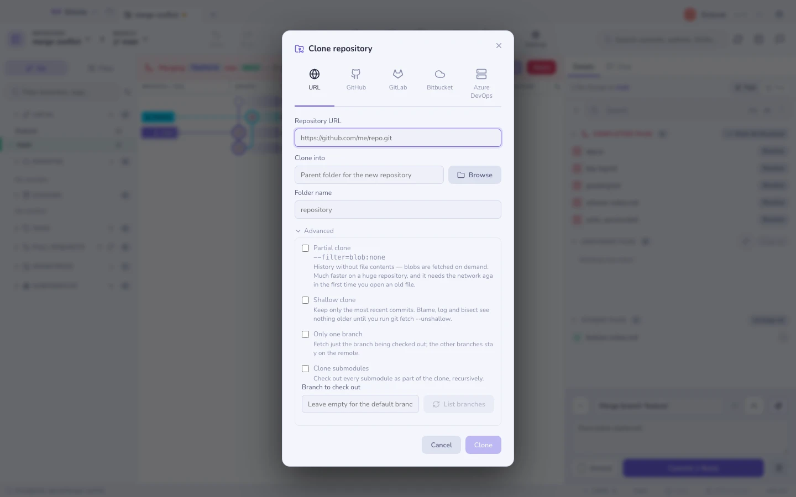

# 클론

**새 저장소 → 클론**, 또는 `⌘K` → *클론*. URL을 붙여 넣거나, GitHub, GitLab,
Bitbucket, Azure DevOps에 로그인해 내 저장소 중에서 고르세요. 선택한
[프로필](profiles.md)의 토큰은 클론에 쓰인 뒤 버려지고, `.git/config`에는 결코
기록되지 않아요.

상위 폴더와 이름을 고르면, 입력란 아래 줄에 저장소가 정확히 어디에 놓일지 표시돼요.
이미 존재하는 폴더는 합쳐지지 않고 거부돼요.

## 고급 — 클론 범위 좁히기

**고급** 아래의 모든 항목은 기본적으로 꺼져 있어요. 그대로 두면 평범하고 완전한
클론을 얻어요. 이 항목들이 값어치를 하는 건 "완전한"이 20분과 수 기가바이트를 뜻하는
저장소에서예요.

| 옵션 | git이 하는 일 | 대가 |
|--------|---------------|---------------|
| **부분 클론** | `--filter=blob:none` | 히스토리는 전부, 파일 내용은 없음. 블롭은 필요할 때 받아 오므로 오래된 파일을 열려면 네트워크가 필요해요. |
| **얕은 클론** | `--depth=N` | 가장 최근 N개의 커밋만 존재해요. blame, log, bisect, range-diff가 그 절단면에서 멈춰요. |
| **브랜치 하나만** | `--single-branch` | 다른 브랜치들은 페치할 때까지 원격에 남아 있어요. |
| **서브모듈도 클론** | `--recurse-submodules` | 모든 서브모듈까지 체크아웃돼요. 지금은 시간이 더 들지만, 나중에 빠진 디렉터리가 없어요. |
| **체크아웃할 브랜치** | `--branch <name>` | 원격의 기본 브랜치 대신 그 브랜치에서 시작해요. |

**얕은 것보다 부분이 먼저예요.** 부분 클론은 모든 커밋을 유지하므로 히스토리는 계속
검색할 수 있고, 파일 내용만 필요할 때 가져와요. 얕은 클론은 실제로 히스토리를 버려요.
`git log`가 절단면에서 끝나고 blame은 그 너머를 보지 못해요. 안에서 작업하려고
모노레포를 클론하는 거라면 대개 부분 클론이 원하는 쪽이에요.

얕은 클론은 되돌릴 수 있어요. [터미널](terminal.md)에서 `git fetch --unshallow`를
실행하면 히스토리가 다시 채워져요.

### 브랜치 고르기

브랜치 이름을 입력하거나, **브랜치 목록 보기**를 눌러 원격에 무엇이 있는지 물어보고
(`git ls-remote --heads`) 드롭다운에서 고르세요. 네트워크 왕복은 한 번뿐이고, 버튼을
누를 때만 일어나요. 입력하는 동안에는 아무것도 조회하지 않아요.

목록 조회가 실패하면 — 아직 토큰이 없는 비공개 URL, 오타, 네트워크 없음 — 그 항목은
그냥 텍스트 입력란으로 남고, 실제 오류는 클론 자체가 알려 줘요.

### 플래그에 대한 두 가지 메모

- **`--depth`는 `--single-branch`를 함축해요.** 얕은 클론에서 *브랜치 하나만*을
  체크하지 않은 채 두는 것이 곧 다른 브랜치들을 다시 요청하는 일(`--no-single-branch`)
  이고, 그래서 그 아래 안내 문구가 바뀌어요.
- **로컬 폴더를 클론할 때**는 보통 `--depth`가 완전히 무시돼요. git이 가져오는 대신
  객체 저장소를 하드링크하거든요. 로컬 저장소의 얕은 사본을 요청하면 Gitcito는
  `file://` URL을 통해 클론해서, 요청한 깊이가 실제로 얻는 깊이가 되게 해요.

## 진행 상황

막대는 git이 보고하는 것을 그대로 보고해요. 세는 중, 압축 중, 받는 중, 해석 중,
체크아웃 중. 전체량을 보고할 수 없는 단계에서는 가짜 백분율 대신 진행 정도를 알 수 없는
막대가 표시돼요.

새 저장소는 탭으로 열리고, 클론에 사용한 프로필에 고정돼요.
