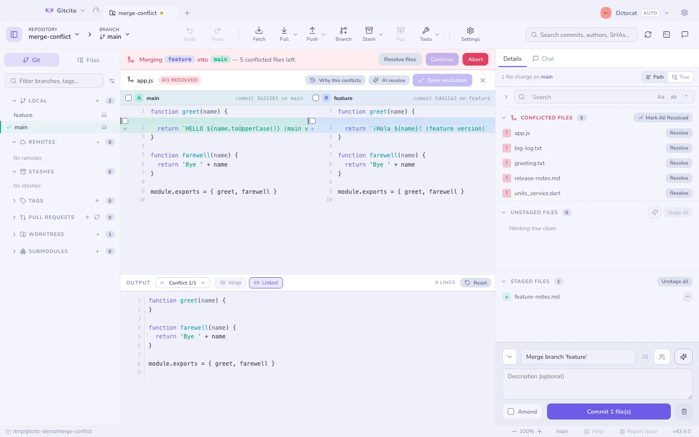

# 충돌 해결

머지, 리베이스, 체리픽, 리버트가 멈추면 배너가 **무엇이** 멈췄고 **무엇 사이에서**
멈췄는지 알려 줘요. 그냥 "충돌"이 아니라 "`feature/x`를 `main`에 머지하는 중"처럼요.

## 왜 충돌하는지

헤더의 **왜 충돌하는지**는 브랜치가 갈라진 뒤 이 파일을 건드린 커밋을 쪽별로
나열해요. `git log --merge`가 하는 일인데, git이 아주 오래전부터 제공해 왔지만 아무도
발견하지 못하는 기능이에요.

마커는 무엇이 부딪히는지 말해 줘요. 이것은 누가 왜 바꿨는지를 말해 주는데, 해결
방향을 실제로 결정하는 건 대개 그쪽이에요. 거기에 아무것도 없다면 양쪽 모두 이 정확한
경로에 대한 변경을 커밋하지 않았다는 뜻이고, 충돌은 이름 변경이나 이동에서 온 거예요.

## 세 개의 패널

| 패널 | 무엇인지 |
|---|---|
| 왼쪽 | **Ours** — 내가 있던 쪽. 해당 커밋이 함께 표시돼요 |
| 오른쪽 | **Theirs** — 들어오는 쪽. 해당 커밋이 함께 표시돼요 |
| 가운데 | **결과물** — 편집할 수 있고, 줄 번호가 있고, 실제로 스테이징되는 내용이에요 |

세 패널 모두 크기를 조절할 수 있어요.

## 고르기

**줄** 단위, **청크** 단위, 또는 **한쪽 전체**를 한 번에 고를 수 있고, 답이 "둘 다
남기기"일 때는 한 청크에서 양쪽을 모두 가져올 수도 있어요. 충돌 하나하나를 따라가는
내비게이터가 남은 것을 훑어 주니, 실수로 마커를 남겨 둘 일이 없어요.

## AI 도움

AI를 켜 두면 **AI로 해결**이 결과물 패널에 머지 결과를 제안해요. 스스로 무언가를
적용하는 일은 결코 없어요. 여러분이 읽고, 고치고, 스테이징하는 거예요.
[AI 기능](ai.md)을 참고하세요.

## 애초에 피하기

[충돌 레이더](conflict-radar.md)는 어떤 브랜치가 충돌할지 머지하기 전에 알려 줘요.

## git이 기억하게 하기 (rerere)

오래 살아 있는 브랜치를 리베이스하면 같은 충돌을 매번 다시 만나요. `rerere` —
*reuse recorded resolution* — 가 git의 답이에요. 충돌을 어떻게 해결했는지 외워 두었다가
똑같은 충돌이 다음에 나타나면 그 답을 그대로 재생해 줘요.

**설정 → 일반 → 충돌 해결 내용 기억하기.** 전역 git 설정에 `rerere.enabled`를
기록하므로 명령줄도 똑같이 동작해요.

git이 대신 답을 낸 경우, 해결기는 "충돌 마커 없음"이라는 빈 화면을 보여 주는 대신 그
사실을 말해 주고 **이 해결 내용 잊기**를 제안해요. 이건 기억을 지우고 *동시에* 충돌을
되돌려 놓아서, 다르게 해결할 수 있게 해 줘요.

알아 둘 만한 것이 두 가지 있어요.

- **재생된 해결 내용은 스테이징되지 않아요.** *재생된 해결 내용을 자동으로
  스테이징*을 켜지 않는 한요. 그건 꺼 두세요. 멈춤의 요점은 외워 둔 답이 이번 머지에는
  틀릴 수도 있다는 것이고, 보지 않고 스테이징하는 것이 그 답이 커밋까지 도달하는
  경로거든요.

  그래서 재생된 파일은 **충돌한 파일** 목록에 **그대로 남아 있어요.** git이 내용은
  썼지만 인덱스는 여전히 그것을 병합되지 않은 상태로 들고 있고, 스테이징만이 그걸
  마무리해요. 해결기의 **있는 그대로 스테이징**이나 목록의 **모두 해결됨으로 표시**가
  그것을 옮겨 주는 동작이에요.
- **rerere가 모든 충돌을 이해하지는 못해요.** add/add와 delete/modify 충돌에는
  프리이미지가 없어서 언제나 날것으로 다시 돌아와요. 설정에 표시되는 개수가 실제로
  갖고 있는 개수이고, **전부 잊기**가 그걸 비워요.

**함께 보기:** [충돌 레이더](conflict-radar.md) · [머지와 리베이스](merging.md)
