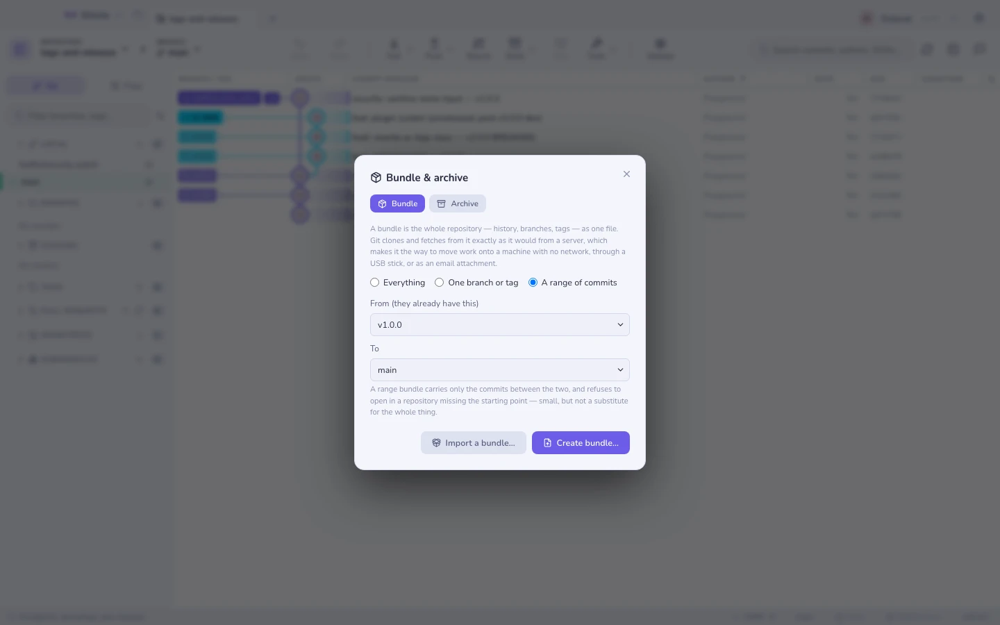

# 번들과 아카이브

저장소를 파일 하나에 담는 두 가지 방법이에요. 서로 바꿔 쓸 수 있어 보이지만
그렇지 않고, 엉뚱한 쪽을 고르는 일이야말로 이 페이지가 존재하는 이유예요.

| | **번들** | **아카이브** |
|---|---|---|
| 담는 것 | 히스토리: 커밋, 브랜치, 태그 | 한 커밋 시점의 파일들 |
| 여는 방법 | `git clone` / `git fetch` — 그 자체가 원격이에요 | 아무 압축 해제 도구 |
| 이후 | 다시 페치하고, 머지하고, 계속 작업할 수 있어요 | 없어요. 스냅숏일 뿐이에요 |
| 쓰임새 | 네트워크가 없는 기기로 작업 옮기기 | "v2.1 시점 소스를 보내줘" |

`⌘K` → **저장소 번들 만들기** 또는 **아카이브 내보내기**.



## 번들

번들은 어떤 네트워크도 건너지 못하는 간극에 대한 git의 답이에요. 망이 분리된 기기,
USB 스틱, 이메일 첨부 파일, 비행기 안의 노트북 같은 것들이죠. 받는 쪽에서
`git clone work.bundle myrepo`를 실행하면 여러분의 히스토리와 브랜치를 담은 진짜
저장소가 생기고, 그 파일이 마치 서버인 것처럼 그로부터 페치해요.

세 가지 범위가 있어요:

| 범위 | 무엇이 옮겨지는가 | 크기 |
|-------|--------------|------|
| **전체** | 모든 브랜치와 태그, 완전한 히스토리 | 저장소 전체 |
| **브랜치 또는 태그 하나** | 그 레퍼런스와 그것이 도달하는 모든 것 | 보통 대부분 |
| **커밋 범위** | 두 끝 사이에 있는 것만 | 작아요 |

**범위 번들은 저장소가 아니라 히스토리의 패치예요.** 먼 쪽 끝을 *선행 조건*으로
기록하며, 그 커밋을 이미 갖고 있지 않은 저장소에서는 git이 열기를 거부해요. 새
커밋을 붙일 곳이 없기 때문이죠. 이는 올바른 동작이지만 처음에는 당황스러워요.
상대편이 어느 시점까지의 작업을 이미 갖고 있을 때 범위를 쓰세요 — 그들이 마지막으로
받은 태그, 두 사람이 함께 갈라져 나온 커밋 같은 지점 말이에요.

### 번들 받기

**번들 가져오기…**는 파일을 읽어 그 안에 무엇이 있는지 나열하고, 이 저장소가 그것을
쓸 수 있는지 미리 알려줘요 — 선행 조건이 빠져 있으면 나중에 git 자체의 표현으로
실패하는 대신, 몇 개가 빠졌는지 알려줘요.

가져온 레퍼런스는 원격 추적 네임스페이스의 **`bundle/…`** 아래에 놓여요. 로컬은
아무것도 움직이지 않아요. 어떤 브랜치도 빨리 감기되지 않고, 어떤 작업도 덮어쓰이지
않아요. 그다음에 여러분이 원하는 방식대로 `bundle/main`을 머지하거나 리베이스하거나
체크아웃하면 돼요. 다른 어떤 원격의 브랜치와 똑같이 말이죠.

번들에서 *새* 저장소를 시작하려면 대신 터미널에서 그 파일로부터 클론하세요:
`git clone work.bundle myrepo`. Gitcito는 열려 있는 저장소로 가져오기만 하며, 파일에서
클론하지는 않아요.

## 아카이브

`git archive`는 한 커밋 시점의 트리를 zip이나 tarball로 써요. `.git`도, 히스토리도,
그로부터 페치할 방법도 없어요 — 받는 사람이 저장소가 아니라 소스 코드를 받아야 할
때는 바로 그게 요점이에요.

| 옵션 | 하는 일 |
|--------|-------------|
| 레퍼런스 | 내보낼 브랜치, 태그 또는 커밋. 보통은 태그가 답이에요 |
| 형식 | `zip`, `tar.gz` 또는 `tar` |
| 디렉터리로 감싸기 | 최상위 폴더를 추가해, 압축을 풀 때 파일이 사방에 흩뿌려지지 않게 해요 |
| 이 경로만 | 트리 전체 대신 하위 디렉터리 하나만 내보내요 |

### export-ignore가 이것을 쓰는 이유

저장소는 `.gitattributes`에서 경로를 표시할 수 있어요:

```
.github/     export-ignore
test/        export-ignore
*.psd        export-ignore
```

그 경로들은 저장소에는 남아 있으면서 **모든 아카이브에서 빠져요**. 프로젝트가 CI
설정, 픽스처, 200 MB짜리 디자인 파일 없이 릴리스 tarball을 내보내는 방법이 바로
이것이고, 그 규칙은 누군가의 릴리스 스크립트가 아니라 저장소 안에 살게 돼요.

## 알아둘 만한 한계

- **번들은 완전한 사본이에요.** 범위를 쓰지 않는 한 그래요. 2 GB짜리 저장소를
  번들로 만들면 2 GB 파일이 만들어지고, 클론만큼 시간이 걸려요.
- **빈 번들은 거부돼요.** Gitcito가 아니라 git이 거부해요. 두 끝 사이에 아무것도
  없는 범위는 쓸모없는 파일 대신 오류를 내요.
- **가져오기는 머지하지 않아요.** 레퍼런스는 `bundle/…` 아래에 도착해, 여러분이
  무언가를 할 때까지 거기 머물러요.
- **아카이브에는 히스토리가 없으므로** 다시 저장소로 되돌릴 수 없어요. 받는 사람이
  커밋을 해야 한다면 번들을 보내세요.
- **`export-ignore`는 아카이브에만 영향을 줘요.** 클론이나 번들, 히스토리에서는
  아무것도 감추지 않아요 — 그건
  [히스토리에서 파일 제거하기](history-purge.md)를 보세요.

함께 보기: [동기화](syncing.md) · [안전한 공유](secure-share.md) ·
[히스토리에서 파일 제거](history-purge.md)
