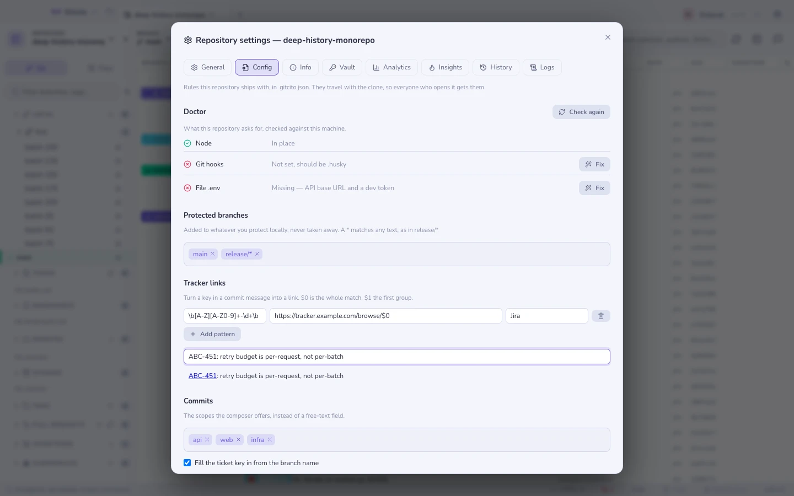

# 저장소 규칙 (`.gitcito.json`)

어느 프로젝트에나 코드만 봐서는 알 수 없는 규칙이 있습니다. *`release/*` 에는
절대 직접 푸시하지 말 것.* *커밋 스코프는 `api`, `web`, `infra` 뿐.* *뭐라도
돌리려면 Node 20, 체크아웃된 서브모듈, `.env.example` 에서 복사한 `.env` 가
필요함.* 그런 규칙은 아무도 다시 읽지 않는 README나, 실패한 CI나, 여기 가장 오래
있은 사람의 머릿속에 삽니다.

`.gitcito.json` 은 저장소가 그것을 적어 두어 도구가 실제로 활용할 수 있게 하는
자리입니다. 저장소 루트에 있고, 다른 파일과 똑같이 커밋되며, 따라서 클론과 함께
따라다닙니다. 프로젝트를 여는 모든 사람이 같은 규칙을 받고, 새로 온 사람은 첫
푸시가 거절당한 날이 아니라 첫날에 받습니다.

이 파일은 완전히 선택 사항입니다. 없는 저장소는 지금까지와 똑같이 동작합니다.

직접 쓸 필요는 없습니다. [저장소 채팅](repo-chat.md)에 이 파일의 스키마가 주어지므로
*JIRA-1234용 티켓 링크를 추가해줘*나 *release 브랜치를 보호해줘*가 검토 가능한 파일
작업으로 돌아옵니다.



## 어디서 편집하나

툴바 도구 옆의 톱니바퀴 → **Config**. 이 편집기는 파일을 작업 트리에 씁니다. 다른
곳에는 저장되지 않으므로, 규칙을 팀과 공유하려면 **커밋하세요**.

저장소에 아직 없다면 **저장소 읽기** 가 이미 있는 것들로부터 초안을 제안합니다.
`.nvmrc` 또는 `engines.node`, `.gitmodules`, `.gitattributes` 의 `filter=lfs`,
옆에 `.env` 가 없는 `.env.example`, 이미 로컬에서 보호 중인 브랜치, 그리고 최근
500개 커밋 제목이 써 온 스코프입니다. 저장하기 전에는 아무것도 기록되지 않습니다.
터미널에서는 `gitcito config init` 이 같은 일을 합니다([명령줄](cli.md) 참고).

## 파일에 담을 수 있는 것

```json
{
  "version": 1,
  "protect": ["main", "release/*"],
  "links": {
    "tickets": [
      { "match": "\\b[A-Z][A-Z0-9]+-\\d+\\b", "url": "https://tracker.example.com/browse/$0", "label": "Jira" }
    ]
  },
  "commit": {
    "scopes": ["api", "web", "infra"],
    "ticketFromBranch": true,
    "trailers": ["Refs: {ticket}"]
  },
  "requires": {
    "node": ">=20",
    "hooksPath": ".husky",
    "submodules": true,
    "lfs": true,
    "files": [{ "path": ".env", "from": ".env.example", "why": "API 기본 주소와 개발용 토큰" }]
  },
  "checklist": {
    "push": ["스테이징에 대해 통합 테스트 실행"]
  }
}
```

| 필드 | 하는 일 |
|---|---|
| `version` | `1` 이어야 합니다. 더 새로운 스키마의 파일은 추측하지 않고 통째로 무시합니다. |
| `protect` | 브랜치 이름, `*` 는 임의의 문자열과 일치합니다. 로컬에서 보호하는 브랜치에 **더해집니다** — [보호 브랜치](repo-settings.md) 참고. |
| `links.tickets` | 정규식과 URL 템플릿. `$0` 은 전체 일치, `$1`…`$9` 는 그룹입니다. 커밋 제목과 본문의 일치가 링크가 됩니다. |
| `commit.scopes` | 작성기가 자유 입력 대신 제시하는 스코프. 선언하면 `gitcito commit-check` 에서 알 수 없는 스코프가 스타일 조언이 아니라 오류가 됩니다. |
| `commit.ticketFromBranch` | 브랜치 이름에서 티켓 키를 채웁니다(`feature/ABC-123-thing` → `ABC-123`). 단 빈 작성기에만 채우며, 입력 중인 제목을 덮어쓰지 않습니다. |
| `commit.trailers` | 커밋 본문에 덧붙는 줄. `{ticket}` 과 `{branch}` 가 채워지고, 채울 값이 없는 자리 표시자가 든 줄은 반쯤 쓰이는 대신 버려집니다. |
| `requires.*` | 동작하는 클론에 필요한 것. 각 항목이 아래의 doctor 행이 됩니다. |
| `checklist.push` | 세션마다 한 번, 첫 푸시 전에 보여 주는 자유 텍스트. |

## doctor

`requires` 는 *"클론했는데 안 돌아간다"* 에 답하는 부분입니다. Gitcito 는 저장소를
열 때 이를 확인하고, 어긋난 것이 있으면 상태 표시줄에 청진기 칩을 띄웁니다. 칩을
누르면 Config 탭이 doctor 행에서 열리고, **다시 확인** 이 재실행합니다.

| 검사 | 통과 조건 | 복구 방법 |
|---|---|---|
| `node` | PATH 의 `node` 가 명세를 만족 | — |
| `submodules` | 체크아웃되지 않은 서브모듈이 없음 | `git submodule update --init --recursive` |
| `lfs` | git-lfs 가 설치되어 있고 추적 파일이 포인터 텍스트가 아닌 실제 내용 | `git lfs pull` |
| `hooksPath` | `core.hooksPath` 가 선언된 경로와 일치 | `core.hooksPath` 설정 |
| `files` | 파일이 존재 | `from` 이 있으면 거기서 복사 |

의도적인 한계가 둘 있습니다. **경고** 는 결코 "고장" 을 뜻하지 않습니다. doctor 가
판단할 수 없었다는 뜻이고(해석 못 하는 Node 명세는, 손쓸 수 없는 실패를 지어내는
대신 통과시킵니다), 경고는 CI 에서 `gitcito doctor` 를 실패시키지 않습니다. 그리고
복구는 결코 파일이 준 것이 아닙니다. 위 목록이 전부이고 컴파일 시점에 닫혀 있습니다.
설정이 넘기는 것은 값뿐입니다 — 복사할 경로, `core.hooksPath` 의 값 — 명령이
아닙니다.

파일 복사는 결코 덮어쓰지 않습니다. 파일이 없다는 사실이 그 행이 떠 있는 이유
자체이기 때문입니다.

## 커밋

`commit.scopes` 가 선언되면 작성기의 스코프 버튼이 자유 입력 대신 그 목록을
제시합니다 — `feat(renderer)` 와 `feat(rendererr)` 의 차이입니다.
`ticketFromBranch` 와 `trailers` 는 메시지의 기계적인 부분을 채우고,
`links.tickets` 는 커밋이 표시되는 모든 곳에서 키를 다시 링크로 만듭니다.

같은 규칙이 창 밖에서도 적용됩니다. `gitcito commit-check` 가 이 파일을 읽으므로
`commit-msg` 훅과 CI 는 작성기가 제안하는 것과 정확히 같은 것을 강제합니다.
[명령줄](cli.md)과 [커밋하기](committing.md)를 보세요.

## 푸시 체크리스트

`checklist.push` 는 세션의 첫 푸시 전에 확인 창으로, 항목당 한 줄씩 표시됩니다.
Gitcito 가 **대신 확인해 주는 일은 결코 없기** 때문에, 여기에는 정말로 사람의
판단이 필요한 것 — *지원팀에 알린 사람 있나?* — 을 적습니다. 관문이 아니라
알림이며, 읽고 푸시하거나 취소하면 됩니다. 저장소당 세션당 한 번만 보여 줍니다.
매번 뜨는 대화 상자는 아무도 읽지 않는 대화 상자이기 때문입니다.

## 왜 해를 끼칠 수 없나

이 파일은 저장소와 함께 옵니다. 즉 저장소를 쓴 사람에게서 옵니다. 커밋 메시지와
다를 바 없이 신뢰할 수 없는 내용으로 다뤄집니다.

- **안의 무엇도 실행되지 않습니다.** 명령을 담는 필드가 없고, doctor 의 복구는
  고정된 목록입니다.
- **제약을 더할 수만 있습니다.** `protect` 는 로컬 목록과의 합집합입니다. 저장소는
  당신이 고른 것보다 더 많이 보호할 수는 있어도, 보호를 그만두게 만들 수는
  없습니다. 어떤 필드도 안전장치를 끄지 못합니다.
- **경로는 저장소를 벗어날 수 없습니다.** 절대 경로, `..`, `~`, 드라이브 문자,
  `.git` 을 건드리는 것은 모두 거부되며, 문자열이 실제 경로가 되는 지점에서 다시
  검사됩니다.
- **링크는 `http(s)` 여야 합니다.** 그 밖의 것은 시스템 URL 열기에 전달되지
  않습니다.
- **모든 것에 상한이 있습니다** — 목록 길이, 문자열 길이, 패턴 길이 — 적대적인
  저장소라도 대화 상자에 글자 벽을, 패널에 칩 천 개를 붙일 수 없습니다.

잘못된 필드는 버려질 뿐 치명적이지 않습니다. 파일의 나머지는 그대로 적용되고,
버려진 것은 Config 탭의 **Gitcito 가 무시함** 아래에 이유와 함께 나열됩니다. 유일한
예외는 잘못된 JSON 이나 알 수 없는 `version` 으로, 그때는 건질 것이 없습니다.

## 일부러 하지 않는 것

- **명령도, 스크립트도, 훅도 없습니다.** 그건 [훅](hooks.md)의 몫이고, 클론마다
  당신이 내리는 결정입니다.
- **브랜치별·사람별 규칙은 없습니다.** 한 파일, 한 벌의 규칙.
- **CI 를 대체하지 않습니다.** 체크리스트는 텍스트이고, doctor 가 보는 것은 환경이지
  당신의 작업이 아닙니다.
- **무엇도 약화시킬 수 없습니다.** Gitcito 의 모든 안전장치는 여전히 당신 것입니다.

**함께 보기:** [저장소별 설정](repo-settings.md) · [명령줄](cli.md) ·
[커밋하기](committing.md) · [훅과 .gitignore](hooks.md)
