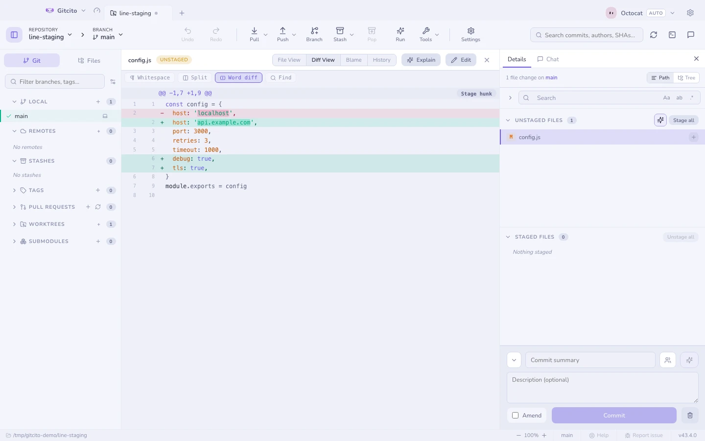

# 스테이징

커밋 패널에는 세 개의 목록이 있어요. **충돌**, **스테이징 안 됨**, **스테이징됨**
이에요. 각각 접을 수 있고, 열어 뒀는지 닫아 뒀는지도 기억해요.

## 세 단계의 정밀도

| 단계 | 방법 |
|---|---|
| **파일** | 행의 ✚를 누르거나, 여러 행을 골라 한꺼번에 스테이징하세요 |
| **헝크** | diff를 열고 헝크 헤더의 버튼을 쓰세요 |
| **줄** | diff 안에서 줄을 선택해 딱 그 줄만 스테이징하세요 |

줄 단위 스테이징 덕분에, 디버그용 `console.log`를 먼저 지우지 않고도 커밋에서
빼 두는 일이 현실적으로 가능해져요.

## 되돌리기

되돌리기도 같은 세 단계에서 동작하고, 언제나 물어봐요. 추적되지 않는 파일은
삭제되고, 추적되는 파일은 스테이징된(또는 커밋된) 상태로 돌아가요.

## 키보드

<kbd>↑</kbd> <kbd>↓</kbd>(또는 <kbd>j</kbd> <kbd>k</kbd>)로 파일 목록을 오가고,
<kbd>⇧</kbd>로 범위를, <kbd>⌘</kbd>/<kbd>Ctrl</kbd>로 개별 파일을 켜고 끌 수
있어요.

<kbd>⇧</kbd>+<kbd>↑</kbd>/<kbd>↓</kbd>는 마지막으로 클릭한 행에서 선택을 넓혀요. 선택 위에서 우클릭하면 그
전부를 한 번에 스테이지·언스테이지·스태시·버리기 할 수 있어요.

## 경로 복사

커밋되지 않은 파일을 우클릭하면 **파일 경로 복사**(절대 경로, 플랫폼 구분자)와
**상대 파일 경로 복사**(`src/index.ts`, 앞의 `./` 없음)가 나와요. 여러 파일을
선택하면 목록 순서대로 한 줄에 하나씩 복사돼요. 삭제된 파일도 켜져 있어요 —
경로 텍스트만 복사하니까요. 폴더는 여전히 폴더 경로를 복사해요.

## 커밋하기 전에

Gitcito는 몇 가지를 확인하고 한 번 물어봐요. 조용히 넘어가는 법은 없어요.

- **비밀**처럼 보이는 파일(`.env`, `*.pem`, `id_rsa`…),
- **아주 큰** blob(임계값은 설정 → 보안에서),
- **보호된 브랜치에 곧바로** 커밋하는 경우(기본값은 `main`/`master`).

각 경우마다 클릭 한 번으로 *무시하고 추적 해제*를 할 수 있어요.
[보안과 비밀](security.md)을 참고하세요.

**함께 보기:** [커밋하기](committing.md) · [Diff](diffs.md) · [Absorb](absorb.md)
