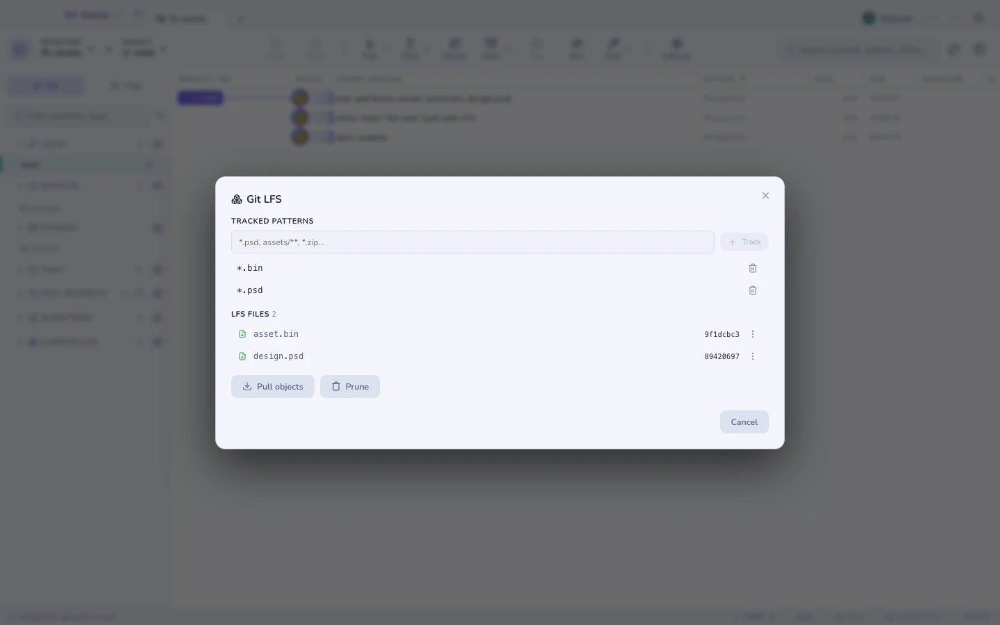
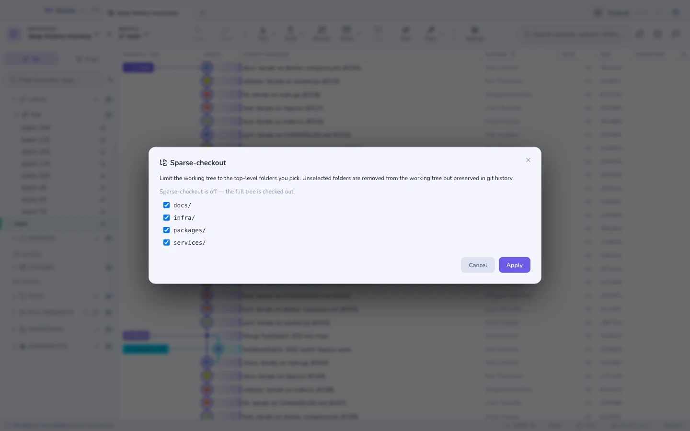

# LFS, sparse-checkout & patches

## Git LFS

Detects whether `git-lfs` is installed, whether this repository uses it, and
which patterns are tracked. The file list shows what is **downloaded** versus
what is still a **pointer**, and you can pull or prune from there.

## Sparse-checkout

Cone mode: tick the top-level folders you actually work in, and the rest leave
your working tree while staying in history. Useful on a monorepo where you only
own two packages.

A **partial clone** (`--filter=blob:none`) is offered when cloning, so you do not
download blobs you will never open.

## Patches

- **Export** a commit (or a multi-selection) as a `.patch`.
- **Apply** one to the working tree (`git apply`) or as a commit (`git am`).

Both from the Tools menu.

**See also:** [Worktrees & submodules](worktrees.md)
