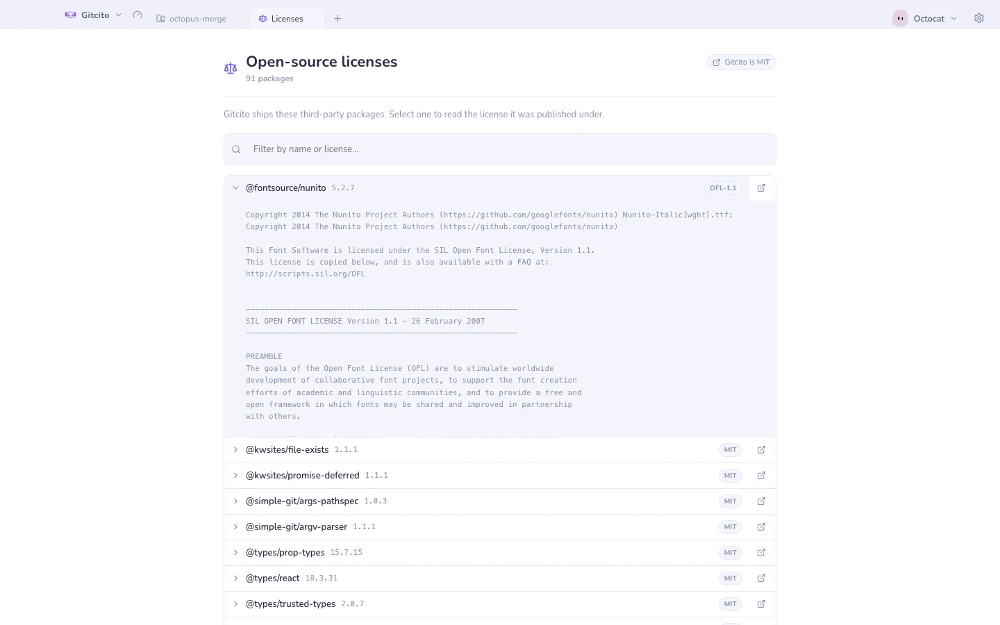

# Open-source licenses

Gitcito is built on ninety-odd open-source packages, and nearly all of them ask
for the same thing in return: that their notice travels with the binary. MIT,
BSD and Apache all say so in the text itself. This page is where that notice
lives, so the obligation is met by the app rather than by a file someone has to
remember to copy.

It is also the honest answer to "what is actually running on my machine".

## Opening it

Click the **version number** in the status bar — that opens
**What's new** — then **Licenses** in its header. Or press the command palette
shortcut and search for *Open-source licenses*. It opens as its own tab, like
What's new does.

| Column | What it is |
|--------|-----------|
| Name | The package as it is published on npm |
| Version | The exact version this build resolved |
| Badge | The SPDX identifier from the package's manifest |

Select a row to read the full license text the package ships. The link icon
opens its project page in your browser. The filter box matches on both the
package name and the license identifier, so typing `Apache` narrows the list to
the Apache-licensed packages.

## What it covers, and what it does not

The list is generated at build time from the **production dependency tree** —
everything that ends up inside the packaged app, including transitive
dependencies you never asked for directly — plus Electron itself. Build-time
tools that never ship are deliberately left out.

Two limits worth knowing:

- **A handful of packages ship no license file.** They declare an identifier in
  their manifest and nothing else. Those rows say so instead of inventing a
  text, because a license you cannot read is not a license you can rely on.
- **The identifier is what the package claims.** Gitcito reports it; it does
  not audit it. If a package's manifest is wrong, this page is wrong with it.

Gitcito's own license is MIT, and the badge in the top-right corner opens it on
GitHub.

**See also:** [Languages & right-to-left](languages.md) · [Themes & appearance](themes.md)
