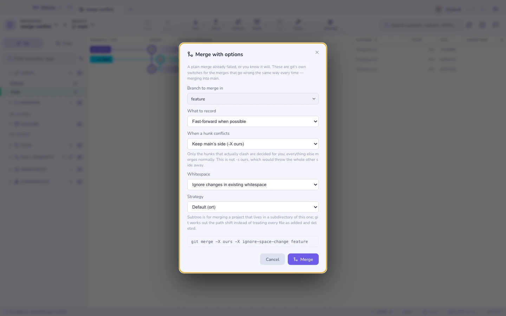
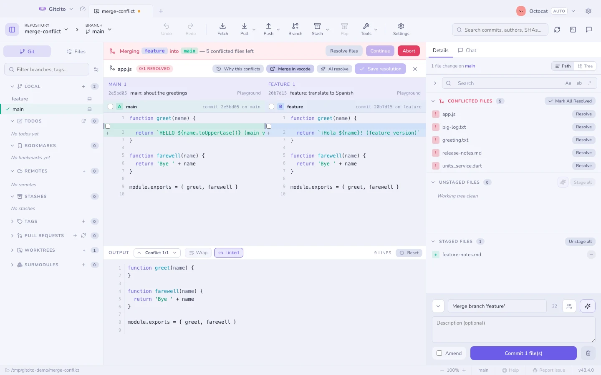

# Merge options

A plain merge is one button, and most of the time that is the whole story. This
page is for the other times: the lockfile that clashes on every merge, the file
someone reindented, the vendored project whose paths do not line up. Git has had
switches for all three for years; they are just buried in a manual page nobody
opens mid-conflict.

Right-click a branch → **Merge with options…** — in the sidebar's branch and
remote rows *and* on the coloured ref badges in the graph, which share one menu
block — or `⌘K` → **Merge with options**.

The command is printed as you build it. It is there to be checked against the
manual — and to be run from a terminal next time, without this dialog.

## When a hunk conflicts

| Choice | Flag | Means |
|--------|------|-------|
| Stop and ask me | — | The default. You resolve it |
| Keep this branch's side | `-X ours` | Clashing hunks resolve to what is already checked out |
| Take the incoming side | `-X theirs` | Clashing hunks resolve to the branch coming in |

**`-X ours` is not `-s ours`.** The switch here decides only the hunks that
actually clash; every other change from the other branch merges normally. The
strategy called `ours` — which Gitcito does not offer — takes your tree wholesale
and throws the other side away, producing a merge commit that claims to contain
work it does not. That distinction is the single most misunderstood thing about
git merges.

**It cannot decide everything.** A modify/delete conflict — one side edited a
file, the other deleted it — is not a content hunk, and `-X` leaves it for you.
That is correct: there is no version of "prefer ours" that answers whether a
deleted file should come back.

## Whitespace

| Choice | Flag |
|--------|------|
| Ignore changes in existing whitespace | `-X ignore-space-change` |
| Ignore whitespace entirely | `-X ignore-space-at-eol`, `-X ignore-all-space` |

The case this exists for: one branch reindented a file (or a formatter did), the
other edited the same lines. Git sees two edits to one line and stops. With
whitespace ignored, the reindent is not a change to weigh, and the real edit
merges through.

The result keeps the *other* side's whitespace on the lines it touched, so a
follow-up formatter run is not a bad idea.

## What to record

| Choice | Flag | Leaves you with |
|--------|------|-----------------|
| Fast-forward when possible | — | A merge commit only when history diverged |
| Always make a merge commit | `--no-ff` | A merge commit even for a fast-forward, so the branch is visible in the graph forever |
| Fast-forward only, or refuse | `--ff-only` | Nothing, if a real merge would be needed. Useful as a check |
| Squash | `--squash` | The changes staged, no merge recorded, the commit yours to write |
| Merge but do not commit | `--no-commit` | The merge staged and in progress, so you can inspect or amend it first |

**Squash and `--no-commit` are not the same.** Squash forgets that a merge
happened at all: git records no second parent, and the branch will look unmerged
next time. `--no-commit` is a merge in progress that is simply waiting for you —
`MERGE_HEAD` is set, and committing finishes it normally.

**`--ff-only` does not fail quietly.** If a merge commit would be needed, git
refuses and nothing moves, which is exactly what makes it a good sanity check
before a scripted merge.

## Strategy

| Strategy | For |
|----------|-----|
| Default (`ort`) | Everything. Git's modern three-way merge |
| `subtree` | The two sides live at different paths — a project vendored into a subdirectory of this one |
| `resolve` | The old three-way merge. Occasionally succeeds where `ort` gives up on a criss-cross history |

`-s subtree` is the one worth remembering. Merging updates from a project that
sits in `vendor/parser/` would otherwise read as "every file deleted, every file
added"; the subtree strategy works out the path shift first. See
[subtrees](subtree.md) for the whole workflow.

## Why this conflicts

Inside the [conflict resolver](conflicts.md) there is a **Why this conflicts**
button. It runs `git log --merge` for the file in front of you and lists, per
side, the commits that touched it since the branches parted.

Conflict markers say *what* clashes. This says *who changed it, when and why* —
which is usually the question that actually decides the resolution, and the
reason to go and ask someone before picking a side.

If it shows nothing, neither side committed a change to this exact file: the
clash comes from a rename or a directory move further up.

## Limits worth knowing

- **Options apply to one merge.** They are not remembered, and they do not
  change the plain **Merge into current** entry or the drag-and-drop menu.
- **Undo still works**: a merge run with options records the same undo entry,
  which resets to `ORIG_HEAD`.
- **Octopus merges** (more than two branches at once) are not offered here.
- **The commit menu's per-ref "Merge X into Y" entries** stay plain merges. Use
  the ref badge itself when you want the options.
- **`-X` decides silently.** Nothing marks which hunks were auto-resolved, so on
  an important merge, read the diff afterwards rather than trusting the absence
  of conflicts.

See also: [Merging & rebasing](merging.md) · [Conflicts](conflicts.md) ·
[Subtrees](subtree.md) · [Conflict radar](conflict-radar.md)
