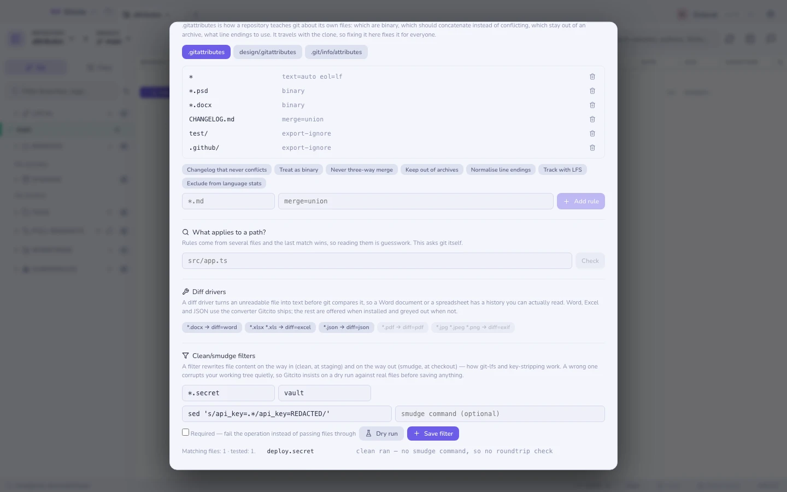

# Bestandsattributen

`.gitattributes` is het waardevolste bestand in git dat vrijwel niemand
schrijft. Het is de manier waarop een repository **git iets leert over zijn eigen
inhoud**: welke bestanden binair zijn, welke aan elkaar geplakt moeten worden in
plaats van te conflicteren, welke nooit meegaan in een archief, en welke
regeleindes iedereen krijgt.

Het belangrijke deel: het wordt gecommit. Een regel die jij toevoegt lost het
probleem op voor iedereen die kloont, op elk besturingssysteem, voorgoed — anders
dan een instelling in je eigen config, die het voor jou oplost en je collega's
het zelf laat ontdekken, op de harde manier.

`⌘K` → **Bestandsattributen**.



## Wat de regels doen

| Attribuut | Lost op |
|-----------|---------|
| `text=auto eol=lf` | Regeleindes die omslaan afhankelijk van wie het bestand uitcheckte |
| `binary` | Git die probeert een PSD, een DOCX of een gecompileerd asset te diffen of drieweg te mergen |
| `merge=union` | Een changelog waar iedereen aan toevoegt en waarop iedereen conflicteert |
| `-merge` | Bestanden waar een drieweg-merge onzin oplevert — lockfiles, gegenereerde code |
| `export-ignore` | CI-config en fixtures die meeliften in een release-tarball |
| `diff=<driver>` | Onleesbare diffs voor formaten die *wel* leesbaar zijn, mits er een converter is |
| `filter=lfs` | Grote bestanden opgeslagen via [LFS](lfs-sparse.md) |
| `linguist-vendored` | Meegeleverde code die in de taalstatistieken als de jouwe telt |

`binary` is een afkorting voor `-diff -merge -text`, oftewel drie antwoorden op
"stop met gissen over dit bestand" in één woord.

## Bewerken

De voorinstellingen vullen een patroon en de bijbehorende attributen in; pas het
patroon aan vóór je het toevoegt — `CHANGELOG.md` is een suggestie, geen uitspraak
over jouw project.

**Bewerkingen zijn chirurgisch.** Een regel toevoegen voor een patroon dat er al
één heeft herschrijft die regel waar hij staat, in plaats van er een tweede regel
achteraan te plakken die wint omdat hij later komt. Commentaar in het bestand
blijft ongemoeid, want het "waarom" naast een regel is meestal meer waard dan de
regel zelf.

Elke keer opslaan is een gewone Gitcito-actie: er verschijnt een melding, en
**Ongedaan maken** zet het bestand precies terug zoals het was.

**Een repository kan meerdere attributenbestanden hebben.** Eén in de root, één
in elke submap, en een privé `.git/info/attributes` dat nooit wordt gecommit en
alleen op jouw machine geldt — de juiste plek voor een regel die over jou gaat en
niet over het project. Gitcito toont ze alle en vertelt welke welke is.

## Wat geldt er voor een pad?

Regels komen uit meerdere bestanden, de specifiekste wint, en ze uitpluizen om
het antwoord te achterhalen is giswerk. **Wat geldt er voor een pad?** draait
`git check-attr` en laat zien wat git er zelf van maakt — het enige antwoord dat
telt.

## Diff-drivers: een Word-document leesbaar maken

Een `.docx` is een zip. Een `.pdf` is een gecomprimeerde objectgraaf. Git difft
ze als wat ze zijn — ruis — dus de geschiedenis van een document is onleesbaar
terwijl het document dat niet is.

Een **diff-driver** lost dit op met `textconv`: een commando dat het bestand
*alleen om te diffen* in tekst verandert. Het bestand in je werkboom blijft
ongemoeid; git vergelijkt gewoon de geconverteerde tekst.

Twee helften, en beide zijn nodig:

1. `diff.<name>.textconv` in de git-config — het converteercommando.
2. `*.docx diff=<name>` in `.gitattributes` — op welke bestanden het van
   toepassing is.

De knoppen hier doen allebei tegelijk. Voor Word, Excel, JSON en `.strings` **levert
Gitcito de converter zelf mee** — dezelfde documentanalyse die zijn
voorvertoningen gebruiken, beschikbaar als een klein `gitcito-textconv`-commando
in de app — dus die vier werken zonder iets te installeren. De rest heeft nog
steeds een echt hulpmiddel in je PATH nodig: Gitcito controleert dat en grijst
uit wat ontbreekt, in plaats van een driver te schrijven die bij de eerste diff
faalt.

| Driver | Vereist | Levert je op |
|--------|---------|--------------|
| `word` | niets — zit bij Gitcito | Prozadiffs van `.docx` |
| `excel` | niets — zit bij Gitcito | Rijdiffs (CSV per werkblad) van `.xlsx`/`.xls` |
| `json` | niets — zit bij Gitcito | Op sleutel gesorteerde, stabiele JSON-diffs |
| `strings` | niets — zit in Gitcito | Regeldiffs van een UTF-16-`.strings`, die git binair noemt |
| `pdf` | `pdftotext` (poppler) | Tekstdiffs van `.pdf` |
| `exif` | `exiftool` | Wat er aan een afbeelding veranderde, als de pixels ondoorzichtig zijn |

### Degene die iOS-projecten bijt

`Localizable.strings` is UTF-16 gedurende bijna heel Xcode's geschiedenis, en
UTF-16 zit vol NUL-bytes, dus git noemt hem binair en toont **niets**:

```
diff --git a/Localizable.strings b/Localizable.strings
Binary files a/Localizable.strings and b/Localizable.strings differ
```

Uitgerekend daar is zien welke string iemand verzette het belangrijkst. De
driver `strings` decodeert hem alleen voor het diffen — hij leest de
byte-volgordemarkering in plaats van hem aan te nemen, zodat een moderne
UTF-8-`.strings` ongeschonden doorgaat in plaats van in koeterwaals te
veranderen.

String Catalogs (`.xcstrings`, Xcode 15 en later) zijn JSON, en de `json`-driver
dekt ze: die sorteert sleutels, zodat een bovenaan toegevoegde vertaling niet
langer het hele bestand in de diff herschrijft.

De grenzen van de meegeleverde converter, zonder omhaal: `.doc` (het oude
binaire Word-formaat) wordt niet begrepen, alleen `.docx`; PDF valt erbuiten —
Gitcito toont PDF's met de viewer van de browser en heeft geen tekstextractor
om te hergebruiken; en elke diff van een document betaalt een korte opstarttijd
van de converter. Met `git config diff.<name>.cachetextconv true` cachet git de
uitvoer per blob.

De converterhelft staat in **jouw** config, niet in de repository — git draait
geen commando's die een kloon je aanreikt, en dat is een beveiligingseigenschap
die het waard is om te behouden. De meegeleverde drivers wijzen bovendien naar
*jouw* Gitcito-installatiepad, dus een collega die kloont krijgt wel de
`diff=word`-regel en, tot die een eigen converter aansluit (Gitcito of iets
anders), de oude onleesbare diff. Zet dat in je README.

## Clean/smudge-filters — met eerst een proefrun

Een **filter** herschrijft inhoud op weg de repository in en uit: `clean`
draait bij het stagen (werkboom → repo), `smudge` bij het uitchecken (repo →
werkboom). Zo werkt git-lfs, en zo strippen teams inloggegevens of gegenereerde
ruis uit wat er gecommit wordt.

Het is ook het gevaarlijkste waar `.gitattributes` naar kan wijzen: een filter
draait bij **elke checkout van elk overeenkomend bestand**, en een verkeerd
filter verminkt je werkboom in stilte. Daarom weigert Gitcito hier een simpel
tekstveld te zijn. Een filter instellen loopt via een **proefrun** tegen echte
overeenkomende bestanden in je repository:

1. Het `clean`-commando draait op een kopie van elk overeenkomend bestand (tot
   vijf) — niets in de repository of zijn config wordt aangeraakt.
2. Is er een `smudge`-commando opgegeven, dan draait het op de geschoonde
   uitvoer en wordt het resultaat byte voor byte met het origineel vergeleken —
   de **roundtrip-controle**. Een filter dat de roundtrip niet haalt betekent
   dat uitchecken niet terugbrengt wat je had.
3. Pas na een proefrun met precies de waarden die je opslaat wordt de
   opslaanknop actief. Een mislukte proefrun — een commandofout, niets dat
   overeenkwam, of een afwijkende roundtrip — kan alsnog worden opgeslagen,
   maar alleen via een expliciete waarschuwing die zegt wat er verloren kan
   gaan.

Opslaan schrijft `filter.<name>.clean/smudge` naar je **lokale** git-config en
de `filter=<name>`-regel naar het attributenbestand, en laat een
ongedaan-maken-item achter dat terugzet wat de config eerst bevatte. De
schakelaar **required** zet `filter.<name>.required`, waardoor git een operatie
laat mislukken in plaats van bestanden stilletjes door te laten wanneer het
filter stukgaat.

De grenzen, zonder omhaal: de proefrun bemonstert tot vijf overeenkomende
bestanden van elk hoogstens 5 MB, met een timeout van 10 seconden per
commando — een filter dat zich op de steekproef gedraagt kan zich alsnog
misdragen op een bestand dat de steekproef miste. De commando's staan in
*jouw* config, dus een collega die kloont krijgt wel de `filter=<name>`-regel
maar niet de commando's; zonder die (en zonder `required`) gaan de bestanden
onveranderd door.

## Grenzen die je moet kennen

- **`text=auto` verandert wat er gecommit wordt** en normaliseert regeleindes op
  de weg naar binnen. Voeg het in een bestaande repository bewust toe en draai
  daarna `git add --renormalize .`, in één eigen commit.
- **Attributen werken niet met terugwerkende kracht.** Een bestand vandaag als
  `binary` markeren verandert niets aan hoe zijn oude diffs zijn opgeslagen; het
  verandert hoe git het van nu af aan behandelt.
- **Regels gelden alleen waar het bestand zichtbaar is.** Een regel in
  `design/.gitattributes` zegt niets over `src/`.
- Gitcito schrijft hele bestanden weg, dus een met de hand opgemaakt bestand komt
  met zijn opmaak terug — maar een regel die Gitcito herschrijft krijgt de
  canonieke `pattern attr attr`-spatiëring van git.

Zie ook: [LFS & sparse checkout](lfs-sparse.md) ·
[Bundles & archieven](export.md) · [Merge-opties](merge-options.md) ·
[Hooks](hooks.md)
