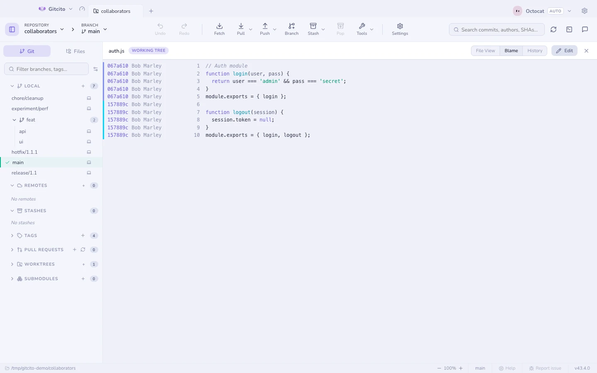
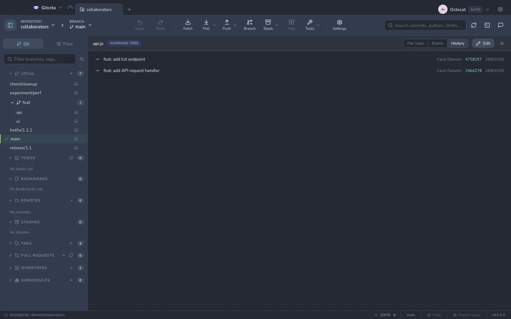

# Blame & bestandsgeschiedenis

Open een willekeurig bestand en wissel van weergave: **Voorbeeld · Bestand ·
Diff · Blame · Geschiedenis**.

## Blame

Elke regel draagt zijn commit, auteur en datum, met een kleur per commit zodat
blokken gedeelde geschiedenis in één oogopslag opvallen.

- **Volg de regel de diff in**: spring van een blame-regel meteen naar de
  wijziging die hem opleverde.
- **Opnieuw blamen vóór deze commit**: rechtsklik een regel om het bestand te
  blamen zoals het *vóór* die commit was — zo loop je de geschiedenis van een
  regel achteruit zonder de weergave te verlaten.

## Geschiedenis

Elke commit die dit bestand aanraakte, nieuwste eerst. Selecteer er één en je
ziet de versie van het bestand uit die commit, zodat je kunt doorbladeren hoe het
gegroeid is.

Voor de hele repository in plaats van één bestand gebruik je de
[tijdmachine](time-machine.md).

## Hover om uit te leggen

Met AI ingeschakeld levert <kbd>⇧</kbd> ingedrukt houden (instelbaar, of helemaal
geen toets) en een identifier aanwijzen een uitleg in één regel op, plus de
regels waarop die stoelt — klik er een aan om erheen te springen. Het leest
alleen een genummerd venster rond het token, dus als iets elders gedefinieerd is
zegt het dat in plaats van het te verzinnen. Zie [AI-functies](ai.md).

**Zie ook:** [De commitgrafiek](graph.md) · [Diffs](diffs.md)
