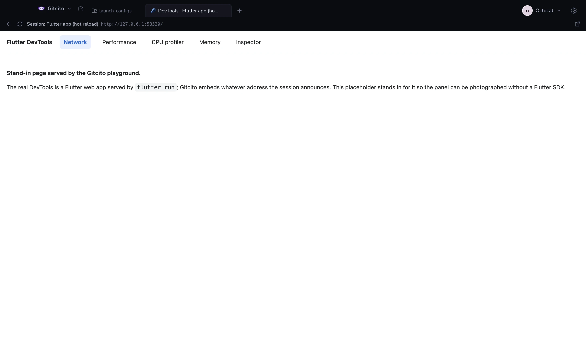

# Flutter DevTools

DevTools heeft de netwerkweergave, de timeline, de widget-inspector en de memory
profiler al — en het is een Flutter-webapp die op je eigen machine wordt
geserveerd. Gitcito bouwt daar dus niets van na en praat ook niet zelf met de
Dart VM Service: het merkt het adres op en bedt het in.



`flutter run` drukt de regel af zodra de VM-service er is:

```
The Flutter DevTools debugger and profiler on iPhone 16 Pro is available at:
http://127.0.0.1:9100?uri=http://127.0.0.1:53412/uJ8k=/
```

De launch-sessie bewaakt daarvoor haar eigen uitvoer, en de debugbalk krijgt een
knop. Eén klik opent DevTools in een eigen tabblad, één per sessie — twee
draaiende apps zijn twee DevTools.

Een **hot restart publiceert een nieuw adres**, en het tabblad volgt zolang de
sessie leeft. Is de sessie weg, dan houdt het tabblad het laatste adres vast, dat
meestal dood is: sluit het en open DevTools opnieuw vanuit de nieuwe run.

## Welke tools

Een tool komt hier binnen als het twee dingen doet: een webinterface serveren op
deze machine, en zijn adres afdrukken.

| Tool | De regel die het afdrukt |
|---|---|
| Flutter DevTools | `The Flutter DevTools … is available at: <url>` |
| Dart DevTools (`dart devtools`) | `Serving DevTools at <url>` |
| Vue DevTools (`@vue/devtools`) | `Vue Devtools … listening on <url>` |
| Prisma Studio | `Prisma Studio is up on <url>` |
| Drizzle Studio | `Drizzle Studio is up and running on <url>` |
| webpack-bundle-analyzer | `Webpack Bundle Analyzer is started at <url>` |
| al het andere dat DevTools en een adres noemt | valt terug op een generieke match |

**Wat niet ingebed kan worden, en waarom.** De Node-inspector drukt een
`ws://`-endpoint af waar een debugger zich aan hangt, geen pagina — en de
bijbehorende Chrome DevTools-frontend zit achter een `devtools://`-URL die geen
ingebedde weergave mag laden. De standalone build van React DevTools is een eigen
bureaubladvenster, geen geserveerde pagina. Geen van beide kan hier een tabblad
zijn; beide zouden een debugprotocol-client vragen in plaats van een adres.

**Een dev server is geen dev tool.** Vite op `:5173` is je app; die inbedden zou
een previewpaneel zijn — een andere functie, bewust niet deze.

## Wat het mag

De ingebedde weergave loopt aan een korte lijn, want deze app bewaart
inloggegevens:

- **Alleen loopback.** `127.0.0.1`, `localhost`, `::1`. Aanhaken met een ander
  adres wordt geweigerd, en een omleiding daarheen ook.
- **Geen preload, geen node-integratie, context isolation aan.** De pagina heeft
  geen brug naar Gitcito.
- **Links openen in je echte browser**, in een gewoon venster, niet in het paneel.

## De grenzen

- **Het is DevTools, niet het onze.** Wat die versie kan, kan het paneel; wat ze
  niet kan, kunnen wij ook niet. Er is geen netwerkweergave in Gitcito-smaak.
- **Alleen Flutter kondigt zich zo aan.** Een gewoon Dart-programma drukt een
  VM-service-URL af maar geen DevTools-adres, dus verschijnt er geen knop.
- **Een leeg paneel betekent dat de app gestopt is.** DevTools wordt geserveerd
  *door de draaiende app*; stopt die, dan antwoordt het adres niet meer.

**Zie ook:** [Uitvoeren en debuggen](launch.md)
