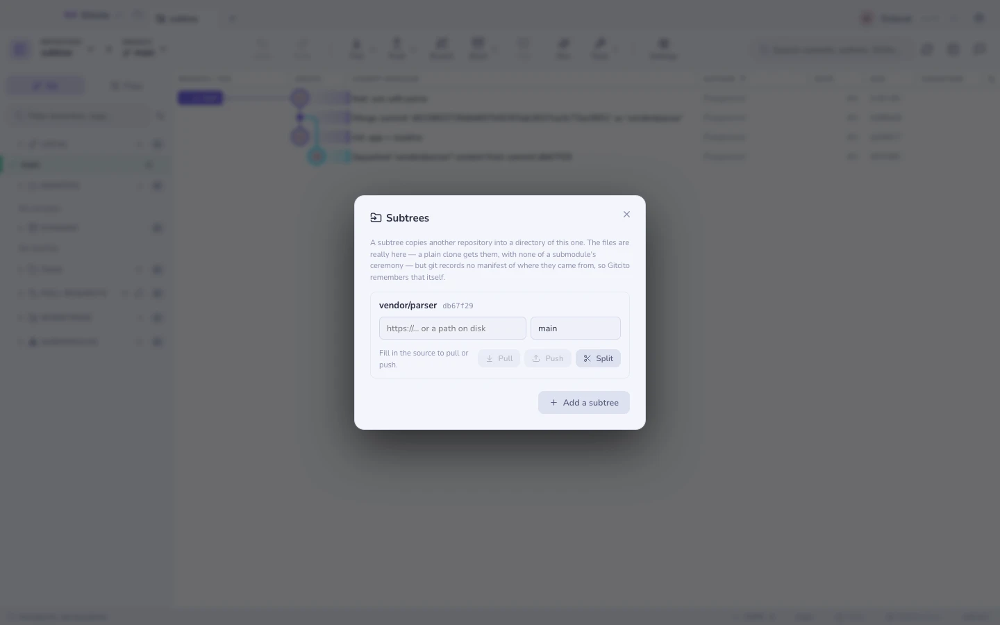

# Subtrees

Een subtree kopieert een andere repository in een map van de jouwe. Daarna zijn
de bestanden **er echt**: een gewone `git clone` haalt ze op, `git checkout`
verzet ze als elk ander bestand, en niemand hoeft te weten dat de map ergens
anders vandaan kwam.

Dat is het hele verschil met een [submodule](lfs-sparse.md), die enkel een
pointer opslaat en `--recurse-submodules` nodig heeft, plus een eigen checkout en
een eigen losgekoppelde HEAD om in het gareel te houden.

`⌘K` → **Subtrees**.

## De adder onder het gras die niemand noemt

**Git legt geen manifest vast voor subtrees.** Een submodule heeft
`.gitmodules`, met elke url en elk pad erin. Een subtree heeft niets — enkel een
`git-subtree-dir:`-trailer op de commit die de import deed.

Een repository kan dus een subtree bevatten en je geen enkele manier geven om uit
te vinden waar hij vandaan kwam. Gitcito doet wat het kan:

- De lijst wordt uit de geschiedenis ontdekt, door die trailers te lezen. Elke
  subtree die door wie dan ook, met welk gereedschap dan ook, is toegevoegd komt
  bovendrijven.
- De **bronrepository en ref** worden door Gitcito onthouden, in de git-config van
  deze repository. Een subtree die uit de geschiedenis ontdekt is begint met die
  velden leeg — vul ze één keer in en vanaf dan werken pullen en pushen.

De onthouden waarden wonen onder `gitcito.subtree.*` in `.git/config`, dus ze
blijven bij de repository maar reizen niet mee naar een kloon. **Vergeten** wist
ze en raakt verder niets aan.

## Er een toevoegen

| Veld | Betekenis |
|------|-----------|
| Map | Waar hij belandt, bijv. `vendor/parser`. Mag nog niet bestaan |
| Bronrepository | Een URL of een pad op schijf |
| Branch of tag | Wat er geïmporteerd wordt |
| Squash | Haal hem binnen als één commit in plaats van met zijn hele geschiedenis |

**Laat Squash aan staan** tenzij je een reden hebt. Zonder dat wordt elke commit
van de bibliotheek voorgoed door je log geweven, en gaat `git log` niet meer over
jouw project.

## Ermee leven

| Actie | Wat het draait |
|--------|----------------|
| **Pullen** | `git subtree pull` — wijzigingen van upstream landen als een merge in jouw map |
| **Pushen** | `git subtree push` — jouw lokale wijzigingen onder die map gaan terug naar de bron |
| **Split** | `git subtree split -b <branch>` — haalt de eigen geschiedenis van de map in een branch, met de bestanden in de root |

**Split** is degene die het kennen waard is: het verandert een opgenomen map
terug in de geschiedenis van een zelfstandige repository, en zo houdt een subtree
op een subtree te zijn.

## Grenzen die je moet kennen

- **Pushen is traag.** Het berekent de geschiedenis van de map elke keer opnieuw
  vanaf nul. Bij een grote repository is dat seconden tot minuten, niet meteen,
  en Gitcito kan er alleen op wachten.
- **Een pull is een merge**, dus hij kan conflicteren als elke merge — je belandt
  in [de oplosser](conflicts.md).
- **`git subtree` is een contrib-script**, geen ingebouwd git-commando. Een
  uitgeklede git-installatie kan het missen; Gitcito zegt dat ronduit in plaats
  van "'subtree' is not a git command" door te geven.
- **Gesquashte geschiedenis kan later niet ontsquasht worden.** De commits zijn
  nooit geïmporteerd.
- Gitcito zet een submodule niet om in een subtree, en ook niet andersom.

Zie ook: [Mergen & rebasen](merging.md) · [Plumbing met een UI](lfs-sparse.md)
