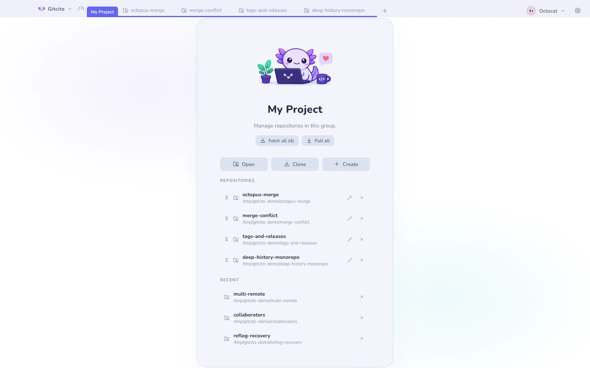
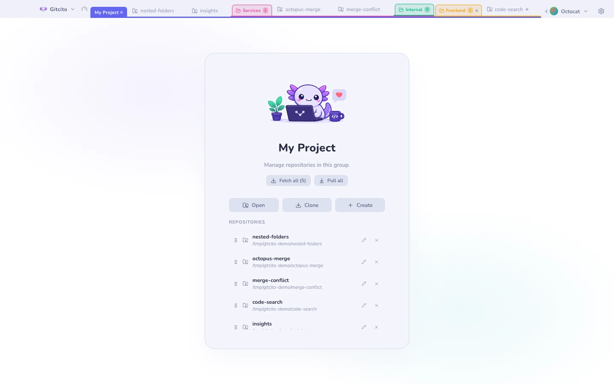

# Workspaces, tabbladen & groepen

Drie niveaus, van het losste naar het strakste.

## Tabbladen

Eén repository, één tabblad. Gebruik <kbd>⌘T</kbd> / <kbd>Ctrl+T</kbd> om de
kiezer voor een nieuw tabblad te openen en <kbd>⌘W</kbd> / <kbd>Ctrl+W</kbd> om
het actieve tabblad te sluiten. Je kunt ook slepen om te herordenen,
middenklikken om te sluiten, of op <kbd>⌘⇧T</kbd> drukken om het laatst gesloten
tabblad te heropenen. Rechtsklik een repositorytabblad (of een chip in een
[groep](#groepen)) voor het [contextmenu van de repository](repo-menu.md) —
alias, worktrees, GitHub, terminal, tonen, editor en verwijderen. Sluit het
laatste tabblad en <kbd>⌘W</kbd> sluit het venster. Een stip op het tabblad betekent niet-gecommit werk; een andere stip
betekent conflicten.

Verschijnt er een sluitwaarschuwing, dan annuleert <kbd>Escape</kbd> altijd.
<kbd>Enter</kbd> bevestigt alleen wanneer het tabblad schoon is — bij
niet-gecommitte wijzigingen of conflicten laat de waarschuwing je met opzet naar
de knop grijpen, zodat een verdwaalde toetsaanslag na <kbd>⌘W</kbd> geen werk kan
sluiten dat je nog vasthield.

## Groepen

Bundel bij elkaar horende repository's in een genoemd, kleurgecodeerd
**groepstabblad**. Binnen een groep krijg je een tweede rij met één chip per
repository, en de groep zelf kan in één keer **Alles fetchen** of **Alles
pullen**.

Groepen kunnen **mappen bevatten, tot elke diepte genest**: rechtsklik de groep →
*Nieuwe map…*, en sleep vervolgens repository's op een mapchip. Elke map krijgt
een kleur, klapt in tot een chip met een teller, telt de statusstippen van alles
erin op, en kan zijn hele subboom fetchen of pullen.

> Mappen ordenen alleen. Er een verwijderen tilt zijn repository's naar de ouder
> — het sluit nooit een repository.

## Workspaces

Een workspace is een **hele opgeslagen tabbladenstrook**. Wisselen verwisselt elk
tabblad tegelijk: `Werk` en `Privé` trappen elkaar niet meer op de tenen.

De naam van de workspace staat linksboven, naast het Gitcito-merkteken. Klik erop
om te wisselen, aan te maken, te hernoemen, te herordenen of te verwijderen.
Ernaast zit de meter die [Mission control](mission-control.md) opent voor de
workspace waarin je zit.

**Zie ook:** [Mission control](mission-control.md) · [De commandoregel](cli.md)
