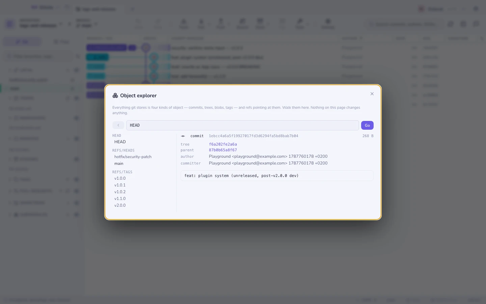

# Object explorer

Git has a reputation for being complicated. Almost all of it comes from never
seeing the model: **four kinds of object, and pointers**. Once you can click a
commit, land on its tree, and find that your file *is* a blob with a name given
to it by a tree, the porcelain stops being magic.

`⌘K` → **Object explorer**. Nothing on this page can change a byte — every call
behind it is a read.

## The four objects

| Object | Is | Knows |
|--------|----|-------|
| **blob** | The *contents* of a file | Nothing. Not its name, not its path, not its history |
| **tree** | A directory listing | Names, modes, and the sha of each child blob or tree |
| **commit** | One snapshot | Its tree, its parents, author, committer, message |
| **tag** | An annotated tag | The object it points at, the tagger, a message |

The surprise for most people is the first row. **A blob has no name.** Two files
with identical content anywhere in your history are the same blob, stored once.
The name lives in the tree that points at it — which is why git tracks content
rather than files, and why renames are detected rather than recorded.

A **ref** — `refs/heads/main`, `refs/tags/v1.0`, `HEAD` — is just a file
containing a sha. That is the whole of "branching is cheap".

## Walking

The left column lists every ref in the repository, grouped as git groups them.
Click one to land on the object it names.

From there everything is a link:

- A **commit** shows its `tree` and each `parent` — click through to the
  snapshot, or backwards through history one commit at a time.
- A **tree** lists its entries with mode, type, sha and size. Click a name to
  open that child.
- A **blob** shows its text (the head of it, for anything large), or says so
  plainly when it is binary.
- An **annotated tag** shows what it points at — click through to the commit.

**Back** retraces your steps.

## Typing a revision

The box takes anything `git rev-parse` accepts, which is where this stops being
a browser and starts being a way to learn:

| Type this | To get |
|-----------|--------|
| `HEAD` | The current commit |
| `HEAD~3` | Three commits back |
| `HEAD^{tree}` | That commit's tree, peeled |
| `HEAD:src/app.ts` | The blob for that path, directly |
| `v1.0^{}` | What an annotated tag points at, rather than the tag object |
| `a1b2c3d` | Any object, by sha — abbreviations work |

Mode digits in a tree listing are worth knowing: `100644` a file, `100755`
executable, `040000` a subtree, `120000` a symlink, `160000` a submodule
gitlink — that last one being the whole of what a submodule stores.

## Limits worth knowing

- **Read-only, on purpose.** There is nothing here to write with. Making objects
  by hand is a `git hash-object` exercise, and belongs in a terminal.
- **Large blobs are truncated** after the first 200 KB — enough to see what it
  is, not enough to hang the window.
- **Sizes are the object's content size** as `git cat-file -s` reports it, not
  what it costs on disk after packing. For that, see
  [maintenance](maintenance.md).
- **Unreachable objects are still objects.** Paste a sha from a `git fsck`
  dangling report and it opens, which is often the fastest way to see what a
  lost commit contained before deciding whether to recover it.

See also: [The graph](graph.md) · [Repository maintenance](maintenance.md) ·
[Recovery](recovery.md)
