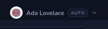

# Awatary autorów

Lista commitów to ściana nazwisk, a nazwiska czyta się wolno. Obrazek obok każdego
zamienia „kto to napisał” w coś, na co odpowiadasz jednym spojrzeniem. Gitcito daje
go każdemu pokazywanemu autorowi: w kolumnie autora w grafie, w szczegółach commita
obok autora i każdego współautora, w wyborze współautorów przy pisaniu, w
przełączniku profili i obok każdego profilu w Ustawieniach.

## Skąd bierze się obrazek

Dwa źródła, sprawdzane w tej kolejności:

| Źródło | Kiedy jest używane |
|---|---|
| **Gravatar** | E-mail commita ma konto w Gravatarze. Pobierany po HTTPS, na podstawie skrótu SHA-256 z adresu zapisanego małymi literami. |
| **Wygenerowany awatar** | Wszystko inne — brak Gravatara, brak sieci albo wyłączone zapytanie. Rysowany lokalnie z adresu, nigdy pobierany. |

Wygenerowany awatar to małe stworzenie, nie kolorowy kwadrat: ten sam adres zawsze
daje ten sam kształt i te same barwy, więc autor pozostaje rozpoznawalny między
repozytoriami i po ponownym uruchomieniu. Dwa różne adresy praktycznie nigdy się nie
zderzają. Rysuje go [blobatar](https://github.com/Alain00/blobatar) (MIT) i nie
potrzebuje żadnej sieci — repozytorium pełne autorów bez Gravatara i tak dostaje
pełny zestaw rozróżnialnych twarzy, offline, przy pierwszym rysowaniu.

Ponieważ ziarnem jest **e-mail commita**, autor commitujący z dwóch adresów dostaje
dwa awatary. To zamierzone — to ten sam sygnał, jaki daje kolumna autora w grafie, i
zwykle tak zauważasz konto maszynowe albo źle ustawiony `user.email`. Napraw to
[atrybutami autora](attributes.md), jeśli oba adresy to naprawdę jedna osoba.

## Twarz na pasku tytułu

Awatar obok nazwy Twojego profilu to jedyny awatar w Gitcito, który przedstawia
**Ciebie, w tym repozytorium, teraz** — więc jedyny, który reaguje na stan repozytorium.
Robi minę, gdy coś się dzieje, a przez resztę czasu pozostaje neutralny.

Na co reaguje, od najgorszego: pliki pozostawione w konflikcie; scalanie, rebase,
cherry-pick albo revert, któremu nikt nie powiedział, jak się skończyć; odłączony
HEAD — przestraszony, gdy pod spodem są niezatwierdzone zmiany, a tylko niepewny,
gdy ich nie ma; commity piętrzące się bez wypchnięcia albo bez pobrania ze
zdalnego; zmiany piętrzące się bez zatwierdzenia; szuflada stashy, której nikt nie
otwiera; i repozytorium, do którego od miesiąca nic nie trafiło.

Wygrywa najgorsze: repozytorium z konfliktami *i* czterdziestoma niewypchniętymi
commitami nosi konflikty. Najedź na awatar, a podpowiedź powie dokładnie, co
spowodowało tę twarz — obrazek, który zmienia się bez podanego powodu, jest
zagadką, nie sygnałem. Czyta się podpowiedź; twarz tylko każe spojrzeć.

Progi są celowo wysokie. Twarz, która martwi się przy jednym niewypchniętym
commicie, martwi się na zawsze, a stały sygnał to sygnał, którego uczysz się nie
czytać. Gałąź bez gałęzi nadrzędnej pozostaje neutralna, a nie zadowolona:
„zsynchronizowana” to nie stwierdzenie, które można wypowiedzieć o gałęzi, której
nikt nie wypchnął.

**To dekoracja, nie pomiar.** Pasek statusu nosi prawdziwe liczby i to jemu należy
wierzyć. Twarz mówi tylko *coś się dzieje*, jednym spojrzeniem.

### Ruch

Awatar na pasku tytułu sam oddycha i mruga. Wyłącz to w
**Ustawienia → Motywy → Graf → Animuj awatar profilu** — wyraz twarzy nadal
odzwierciedla repozytorium, tylko przestaje się ruszać. Ruch jest też automatycznie
pomijany, gdy system prosi o ograniczony ruch.

Animuje się tylko ten jeden awatar. Animowany awatar musi być rysowany jako żywy SVG,
a nie obrazek z pamięci podręcznej — w porządku dla jednego, marnotrawstwo dla kilkuset,
które graf rysuje podczas przewijania.

## Wyłączanie zapytania

**Ustawienia → Motywy → Graf → Pokaż awatary.**

Wyłączone znaczy:

- żadnego żądania do `gravatar.com`, nigdy — ani odroczonego, ani z pamięci
  podręcznej z ponowieniem;
- awatary nadal się pojawiają, wszystkie generowane lokalnie.

To więc przełącznik prywatności, a nie „ukryj obrazki”. Nie ma ustawienia, które
usuwa awatary całkowicie.

## Ograniczenia

- **Zapytanie do Gravatara mówi gravatar.com, że ten adres był sprawdzany.** Skrót
  nie jest tajemnicą: każdy, kto ma kandydujący adres, może go zahaszować i
  porównać. Jeśli lista autorów repozytorium to coś, czego wolisz nie oddawać
  stronie trzeciej, wyłącz zapytanie przed jego otwarciem.
- **Tylko Gravatar.** Awatary wgrane na GitHuba, GitLaba czy Bitbucketa nie są
  czytane — wymagałyby uwierzytelnionego wywołania API hosta na każdego autora, czyli
  bardzo dużo sieci dla ozdoby.
- **Bez nadpisań.** Nie da się przypiąć wybranego obrazka do autora ani zmienić stylu
  generowanego awatara. Awatar jest funkcją adresu e-mail i niczego więcej.
- **Zdjęcie z Gravatara nie ma wyrazu twarzy.** Jeśli e-mail Twojego profilu je ma,
  pasek tytułu pokazuje zdjęcie i żadnej miny — fotografia nie zrobi do Ciebie
  grymasu. Wyłącz zapytanie, jeśli wolisz ekspresyjny blob.
- **Twarz podąża wyłącznie za aktywnym repozytorium.** Na karcie, która nie jest
  repozytorium, nie ma na co reagować, więc pozostaje neutralna.
- **Jedno odczytanie naraz.** Twarz pokazuje jedną najgorszą rzecz, jaką znalazła,
  więc repozytorium może być nieporządne na kilka sposobów i nosić jeden wyraz. To
  nie jest lista stanu — od tego są pasek statusu i podpowiedź.
- **Małe jest małe.** W kolumnie autora w grafie awatar ma 16px, co nosi barwę i
  sylwetkę, ale nie szczegół. Szczegóły commita rysują autora w 38px i tam twarz
  naprawdę widać.

**Zobacz też:** [Motywy i wygląd](themes.md) · [Graf commitów](graph.md) ·
[Atrybuty autora](attributes.md) · [Profile](profiles.md)
