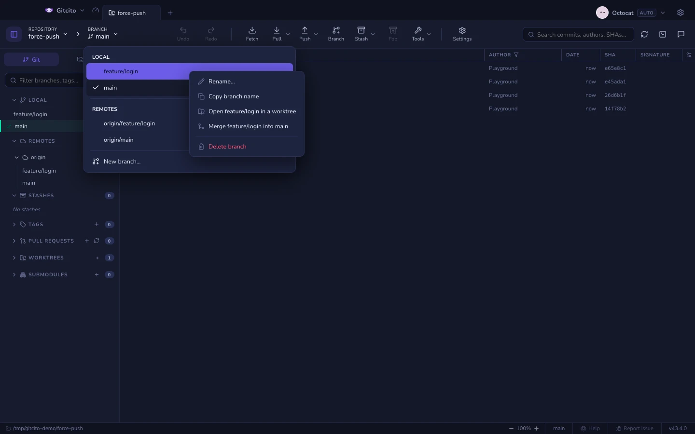
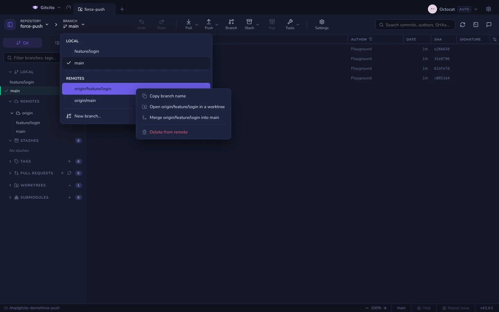

# Gałęzie, zdalne repozytoria i panel boczny

Jeden panel boczny — przestawialny i przeszukiwalny — mieści **gałęzie, zdalne
repozytoria, tagi, stashe, worktree i podmoduły**. Każdą sekcję da się ukryć
albo przestawić (Ustawienia → Układ), a pole filtra działa na wszystkie naraz.
To, które sekcje i katalogi zostawiasz rozwinięte albo zwinięte, jest
zapamiętywane per repozytorium — także po restarcie.

Sekcja zawierająca ponad 300 referencji startuje zwinięta. W repozytorium z
tysiącami nigdy nieusuniętych gałęzi zdalnych wszystkie trafiłyby inaczej na
ekran, choć nikt o to nie prosił; rozwiń ją raz, a ten wybór zostanie
zapamiętany jak każdy inny.

## Gałęzie

Twórz, przełączaj, zmieniaj nazwy i usuwaj — lokalne i zdalne. Wiersze gałęzi
pokazują:

- **↑przed / ↓za** względem swojego upstreamu,
- **plakietki obecności na poszczególnych zdalnych** (które zdalne mają tę
  gałąź),
- **kropkę ryzyka** po skanie [radaru konfliktów](conflict-radar.md),
- **znacznik ⟳**, gdy zdalne repozytorium
  [przepisało historię](range-diff.md).

Gałęzie z `/` w nazwie same zwijają się w składane katalogi.
Kliknij prawym przyciskiem nagłówek katalogu, by zadziałać na całą grupę: *Usuń
wszystkie branche pod `feature` (4 branchy)* usuwa wszystko w środku po jednym
potwierdzeniu, które wypisuje dokładnie, które gałęzie znikną — gałąź, na
której jesteś, jest wykluczona. To samo menu istnieje na katalogach zdalnych
gałęzi, usuwając wtedy ze zdalnego repozytorium.

Rozwijana lista gałęzi na pasku narzędzi pokazuje gałęzie lokalne i zdalne.
Kliknij prawym przyciskiem dowolną gałąź na tej liście, aby zmienić nazwę
gałęzi lokalnej, skopiować jej nazwę, otworzyć ją w nowym worktree, scalić
ją z aktywną gałęzią lub ją usunąć. Gałęzie zdalne nie oferują zmiany nazwy
i po potwierdzeniu są usuwane ze swojego zdalnego repozytorium. Gitcito
pomija scalanie, gdy wybrana referencja jest już zawarta w aktywnej gałęzi,
i wyłącza tworzenie worktree, gdy ta gałąź jest już wyewidencjonowana.

Wiersze zaznacza się grupowo jak pliki: klik z <kbd>⌘/Ctrl</kbd> przełącza
wiersz, klik z <kbd>Shift</kbd> zaznacza zakres, a
<kbd>Shift</kbd>+<kbd>↑</kbd>/<kbd>↓</kbd> rozszerza zaznaczenie od ostatnio
klikniętego wiersza. Kliknij zaznaczenie prawym przyciskiem, by otworzyć menu
zbiorcze — *Usuń 4 branchy* — które potwierdza pełną listą. Te same gesty
działają na zdalnych gałęziach, tagach i stashach.

## Zmiana nazwy gałęzi

Gałąź nazwana trzy dni temu `fix` to dziś gałąź, której nikt nie potrafi
umiejscowić. Zmień jej nazwę tam, gdzie zauważysz problem:

| Gdzie | Jak |
|-------|-----|
| Panel boczny | Prawy przycisk na gałęzi → *Zmień nazwę…* |
| Lista gałęzi na pasku narzędzi | Prawy przycisk na gałęzi → *Zmień nazwę…* |
| Graf commitów | Prawy przycisk na plakietce gałęzi przy commicie → *Zmień nazwę…* |
| Paleta poleceń | <kbd>⌘/Ctrl</kbd>+<kbd>K</kbd> → *Zmień nazwę brancha* (działa na bieżącej gałęzi) |

Lokalna zmiana nazwy to `git branch -m`: natychmiastowa i **odwracalna przez
⌘Z** — wpis cofnięcia przywraca starą nazwę. Zmiana nazwy gałęzi, na której
jesteś, pozostawia cię na niej.

Gdy gałąź śledzi zdalną, menu oferuje też *Zmień nazwę (także na remote)…*:
zmiana lokalna, wypchnięcie nowej nazwy i usunięcie starej po stronie zdalnej.
Tego **nie da się cofnąć** — stara gałąź zdalna znika, a każdy, kto ją miał
wybraną, musi przestawić się sam. Na plakietce w grafie opcja pojawia się tylko
wtedy, gdy gałąź śledzi dokładnie jedną zdalną; przy kilku wybierz gałąź w
panelu bocznym, żeby upstream był jednoznaczny.

**Ograniczenia:** Gitcito nie przepisuje niczego, co odwoływało się do starej
nazwy — otwarte pull requesty nadal wskazują gałąź, wobec której powstały, a
reguły CI dopasowane do wzorca gałęzi przestają pasować. Zmiana nazwy gałęzi
wybranej w innym [worktree](worktrees.md) kończy się błędem, a git to zgłasza.

## Pull i push gałęzi, na której nie jesteś

Kliknij prawym przyciskiem dowolną gałąź lokalną — pozycje **Pobierz** i
**Wypchnij** działają na *tej* gałęzi, a nie na aktualnie przełączonej: bez
objazdu przez checkout, gdy trzeba nadgonić trzy gałęzie. Zobacz
[fetch, pull i push](syncing.md).

## Przypięte gałęzie

Oznacz gwiazdką gałęzie, do których ciągle wracasz — najedź na wiersz i kliknij
★ albo kliknij prawym przyciskiem → *Przypnij gałąź*. Wypływają wtedy do grupy
**Przypięte** na górze sekcji lokalnej, zapamiętywane osobno dla każdego
repozytorium, i jednocześnie zostają na swoim zwykłym miejscu niżej.

## Przełączanie na gałąź zdalną

Kliknij dwukrotnie gałąź zdalną, żeby utworzyć lokalną, która ją śledzi. Jeśli
lokalna gałąź o tej nazwie już istnieje i się **rozeszła**, Gitcito zapyta, jak
to pogodzić — rebase, merge czy reset — i zaproponuje wcześniejsze zrobienie
kopii gałęzi.

### Gdy Twoja lokalna gałąź jest z tyłu

Przy przełączaniu zostaje przewinięta (fast-forward) do wierzchołka zdalnej
gałęzi. Brudne drzewo robocze trafia najpierw do nazwanego stasha i wraca po
aktualizacji, więc lokalne zmiany jej nie przerywają.

### Gdy Twoja lokalna gałąź jest do przodu

Jeśli lokalna gałąź jest do przodu, a zdalna nie ma nic nowego, przełączenie
odpowiedziałoby na prośbę o gałąź *zdalną* Twoją własną, niewypchniętą pracą —
dlatego nic nie zostaje przełączone, dopóki nie powiesz, którą stronę masz na
myśli:

| Wybór | Co się dzieje |
|-------|---------------|
| Przełącz na lokalną | Przechodzi na lokalną gałąź z nienaruszonymi commitami. To, co każdy inny klient robi po cichu. |
| Reset (soft) | Cofa gałąź do wierzchołka zdalnej; zmiany z commitów zostają **w poczekalni**, gotowe do ponownego commita. |
| Reset (mixed) | To samo cofnięcie, zmiany zostają **poza poczekalnią** w drzewie roboczym. |
| Reset (hard) | Odrzuca commity *i* ich zmiany. |

Zostaw zaznaczone *Najpierw utwórz gałąź zapasową*, a wierzchołek lokalnej gałęzi
zostanie zapisany jako `backup/<gałąź>-<znacznik-czasu>`, zanim cokolwiek się
przesunie — nawet reset hard dzieli wtedy od cofnięcia jedno przełączenie. Reset
trafia też na stos cofania (⌘Z), ale tylko do zamknięcia repozytorium; gałąź
zapasowa zostaje dłużej.

**Ograniczenia:** okno porównuje gałąź wyłącznie z właśnie pobraną referencją
śledzącą, więc zdalne repozytorium, które odrzuciło pobranie (brak sieci, złe
dane logowania), zostanie porównane z ostatnio znanym wierzchołkiem. Nie mówi
nic o tym, czy Twoje commity są *dobre* — tylko że są tu, a nie tam.

## Zdalne repozytoria

Sekcja Zdalne w panelu bocznym to miejsce, gdzie dodaje się, edytuje, pobiera
i usuwa remote’y. Fetch, pull lub push na repozytorium, które nie ma żadnego,
otwiera to samo okno **Dodaj remote** — wklej URL albo utwórz repo na hoście —
zamiast nic nie robić. Zobacz [fetch, pull i push](syncing.md).

**Zobacz też:** [Merge i rebase](merging.md) · [Worktree](worktrees.md)
